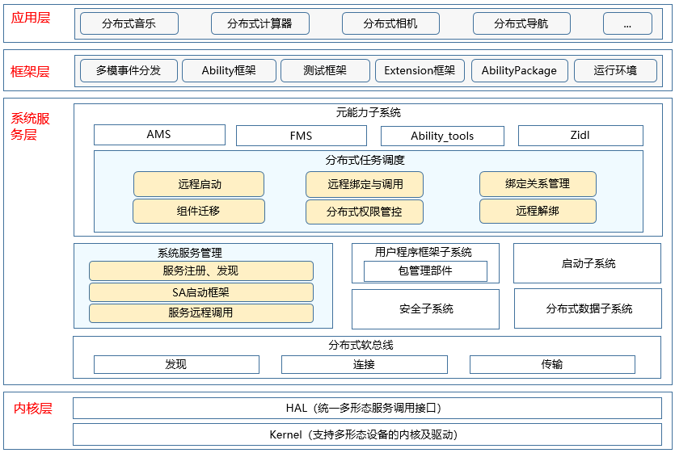

# 分布式任务调度子系统<a name="ZH-CN_TOPIC_0000001115719369"></a>

-   [简介](#section11660541593)
-   [系统架构](#section13587185873516)
-   [目录](#section161941989596)
-   [相关仓](#section1371113476307)

## 简介<a name="section11660541593"></a>

分布式任务调度模块负责跨设备组件管理，提供访问和控制远程组件的能力，支持分布式场景下的应用协同。主要功能如下：

-   远程启动元能力：跨设备拉起远端设备上的指定元能力。
-   远程迁移元能力：将元能力跨设备迁移到远端设备。
-   远程绑定元能力：跨设备绑定远端设备上的指定元能力。
-   系统服务管理：提供系统服务的本地启动、注册、查询等功能；提供系统服务的跨设备查询功能。

## 系统架构<a name="section13587185873516"></a>

**图 1**  子系统架构图<a name="fig4460722185514"></a>




## 目录<a name="section161941989596"></a>

```
/foundation/distributedschedule
├── dmsfwk                      # 分布式任务调度模块
├── safwk                       # 系统服务框架模块
├── samgr                       # 系统服务管理模块
├── dms_fwk_lite                # 轻量分布式任务调度模块
├── safwk_lite                  # 轻量foundation进程
├── samgr_lite                  # 轻量系统服务管理模块
```

## 相关仓<a name="section1371113476307"></a>

**分布式任务调度子系统**

distributedschedule\_dms\_fwk

distributedschedule\_safwk

distributedschedule\_samgr

distributedschedule\_safwk\_lite

hdistributedschedule\_samgr\_lite

distributedschedule\_dms\_fwk\_lite