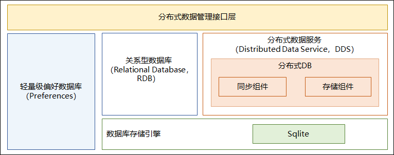

# 分布式数据管理子系统<a name="ZH-CN_TOPIC_0000001096920663"></a>

-   [简介](#section11660541593)
-   [目录](#section161941989596)
-   [说明](#section1312121216216)
    -   [本地数据管理说明](#section129654513264)
    -   [分布式数据服务说明](#section1961602912224)
    -   [KV数据模型说明](#section1961602912225)
    -   [分布式数据对象说明](#section1961602912257)

-   [相关仓](#section1371113476307)

## 简介<a name="section11660541593"></a>

**子系统介绍**

分布式数据管理子系统支持单设备的各种结构化数据的持久化，以及跨设备之间数据的同步、共享功能。开发者通过分布式数据管理子系统，能够方便地完成应用程序数据在不同终端设备间的无缝衔接，满足用户跨设备使用数据的一致性体验。

-   本地数据管理

    提供单设备上结构化数据的存储和访问能力。使用SQLite作为持久化存储引擎，提供了多种类型的本地数据库，分别是关系型数据库（Relational Database，RDB）和轻量级偏好数据库（Preferences），用以满足使用不同数据模型对应用数据进行持久化和访问的需求。


-   分布式数据服务

    分布式数据服务支持数据跨设备相互同步，为用户提供在多种终端设备上一致的数据访问体验。通过结合帐号、应用和数据库三元组，分布式数据服务对数据进行隔离。在通过可信认证的设备间，分布式数据服务支持数据相互同步，提供跨设备的数据访问。


**子系统架构**

**图 1**  子系统架构图<a name="fig4460722185514"></a>




## 目录<a name="section161941989596"></a>

子系统1-2层目录描述

```
distributeddatamgr/                 # 子系统目录
├── appdatamgr                      # 本地数据管理组件目录
└── distributeddatamgr              # 分布式数据服务组件目录
│   ├── frameworks                  # 框架层代码
│   │   ├── common                  # 公共工具类
│   │   ├── innerkitsimpl           # 部件间接口代码实现
│   │   ├── jskitsimpl              # JS API的实现
│   │   ├── libs                    # DB代码实现
│   │   └── native                  # 内部接口实现
│   ├── interfaces                  # 接口代码
│   │    ├── inner_api              # 内部接口声明
│   │    ├── innerkits              # 部件间接口声明
│   │    └── jskits                 # JS API的声明
│   └── services                    # 服务层代码
│       └── distributeddataservice  # 分布式数据服务实现
└── objectstore                     # 分布式数据对象目录
    ├─frameworks                    # 框架层代码
    │  ├─innerkitsimpl              # 部件间接口代码实现
    │  └─jskitsimpl                 # JS API的实现
    └─interfaces                    # 接口代码
        ├─innerkits                 # 部件间接口声明
        └─jskits                    # JS API的声明
    
│third_party/                       # 开源软件目录
├── flatbuffers                     # flatbuffers代码目录
└── sqlite                          # SQLite代码目录
```

## 说明<a name="section1312121216216"></a>

### 本地数据管理说明<a name="section129654513264"></a>

-   关系型数据库

    以下是几个基本概念：

    -   **关系型数据库**

        创建在关系模型基础上的数据库，以行和列的形式存储数据。

    -   **结果集**

        指用户查询之后的结果集合，可以对数据进行访问。结果集提供了灵活的数据访问方式，可以更方便的拿到用户想要的数据。

    -   **SQLite数据库**

        一款轻量级的数据库，是遵守ACID的关系型数据库组件。它是一个开源的项目


-   轻量级偏好数据库

    以下是几个基本概念：

    -   **Key-Value数据库**

        一种以键值对存储数据的一种数据库。Key是关键字，Value是值。

    -   **非关系型数据库**

        区别于关系数据库，不保证遵循ACID（Atomic、Consistency、Isolation及Durability）特性，不采用关系模型来组织数据，数据之间无关系，扩展性好。

    -   **偏好数据**

        用户经常访问和使用的数据。

    
### 分布式数据服务说明<a name="section1961602912224"></a>

分布式数据服务（Distributed Data Service，DDS） 提供不同设备间数据库数据分布式的能力。通过结合帐号、应用和数据库三元组，分布式数据服务对数据进行隔离。在通过可信认证的设备间，分布式数据服务支持数据相互同步，为用户提供在多种终端设备上一致的数据访问体验。

### KV数据模型说明<a name="section1961602912225"></a>

“KV数据模型”是“Key-Value数据模型”的简称，“Key-Value”即“键-值”。它是一种NoSQL类型数据库，其数据以键值对的形式进行组织、索引和存储。

KV数据模型适合不涉及过多数据关系和业务关系的业务数据存储，比SQL数据库存储拥有更好的读写性能，同时在分布式场景中降低了数据库版本兼容和数据同步过程中冲突解决的复杂度而被广泛使用。分布式数据库也是基于KV数据模型，对外提供KV类型的访问接口。

### 分布式数据对象说明<a name="section1961602912257"></a>

分布式数据对象管理框架是一款面向对象的内存数据管理框架，向应用开发者提供内存对象的创建、查询、删除、修改、订阅等基本数据对象的管理能力，同时具备分布式能力，满足超级终端场景下，相同应用多设备间的数据对象协同需求。

分布式数据对象提供JS接口，让开发者能以使用本地对象的方式使用分布式对象。分布式数据对象支持的数据类型包括数字型、字符型、布尔型等基本类型，同时也支持数组、基本类型嵌套等复杂类型。

## 相关仓<a name="section1371113476307"></a>

分布式数据管理子系统

distributeddatamgr\_appdatamgr

distributeddatamgr\_distributeddatamgr

third\_party\_sqlite

third\_party\_flatbuffers

