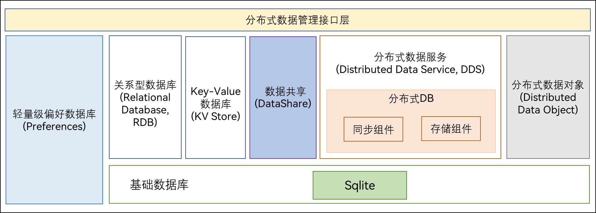

# 分布式数据管理子系统<a name="ZH-CN_TOPIC_0000001096920663"></a>

- [简介](#section11660541593)
- [目录](#section161941989596)
-   [组件说明](#section1312121216216)
    
    -   [分布式数据对象](#section129654513264)
    -   [数据共享](#section1961602912223)
    -   [分布式数据服务](#section1961602912224)
    -   [Key-Value数据库](#section1961602912225)
    -   [首选项](#section1961602912226)
    -   [关系型数据库](#section1961602912227)
    -   [标准数据化通路](#section1961602912228)
-   [相关仓](#section1371113476307)

## 简介<a name="section11660541593"></a>

**子系统介绍**

分布式数据管理子系统支持单设备的各种结构化数据的持久化，以及跨设备之间数据的同步、共享功能。开发者通过分布式数据管理子系统，能够方便地完成应用程序数据在不同终端设备间的无缝衔接，满足用户跨设备使用数据的一致性体验。


**子系统架构**

**图 1**  子系统架构图<a name="fig4460722185514"></a>



## 目录<a name="section161941989596"></a>

子系统1-2层目录描述

```
distributeddatamgr/          # 子系统目录
├── data_object              # 分布式数据对象目录
└── data_share               # 数据共享目录
└── datamgr_service          # 数据服务目录
└── kv_store                 # Key-Value数据库目录
└── preferences              # 首选项目录
└── relational_store         # 关系型数据库目录
└── udmf                     # 标准化数据通路目录

third_party/                 # 开源软件目录
├── bounds_checking_function # bounds_checking_function代码目录
└── cJSON                    # cJSON代码目录
└── flatbuffers              # flatbuffers代码目录
└── googletest               # googletest代码目录
└── jsoncpp                  # jsoncpp代码目录
└── icu                      # icu代码目录
└── libuv                    # libuv代码目录
└── openssl                  # openssl代码目录
└── sqlite                   # SQLite代码目录
└── zlib                     # zlib代码目录
```

## 组件说明<a name="section1312121216216"></a>

### 分布式数据对象<a name="section129654513264"></a>

分布式数据对象管理框架是一款面向对象的内存数据管理框架，向应用开发者提供内存对象的创建、查询、删除、修改、订阅等基本数据对象的管理能力，同时具备分布式能力，满足超级终端场景下，相同应用多设备间的数据对象协同需求。

分布式数据对象提供JS接口，让开发者能以使用本地对象的方式使用分布式对象。分布式数据对象支持的数据类型包括数字型、字符型、布尔型等基本类型，同时也支持数组、基本类型嵌套等复杂类型。

### 数据共享<a name="section1961602912223"></a>

**数据共享（Data Share）** 提供了向其他应用共享以及管理其数据的方法，支持同个设备上不同应用之间的数据共享。

### 分布式数据服务<a name="section1961602912224"></a>

**分布式数据服务（Distributed Data Service，DDS）** 提供不同设备间数据库数据分布式的能力。通过结合帐号、应用和数据库三元组，分布式数据服务对数据进行隔离。在通过可信认证的设备间，分布式数据服务支持数据相互同步，为用户提供在多种终端设备上一致的数据访问体验。

### Key-Value数据库<a name="section1961602912225"></a>

**分布式键值数据库(kv Store）** 为应用程序提供不同设备间数据库的分布式协同能力。通过调用分布式键值数据库各个接口，应用程序可将数据保存到分布式键值数据库中，并可对分布式键值数据库中的数据进行增加、删除、修改、查询、同步等操作。

该模块提供以下分布式键值数据库相关的常用功能：

- [KVManager](https://gitee.com/openharmony/docs/blob/master/zh-cn/application-dev/reference/apis-arkdata/js-apis-distributedKVStore.md#kvmanager)：分布式键值数据库管理实例，用于获取数据库的相关信息。
- [KVStoreResultSet](https://gitee.com/openharmony/docs/blob/master/zh-cn/application-dev/reference/apis-arkdata/js-apis-distributedKVStore.md#kvstoreresultset)：提供获取数据库结果集的相关方法，包括查询和移动数据读取位置等。
- [Query](https://gitee.com/openharmony/docs/blob/master/zh-cn/application-dev/reference/apis-arkdata/js-apis-distributedKVStore.md#query)：使用谓词表示数据库查询，提供创建Query实例、查询数据库中的数据和添加谓词的方法。
- [SingleKVStore](https://gitee.com/openharmony/docs/blob/master/zh-cn/application-dev/reference/apis-arkdata/js-apis-distributedKVStore.md#singlekvstore)：单版本分布式键值数据库，不对数据所属设备进行区分，提供查询数据和同步数据的方法。
- [DeviceKVStore](https://gitee.com/openharmony/docs/blob/master/zh-cn/application-dev/reference/apis-arkdata/js-apis-distributedKVStore.md#devicekvstore)：设备协同数据库，继承自[SingleKVStore](https://gitee.com/openharmony/docs/blob/master/zh-cn/application-dev/reference/apis-arkdata/js-apis-distributedKVStore.md#singlekvstore)，以设备维度对数据进行区分，提供查询数据和同步数据的方法。

### 首选项<a name="section1961602912226"></a>

**首选项（Preferences）** 主要提供轻量级Key-Value操作，支持本地应用存储少量数据，数据存储在本地文件中，同时也加载在内存中，所以访问速度更快，效率更高。首选项提供非关系型数据存储，不宜存储大量数据，经常用于操作键值对形式数据的场景。

1.  本模块提供首选项的操作类，应用通过这些操作类完成首选项操作。
2.  借助getPreferences，可以将指定文件的内容加载到Preferences实例，每个文件最多有一个Preferences实例，系统会通过静态容器将该实例存储在内存中，直到主动从内存中移除该实例或者删除该文件。
3.  获取Preferences实例后，可以借助Preferences类的函数，从Preferences实例中读取数据或者将数据写入Preferences实例，通过flush将Preferences实例持久化。

### 关系型数据库<a name="section1961602912227"></a>

**关系型数据库（Relational Database，RDB）** 是一种基于关系模型来管理数据的数据库。OpenHarmony关系型数据库基于SQLite组件提供了一套完整的对本地数据库进行管理的机制。

OpenHarmony关系型数据库底层使用SQLite作为持久化存储引擎，支持SQLite具有的所有数据库特性，包括但不限于事务、索引、视图、触发器、外键、参数化查询和预编译SQL语句。

### 标准化数据通路<a name="section1961602912228"></a>

**标准化数据通路（Unified Data Management Framework,UDMF）** 针对多对多跨应用数据共享的不同业务场景提供了标准化的数据通路，提供了标准化的数据接入与读取接口。同时对文本、图片等数据类型提供了标准化定义，方便不同应用间进行数据交互，减少数据类型适配的工作量。

## 相关仓<a name="section1371113476307"></a>

分布式数据管理子系统

[distributeddatamgr\_data_object](https://gitee.com/openharmony/distributeddatamgr_data_object)

[distributeddatamgr\_data_share](https://gitee.com/openharmony/distributeddatamgr_data_share)

[distributeddatamgr\_datamgr_service](https://gitee.com/openharmony/distributeddatamgr_datamgr_service)

[distributeddatamgr\_kv_store](https://gitee.com/openharmony/distributeddatamgr_kv_store)

[distributeddatamgr\_preferences](https://gitee.com/openharmony/distributeddatamgr_preferences)

[distributeddatamgr\_relational_store](https://gitee.com/openharmony/distributeddatamgr_relational_store)

[distributeddatamgr\_udmf](https://gitee.com/openharmony/distributeddatamgr_udmf)

[third\_party\_bounds_checking_function](https://gitee.com/openharmony/third_party_bounds_checking_function)

[third\_party\_cJSON](https://gitee.com/openharmony/third_party_cJSON)

[third\_party\_flatbuffers](https://gitee.com/openharmony/third_party_flatbuffers)

[third\_party\_googletest](https://gitee.com/openharmony/third_party_googletest)

[third\_party\_jsoncpp](https://gitee.com/openharmony/third_party_jsoncpp)

[third\_party\_icu](https://gitee.com/openharmony/third_party_icu)

[third\_party\_libuv](https://gitee.com/openharmony/third_party_libuv)

[third\_party\_openssl](https://gitee.com/openharmony/third_party_openssl)

[third\_party\_sqlite](https://gitee.com/openharmony/third_party_sqlite)

[third\_party\_zlib](https://gitee.com/openharmony/third_party_zlib)

