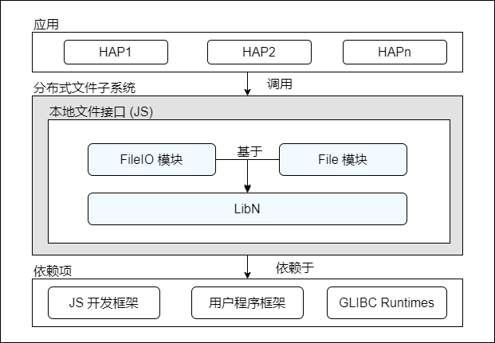

# 分布式文件子系统<a name="ZH-CN_TOPIC_0000001101541814"></a>

-   [简介](#section104mcpsimp)
    -   [系统架构](#section110mcpsimp)

-   [目录结构](#section113mcpsimp)
-   [约束](#section117mcpsimp)
-   [说明](#section125mcpsimp)
    -   [接口说明](#section127mcpsimp)
    -   [使用说明](#section149mcpsimp)

-   [相关仓](#section178mcpsimp)

## 简介<a name="section104mcpsimp"></a>

分布式文件子系统当前向应用程序提供用于的 IO 的 JS 接口。其具体包括用于管理文件的基本文件接口，用于管理目录的基本目录接口，用于获取文件信息的统计接口，用于流式读写文件的流式接口，以及接收 URI 而非绝对路径的沙盒接口。

### 系统架构<a name="section110mcpsimp"></a>

当前分布式文件子系统仅面向应用提供本地 JS 文件接口，这些接口分别通过 FileIO 模块以及 File 模块提供。架构上，分布式文件子系统实现了自研的 LibN，其抽象了 NAPI 层接口，向分布式文件子系统提供包括基本类型系统、内存管理、通用编程模型在内的基本能力。本系统对外依赖 JS 开发框架提供将 JS 接口转换为 C++ 代码的能力，依赖用户程序框架提供应用相关目录，依赖 GLIBC Runtimes 提供 IO 能力。

**图 1**  分布式文件子系统架构图<a name="fig174088216114"></a>  


## 目录结构<a name="section113mcpsimp"></a>

```
foundation/distributeddatamgr/distributedfile
├── interfaces                  # 接口层代码
│   └── kits                    # 对外接口
```

## 约束<a name="section117mcpsimp"></a>

本地 IO 接口

-   目前仅支持 UTF-8/16 编码；
-   目前 URI 暂不支持外部存储目录；

## 说明<a name="section125mcpsimp"></a>

### 接口说明<a name="section127mcpsimp"></a>

当前分布式文件子系统开放本地文件目录访问接口，按照功能，其可划分为如下几种类型：

**表 1**  接口类型表

<a name="table99228171027"></a>
<table><thead align="left"><tr id="row2092221715211"><th class="cellrowborder" valign="top" width="15.02%" id="mcps1.2.5.1.1"><p id="p79225171524"><a name="p79225171524"></a><a name="p79225171524"></a>接口类型</p>
</th>
<th class="cellrowborder" valign="top" width="32.25%" id="mcps1.2.5.1.2"><p id="p992271711216"><a name="p992271711216"></a><a name="p992271711216"></a>接口用途</p>
</th>
<th class="cellrowborder" valign="top" width="25.840000000000003%" id="mcps1.2.5.1.3"><p id="p29225175213"><a name="p29225175213"></a><a name="p29225175213"></a>相关模块</p>
</th>
<th class="cellrowborder" valign="top" width="26.889999999999997%" id="mcps1.2.5.1.4"><p id="p129221017720"><a name="p129221017720"></a><a name="p129221017720"></a>接口示例（类名.方法名）</p>
</th>
</tr>
</thead>
<tbody><tr id="row149231717327"><td class="cellrowborder" valign="top" width="15.02%" headers="mcps1.2.5.1.1 "><p id="p3923417629"><a name="p3923417629"></a><a name="p3923417629"></a>基本文件接口</p>
</td>
<td class="cellrowborder" valign="top" width="32.25%" headers="mcps1.2.5.1.2 "><p id="p89236171124"><a name="p89236171124"></a><a name="p89236171124"></a>需要用户提供绝对路径或文件描述符（fd），提供创建、修改及访问文件，或修改文件权限的能力</p>
</td>
<td class="cellrowborder" valign="top" width="25.840000000000003%" headers="mcps1.2.5.1.3 "><p id="p22011844349"><a name="p22011844349"></a><a name="p22011844349"></a>@ohos.distributedfile.fileio</p>
</td>
<td class="cellrowborder" valign="top" width="26.889999999999997%" headers="mcps1.2.5.1.4 "><p id="p1784383174320"><a name="p1784383174320"></a><a name="p1784383174320"></a>accessSync</p>
<p id="p184313310437"><a name="p184313310437"></a><a name="p184313310437"></a>chownSync</p>
<p id="p1684318315436"><a name="p1684318315436"></a><a name="p1684318315436"></a>chmodSync</p>
</td>
</tr>
<tr id="row1692320171825"><td class="cellrowborder" valign="top" width="15.02%" headers="mcps1.2.5.1.1 "><p id="p392391710219"><a name="p392391710219"></a><a name="p392391710219"></a>基本目录接口</p>
</td>
<td class="cellrowborder" valign="top" width="32.25%" headers="mcps1.2.5.1.2 "><p id="p109232176211"><a name="p109232176211"></a><a name="p109232176211"></a>需要用户提供绝对路径，提供读取目录及判断文件类型的能力</p>
</td>
<td class="cellrowborder" valign="top" width="25.840000000000003%" headers="mcps1.2.5.1.3 "><p id="p271274219410"><a name="p271274219410"></a><a name="p271274219410"></a>@ohos.distributedfile.fileio</p>
</td>
<td class="cellrowborder" valign="top" width="26.889999999999997%" headers="mcps1.2.5.1.4 "><p id="p29233177216"><a name="p29233177216"></a><a name="p29233177216"></a>Dir.openDirSync</p>
</td>
</tr>
<tr id="row14923171716217"><td class="cellrowborder" valign="top" width="15.02%" headers="mcps1.2.5.1.1 "><p id="p159234176215"><a name="p159234176215"></a><a name="p159234176215"></a>基本Stat接口</p>
</td>
<td class="cellrowborder" valign="top" width="32.25%" headers="mcps1.2.5.1.2 "><p id="p1992314179215"><a name="p1992314179215"></a><a name="p1992314179215"></a>需要用户提供绝对路径，提供包括文件大小、访问权限、修改时间在内的基本统计信息</p>
</td>
<td class="cellrowborder" valign="top" width="25.840000000000003%" headers="mcps1.2.5.1.3 "><p id="p325774111413"><a name="p325774111413"></a><a name="p325774111413"></a>@ohos.distributedfile.fileio</p>
</td>
<td class="cellrowborder" valign="top" width="26.889999999999997%" headers="mcps1.2.5.1.4 "><p id="p59231317420"><a name="p59231317420"></a><a name="p59231317420"></a>Stat.statSync</p>
</td>
</tr>
<tr id="row692319171228"><td class="cellrowborder" valign="top" width="15.02%" headers="mcps1.2.5.1.1 "><p id="p1592318171526"><a name="p1592318171526"></a><a name="p1592318171526"></a>流式文件接口</p>
</td>
<td class="cellrowborder" valign="top" width="32.25%" headers="mcps1.2.5.1.2 "><p id="p992311171421"><a name="p992311171421"></a><a name="p992311171421"></a>需要用户提供绝对路径或文件描述符，提供流式读写文件的能力</p>
</td>
<td class="cellrowborder" valign="top" width="25.840000000000003%" headers="mcps1.2.5.1.3 "><p id="p1692321716217"><a name="p1692321716217"></a><a name="p1692321716217"></a>@ohos.distributedfile.fileio</p>
</td>
<td class="cellrowborder" valign="top" width="26.889999999999997%" headers="mcps1.2.5.1.4 "><p id="p10923141711215"><a name="p10923141711215"></a><a name="p10923141711215"></a>Stream.createStreamSync</p>
<p id="p88031126184311"><a name="p88031126184311"></a><a name="p88031126184311"></a>Stream.fdopenStreamSync</p>
</td>
</tr>
<tr id="row82479241516"><td class="cellrowborder" valign="top" width="15.02%" headers="mcps1.2.5.1.1 "><p id="p12923111711216"><a name="p12923111711216"></a><a name="p12923111711216"></a>沙盒文件接口</p>
</td>
<td class="cellrowborder" valign="top" width="32.25%" headers="mcps1.2.5.1.2 "><p id="p49237171020"><a name="p49237171020"></a><a name="p49237171020"></a>需要用户提供 URI，提供基本文件接口、基本目录接口及基本统计接口能力的子集能力，或这些能力的组合能力</p>
</td>
<td class="cellrowborder" valign="top" width="25.840000000000003%" headers="mcps1.2.5.1.3 "><p id="p724852418510"><a name="p724852418510"></a><a name="p724852418510"></a>@system.file</p>
</td>
<td class="cellrowborder" valign="top" width="26.889999999999997%" headers="mcps1.2.5.1.4 "><p id="p0390135216324"><a name="p0390135216324"></a><a name="p0390135216324"></a>move</p>
<p id="p202016525456"><a name="p202016525456"></a><a name="p202016525456"></a>copy</p>
<p id="p8142558194520"><a name="p8142558194520"></a><a name="p8142558194520"></a>list</p>
</td>
</tr>
</tbody>
</table>


### 使用说明<a name="section149mcpsimp"></a>

当前分布式文件子系统所提供的 IO 接口，按照编程模型，可划分为如下几种类型：

-   同步编程模型

    名称包含 Sync 的接口实现为同步模型。用户在调用这些接口的时候，将同步等待，直至执行完成，执行结果以函数返回值的形式返回。

    下例以只读的方式打开一个文件流，接着试图读取其中前 4096 个字节并将之转换为 UTF-8 编码的字符串，最后关闭该文件流。

    ```
    import fileio from '@ohos.distributedfile.fileio';
    
    try {
        var ss = fileio.Stream.createStreamSync("tmp", "r")
        buf = new ArrayBuffer(4096)
        ss.readSync(buf)
        console.log(String.fromCharCode.apply(null, new Uint8Array(buf)))
        ss.closeSync()
    }
    catch (e) {
        console.log(e);
    }
    ```


-   异步编程模型：Promise

    @ohos.distributedfile.fileio 模块中，名称不含 Sync 的接口，在不提供最后一个函数型参数 callback 的时候，即实现为 Prom
    ise 异步模型。Promise 异步模型是 ohos 标准异步模型之一。用户在调用这些接口的时候，接口实现将异步执行任务，同时返回一个 promise 对象，其代表异步操作的结果。在返回的结果的个数超过一个时，其以对象属性的形式返回。

    下例通过 Promise 链依次完成：以只读方式打开文件流、尝试读取文件前 4096 个字节、显示读取内容的长度，最后关闭文件。

    ```
    import fileio from '@ohos.distributedfile.fileio';
    
    try {
        let openedStream
        fileio.Stream.createStream("test.txt", "r")
            .then(function (ss) {
                openedStream = ss;
                return ss.read(new ArrayBuffer(4096))
            })
            .then(function (res) {
                console.log(res.bytesRead);
                console.log(String.fromCharCode.apply(null, new Uint8Array(res.buffer)))
                return openedStream.close()
            })
            .then(function (undefined) {
                console.log("Stream is closed")
            })
            .catch(function (e) {
                console.log(e)
            })
    } catch (e) {
        console.log(e)
    }
    ```


-   异步编程模型：Callback

    @ohos.distributedfile.fileio 模块中，名字不含 Sync 的接口，在提供最后一个函数性参数 callback 的时候，即实现为 Callback 异步模型。Callback 异步模型是 ohos 标准异步模型之一。用户在调用这些接口的时候，接口实现将异步执行任务。任务执行结果以参数的形式提供给用户注册的回调函数。这些参数的第一个是 Error 或 undefined 类型，分别表示执行出错与正常。

    下例异步创建文件流，并在文件流的回调函数中异步读取文件的前 4096 字节，接着在读取文件的回调函数中异步关闭文件。

    ```
    import fileio from '@ohos.distributedfile.fileio';
    
    try {
        fileio.Stream.createStream("./testdir/test_stream.txt", "r", function (err, ss) {
            if (!err) {
                ss.read(new ArrayBuffer(4096), {}, function (err, buf, readLen) {
                    if (!err) {
                        console.log('readLen: ' + readLen)
                        console.log('data: ' + String.fromCharCode.apply(null, new Uint8Array(buf)))
                    } else {
                        console.log('Cannot read from the stream ' + err)
                    }
                    ss.close(function (err) {
                        console.log(`Stream is ${err ? 'not' : ''}closed`)
                    });
                })
            } else {
                console.log('Cannot open the stream ' + err)
            }
        })
    } catch (e) {
        console.log(e)
    }
    ```


-   异步编程模型：Legacy

    @system.file 模块中的所有接口都实现为 Legacy 异步模型。用户在调用这些接口的时候，需要提供 success、fail 及 complete 三个回调。在正确提供参数的情况下，当异步任务完成后，接口会根据是否成功，分别调用 success 回调或 fail 回调，并最终调用 complete 回调。

    下例异步判断 URI 所指向的文件是否存在，并相应提供三个回调用于打印判断结果。

    ```
    import file from '@system.file'
    
    file.access({
        uri: 'internal://app/test.txt',
        success: function() {
            console.log('call access success.');
        },
        fail: function(data, code) {
            console.error('call fail callback fail, code: ' + code + ', data: ' + data);
        },
        complete: function () {
            console.log('call access finally.');
        }
    });
    
    console.log("file access tested done")
    ```


## 相关仓<a name="section178mcpsimp"></a>

**分布式文件**

distributeddatamgr\_distributedfile

