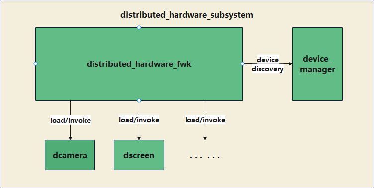

# 分布式硬件子系统

## 简介

### 子系统介绍

超级终端是指多个设备互相协同，借助各个设备的优势能力为用户提供1+1>2的更优体验。
分布式硬件子系统是超级终端中用于设备间外设能力共享的子系统，其管理超级终端内各个设备的硬件信息，纳入硬件资源池统一管理，实现设备间硬件能力的跨设备共享和调用能力，打破了设备边界，并通过软件定义各种新产品形态和体验。如手机可以使用电视大屏幕显示，办公PC也能使用手机摄像头提供更强的摄像能力。
分布式硬件平台对超级终端中的所有设备的硬件资源池化都是基于硬件虚拟化组件来进行构建的，每一个硬件在平台上注册对应的虚拟硬件实例，虚拟硬件通过虚拟化组件实现与对应的物理硬件之间的交互，从而实现了对周边设备对应硬件的控制和数据传输。硬件资源池化基于驱动接口（HDI）完成硬件虚拟化，服务层各个业务子系统可以像使用本机硬件一样使用分布式硬件。

### 子系统架构图



## 目录

```
foundation/distributedhardware
├──device_manager                     # 分布式设备管理部件目录
├──distributed_hardware_fwk           # 分布式硬件管理框架部件目录
├──distributed_camera                 # 分布式相机部件目录
└──distributed_screen                 # 分布式屏幕部件目录
```

## 组件说明

### 分布式设备管理

DeviceManager组件在OpenHarmony上提供分布式设备的认证组网能力，并为开发者提供了一套用于分布式设备间上下线状态感知、发现和认证的接口，其能力主要包括分布式设备的可信状态管理，上下线状态管理以及设备的发现和认证管理。经过设备发现和认证后，两台设备会组成超级终端，超级终端中所有设备的硬件资源会自动同步，并由分布式硬件子系统进行统一的管理。

### 分布式硬件管理框架

分布式硬件管理框架是为分布式硬件子系统提供信息管理能力的部件。分布式硬件管理框架为分布式硬件子系统提供统一的硬件接入、查询和使能等能力。

### 分布式相机

分布式相机是多个设备的相机同时协同使用的能力。分布式相机部件是为分布式硬件子系统提供这一能力的部件。本部件不直接对接应用，只向分布式硬件框架子系统提供C++接口。应用可以通过相机框架的接口使用分布式相机部件操作其他设备的Camera，使用方式与本地相机一致。

### 分布式屏幕

分布式屏幕是一种屏幕虚拟化能力，支持用户指定组网认证过的其他OpenHarmony设备的屏幕作为Display的显示区域。在分布式硬件子系统中，分布式屏幕组件提供跨设备屏幕能力调用，为OpenHarmony操作系统提供系统投屏、屏幕镜像、屏幕分割等能力的实现。

## 相关仓

[distributedhardware\_device\_manager](https://gitee.com/openharmony/distributedhardware_device_manager)

[distributedhardware\_distributed\_hardware\_fwk](https://gitee.com/openharmony/distributedhardware_distributed_hardware_fwk)

[distributedhardware\_distributed\_camera](https://gitee.com/openharmony/distributedhardware_distributed_camera)

[distributedhardware\_distributed\_screen](https://gitee.com/openharmony/distributedhardware_distributed_screen)