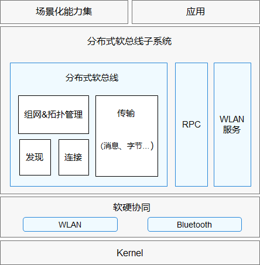

# 分布式软总线子系统<a name="ZH-CN_TOPIC_0000001090266209"></a>

-   [简介](#section11660541593)
-   [系统架构](#section342962219551)
-   [目录](#section161941989596)
-   [约束](#section119744591305)
-   [使用说明](#section1312121216216)
    -   [进程间通信](#section129654513264)
    -   [软总线](#section36252592710)

-   [相关仓](#section1371113476307)

## 简介<a name="section11660541593"></a>

分布式软总线子系统旨在为OpenHarmony系统提供的通信相关的能力，包括：WLAN服务能力、蓝牙服务能力、软总线、进程间通信RPC（Remote Procedure Call）等通信能力。

WLAN服务：为用户提供WLAN基础功能、P2P（peer-to-peer）功能和WLAN消息通知的相应服务，让应用可以通过WLAN和其他设备互联互通。

蓝牙服务：为应用提供传统蓝牙以及低功耗蓝牙相关功能和服务。

软总线：为应用和系统提供近场设备间分布式通信的能力，提供不区分通信方式的设备发现，连接，组网和传输功能。

进程间通信：提供不区分设备内或设备间的进程间通信能力。

## 系统架构<a name="section342962219551"></a>

**图 1**  分布式软总线子系统架构图<a name="fig4460722185514"></a>  




## 目录<a name="section161941989596"></a>

分布式软总线子系统主要代码目录结构如下：

```
/foundation/communication
├── bluetooth       # 蓝牙功能代码
├── dsoftbus        # 软总线功能代码
├── ipc             # 进程间通信代码
└── wifi            # WLAN功能代码
```

## 约束<a name="section119744591305"></a>

-   组网限制：必须确保设备在同一个局域网中。

## 使用说明<a name="section1312121216216"></a>

### 进程间通信<a name="section129654513264"></a>

在使用RPC时，请求服务的一端进程可获取提供服务一端所在进程的代理 （Proxy），并通过此代理读写数据来实现进程间的数据通信，其详细过程如下：

1.  实现服务端及其提供的能力。
2.  请求服务的一端会建立一个服务提供端的代理对象，这个代理对象具备和服务提供端一样的功能，若想访问服务提供端中的某个方法，只需要访问代理对象中对应的方法即可。
3.  服务提供端处理接收到的请求，处理完之后通过驱动返回处理结果给代理对象。
4.  代理对象将请求结果进一步返回给请求服务端。

### 软总线<a name="section36252592710"></a>

-   组网

1.  服务启动之后，获取已经在线的设备列表。
2.  注册上下线监听，通过回调通知感知设备列表变化。
3.  获取设备的Id、设备名称、设备类型。
4.  获取指定设备的设备类型，组网类型，设备能力等更多信息。
5.  进程退出时，删除上下线监听。

-   传输

1.  根据Socket名称，调用者包名等信息，创建Socket。
2.  服务端启动监听，客户端进行绑定。
3.  绑定成功，可发送数据。
4.  待Socket不使用时，关闭Socket。

## 相关仓<a name="section1371113476307"></a>

**分布式软总线子系统**

[communication\_bluetooth](https://gitee.com/openharmony/communication_bluetooth)

[communication\_dsoftbus](https://gitee.com/openharmony/communication_dsoftbus)

[communication\_ipc](https://gitee.com/openharmony/communication_ipc)

[communication\_wifi](https://gitee.com/openharmony/communication_wifi)

