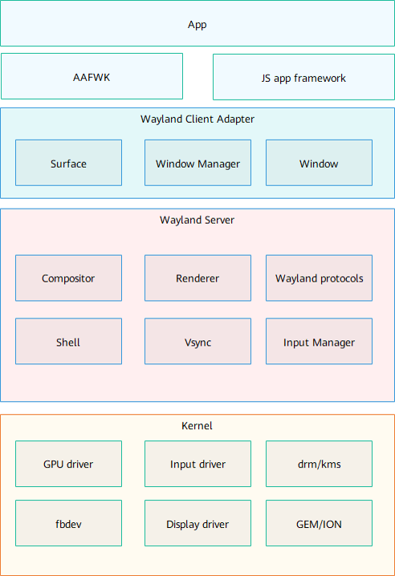

# 图形子系统<a name="ZH-CN_TOPIC_0000001115588688"></a>

-   [1.1 轻量系统](#section1346303311377)
    -   [简介](#section1165992615384)
    -   [目录](#section141331948134020)
    -   [约束](#section15729113104112)
    -   [说明](#section812962919413)
    -   [相关仓](#section12651205434115)

-   [1.2 标准系统](#section1249610812538)
    -   [简介](#section1374615251510)
    -   [目录](#section16751364713)
    -   [约束](#section126494189715)
    -   [编译构建](#section883114292070)
    -   [说明](#section1351214227564)
    -   [相关仓](#section11578621131119)


图形子系统主要包括UI组件、布局、动画、字体、输入事件、窗口管理、渲染绘制等模块，构建基于轻量OS应用框架满足硬件资源较小的物联网设备或者构建基于标准OS的应用框架满足富设备（如平板和轻智能机等）的OpenHarmony系统应用开发。

## 1.1 轻量系统<a name="section1346303311377"></a>

### 简介<a name="section1165992615384"></a>

图形子系统主要包括UI组件、布局、动画、字体、输入事件、窗口管理、渲染绘制等模块，构建基于轻量OS的应用框架，满足硬件资源较小的物联网设备的OpenHarmony系统应用开发。

**图 1**  图形子系统架构图<a name="fig16488143010409"></a>  


各模块介绍：

-   View：应用组件，包括UIView、UIViewGroup、UIButton、UILabel、UILabelButton、UIList、UISlider等。
-   Animator：动画模块，开发者可以自定义动画。
-   Layout：布局控件，包括Flexlayout、GridLayout、ListLayout等。
-   Transform：图形变换模块，包括旋转、平移、缩放等。
-   Event：事件模块，包括click、press、drag、long press等基础事件。
-   Rendering engine：渲染绘制模块。
-   2D graphics library：2D绘制模块，包括直线、矩形、圆、弧、图片、文字等绘制。包括软件绘制和硬件加速能力对接。
-   Multi-language：多语言模块，用于处理不用不同语言文字的换行、整形等。
-   Image library：图片处理模块，用于解析和操作不同类型和格式的图片，例如png、jpeg、ARGB8888、ARGB565等
-   WindowManager：窗口管理模块，包括窗口创建、显示隐藏、合成等处理。
-   InputManager：输入事件管理模块。

### 目录<a name="section141331948134020"></a>

```
/foundation/graphic
├── surface  # 共享内存
├── ui       # UI模块，包括UI控件、动画、字体等功能
├── utils    # 图形基础库和硬件适配层
└── wms      # 窗口管理和输入事件管理
```

### 约束<a name="section15729113104112"></a>

-   图形组件不支持多线程并发操作，建议相关操作都在ui线程中执行；
-   utils/interfaces/innerkits/graphic\_config.h文件列举了图形部分可配置功能的宏开关，需要在编译前配置，配置时需要注意部分宏开关是分平台配置的。

### 说明<a name="section812962919413"></a>

参考各仓README以及test目录

### 相关仓<a name="section12651205434115"></a>

**图形子系统**

graphic\_surface

graphic\_ui

graphic\_wms

graphic\_utils

## 1.2 标准系统<a name="section1249610812538"></a>

### 简介<a name="section1374615251510"></a>

**Graphic子系统**  提供了图形接口能力和窗口管理接口能力， 支持应用程序框架子系统和ACE等子系统使用。支持所有运行标准系统的设备使用。

其主要的结构如下图所示：



-   Surface

    图形缓冲区管理接口，负责管理图形缓冲区和高效便捷的轮转缓冲区。

-   Vsync

    垂直同步信号管理接口，负责管理所有垂直同步信号注册和响应。

-   WindowManager

    窗口管理器接口，负责创建和管理窗口。

-   WaylandProtocols

    窗口管理器和合成器的通信协议。

-   Compositor

    合成器，负责合成各个图层。

-   Renderer

    合成器的后端渲染模块。

-   Wayland protocols

    Wayland 进程间通信协议

-   Shell

    提供多窗口能力

-   Input Manager

    多模输入模块，负责接收事件输


### 目录<a name="section16751364713"></a>

```
foundation/graphic/standard/
├── frameworks              # 框架代码目录
│   ├── bootanimation       # 开机动画目录
│   ├── surface             # Surface代码
│   ├── vsync               # Vsync代码
│   └── wm                  # WindowManager代码
├── interfaces              # 对外接口存放目录
│   ├── innerkits           # native接口存放目录
│   └── kits                # js/napi接口存放目录
└── utils                   # 小部件存放目录
```

### 约束<a name="section126494189715"></a>

语言版本：C++11及以上

### 编译构建<a name="section883114292070"></a>

可以依赖的接口有:

-   graphic\_standard:libwms\_client
-   graphic\_standard:libsurface
-   graphic\_standard:libvsync\_client

### 说明<a name="section1351214227564"></a>

参考各仓README以及test目录

### 相关仓<a name="section11578621131119"></a>

**图形子系统**

graphic\_standard

ace\_ace\_engine

aafwk\_standard

multimedia\_media\_standard

multimedia\_camera\_standard

