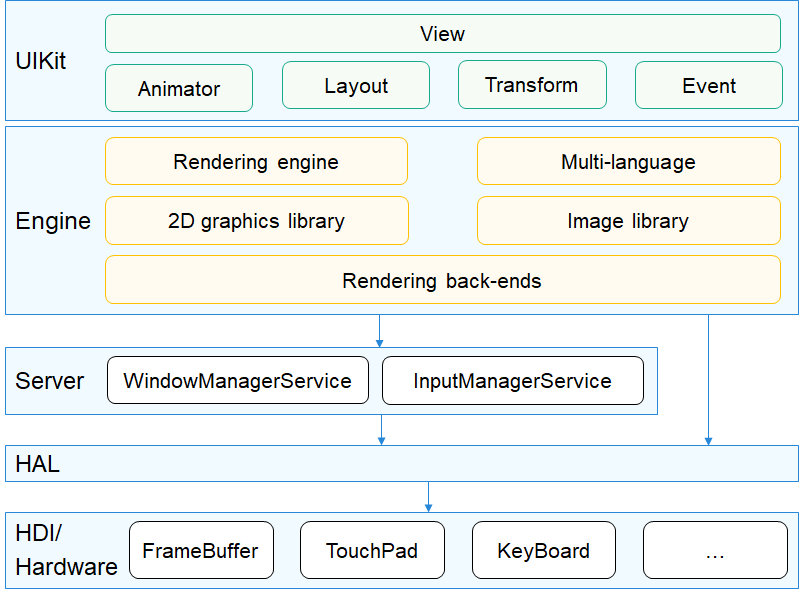
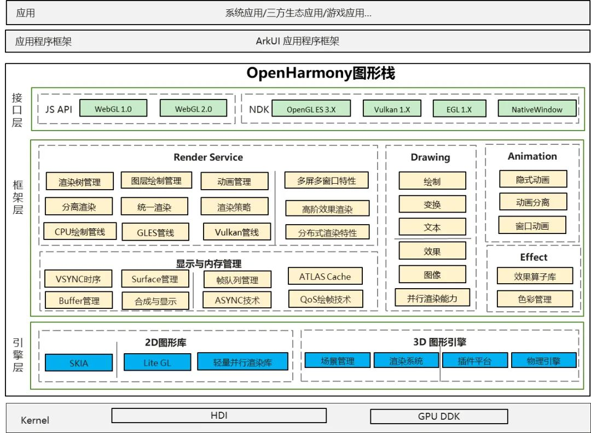

# 图形子系统<a name="ZH-CN_TOPIC_0000001115588688"></a>

图形子系统主要包括UI组件、布局、动画、字体、输入事件、窗口管理、渲染绘制等模块，构建基于轻量OS应用框架满足硬件资源较小的物联网设备或者构建基于标准OS的应用框架满足富设备的OpenHarmony系统应用开发。

## 1.1 轻量系统<a name="section1346303311377"></a>

### 简介<a name="section1165992615384"></a>

图形子系统主要包括UI组件、布局、动画、字体、输入事件、窗口管理、渲染绘制等模块，构建基于轻量OS的应用框架，满足硬件资源较小的物联网设备的OpenHarmony系统应用开发。

**图 1**  图形子系统架构图<a name="fig16488143010409"></a>  


各模块介绍：

-   View：应用组件，包括UIView、UIViewGroup、UIButton、UILabel、UILabelButton、UIList、UISlider等。
-   Animator：动画模块，开发者可以自定义动画。
-   Layout：布局控件，包括FlexLayout、GridLayout、ListLayout等。
-   Transform：图形变换模块，包括旋转、平移、缩放等。
-   Event：事件模块，包括click、press、drag、long press等基础事件。
-   Rendering engine：渲染绘制模块。
-   2D graphics library：2D绘制模块，包括直线、矩形、圆、弧、图片、文字等绘制。包括软件绘制和硬件加速能力对接。
-   Multi-language：多语言模块，用于处理不用不同语言文字的换行、整形等。
-   Image library：图片处理模块，用于解析和操作不同类型和格式的图片，例如png、jpeg、ARGB8888、ARGB565等
-   WindowManager：窗口管理模块，包括窗口创建、显示隐藏、合成等处理。
-   InputManager：输入事件管理模块。

### 目录<a name="section141331948134020"></a>

```
/foundation/arkui
├── ui_lite                  # UI模块，包括UI控件、动画、字体等功能

/foundation/graphic
├── surface_lite             # 共享内存
├── graphic_utils_lite       # 图形基础库和硬件适配层

/foundation/window
└── window_manager_lite      # 窗口管理和输入事件管理
```

### 约束<a name="section15729113104112"></a>

-   图形组件不支持多线程并发操作，建议相关操作都在ui线程中执行；
-   utils/interfaces/innerkits/graphic\_config.h文件列举了图形部分可配置功能的宏开关，需要在编译前配置，配置时需要注意部分宏开关是分平台配置的。

### 说明<a name="section812962919413"></a>

参考各仓README以及test目录

### 相关仓<a name="section12651205434115"></a>

**图形子系统**

[graphic\_surface_lite](https://gitee.com/openharmony/graphic_surface_lite)

[arkui\_ui_lite](https://gitee.com/openharmony/arkui_ui_lite)

[window\_window_manager_lite](https://gitee.com/openharmony/window_window_manager_lite)

[graphic\_graphic_utils_lite](https://gitee.com/openharmony/graphic_graphic_utils_lite)

## 1.2 标准系统<a name="section1249610812538"></a>

### 简介<a name="section1374615251510"></a>

**图形子系统**  提供了图形接口能力。

其主要的结构如下图所示：



OpenHarmony 图形栈的分层说明如下：

• 接口层：提供图形的 Native API能力，包括：WebGL、Native Drawing的绘制能力、OpenGL 指令级的绘制能力支撑等。

• 框架层：分为 Render Service、Drawing、Animation、Effect、显示与内存管理五个模块。
| 模块                     | 能力描述                                                                                       |
|------------------------|--------------------------------------------------------------------------------------------|
| Render Service （渲染服务） | 提供UI框架的绘制能力，其核心职责是将ArkUI的控件描述转换成绘制树信息，根据对应的渲染策略，进行最佳路径渲染。同时，负责多窗口流畅和空间态下UI共享的核心底层机制。       |
| Drawing （绘制）           | 提供图形子系统内部的标准化接口，主要完成2D渲染、3D渲染和渲染引擎的管理等基本功能。                                                |
| Animation (动画）         | 提供动画引擎的相关能力。                                                                               |
| Effect （效果）            | 主要完成图片效果、渲染特效等效果处理的能力，包括：多效果的串联、并联处理，在布局时加入渲染特效、控件交互特效等相关能力。                               |
| 显示与内存管理                | 此模块是图形栈与硬件解耦的主要模块，主要定义了OpenHarmony显示与内存管理的能力，其定义的HDI接口需要让不同的OEM厂商完成对OpenHarmony图形栈的适配． |

• 引擎层：包括2D图形库和3D图形引擎两个模块。2D图形库提供2D图形绘制底层API，支持图形绘制与文本绘制底层能力。3D图形引擎能力尚在构建中。


### 目录<a name="section16751364713"></a>

```
foundation/graphic/standard/
├── figures                 # Markdown引用的图片目录
├── frameworks              # 框架代码目录
│   ├── animation_server    # AnimationServer代码
│   ├── bootanimation       # 开机动画目录
│   ├── dumper              # graphic dumper代码
│   ├── fence               # fence代码
│   ├── surface             # Surface代码
│   ├── vsync               # Vsync代码
├── rosen                   # 框架代码目录
│   ├── build               # 构建说明
│   ├── doc                 # doc
│   ├── include             # 对外头文件代码
│   ├── lib                 # lib
│   ├── modules             # graphic 子系统各模块代码
│   ├── samples             # 实例代码
│   ├── test                # 开发测试代码
│   ├── tools               # 工具代码
├── interfaces              # 图形接口存放目录
│   ├── innerkits           # 内部native接口存放目录
│   └── kits                # js/napi外部接口存放目录
└── utils                   # 小部件存放目录
```

### 约束<a name="section126494189715"></a>

语言版本：C++11及以上

### 编译构建<a name="section883114292070"></a>

### 说明<a name="section1351214227564"></a>

参考各仓README以及test目录

### 相关仓<a name="section11578621131119"></a>

**图形子系统**

- [**graphic_graphic_2d**](https://gitee.com/openharmony/graphic_graphic_2d)
- [arkui_ace_engine](https://gitee.com/openharmony/arkui_ace_engine)
- [ability_ability_runtime](https://gitee.com/openharmony/ability_ability_runtime)
- [multimedia_player_framework](https://gitee.com/openharmony/multimedia_player_framework)
- [multimedia_image_standard](https://gitee.com/openharmony/multimedia_image_standard)
- [Windowmanager](https://gitee.com/openharmony/windowmanager)
- [third_party_egl](https://gitee.com/openharmony/third_party_egl)
- [third_party_opengles](https://gitee.com/openharmony/third_party_opengles)
- [third_party_skia](https://gitee.com/openharmony/third_party_skia)
- [third_party_giflib](https://gitee.com/openharmony/third_party_giflib)
