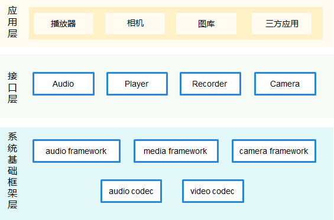
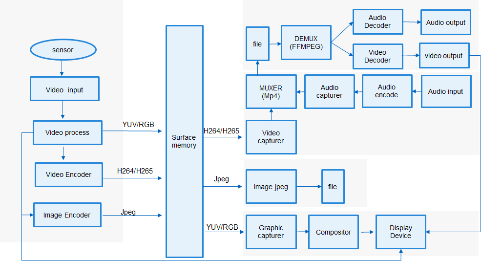

# 媒体子系统<a name="ZH-CN_TOPIC_0000001078026808"></a>

-   [简介](#section11660541593)
-   [目录](#section161941989596)
-   [约束](#section119744591305)
-   [使用说明](#section1312121216216)
-   [安装](#section11914418405)
-   [相关仓](#section1371113476307)

## 简介<a name="section11660541593"></a>

媒体子系统为开发者提供一套简单且易于理解的接口，使得开发者能够方便接入系统并使用系统的媒体资源。

媒体子系统包含了音视频、相机相关媒体业务，提供以下常用功能：

-   音频播放和录制。
-   视频播放和录制。

-   相机拍照和录制。

**图 1**  OpenHarmony媒体子系统通用架构图<a name="fig99659301300"></a>  




**图 2**  OpenHarmony小型媒体子系统架构图<a name="fig11400536715"></a>  


**图 3**  OpenHarmony小型媒体子系统业务流程图<a name="fig199079467553"></a>  




## 目录<a name="section161941989596"></a>

仓目录结构如下：

```
/foundation/multimedia                                 # 媒体子系统业务代码
├── audio_lite                                         # 小型系统音频模块
│   ├── figures                                        # 小型系统音频架构和流程图
│   ├── frameworks                                     # 小型系统音频框架实现
│   └── interfaces                                     # 小型系统音频模块接口
├── audio_standard                                     # 标准系统音频模块
│   ├── figures                                        # 标准系统音频架构和流程图
│   ├── frameworks                                     # 标准系统音频框架实现
│   ├── interfaces                                     # 标准系统音频模块接口
│   ├── sa_profile                                     # 标准系统音频服务配置
│   └── services                                       # 标准系统音频服务实现
├── camera_lite                                        # 小型系统相机模块
│   ├── figures                                        # 小型系统相机架构和流程图
│   ├── frameworks                                     # 小型系统相机框架实现
│   └── interfaces                                     # 小型系统相机模块接口
├── camera_standard                                    # 标准系统相机模块
│   ├── figures                                        # 标准系统相机架构和流程图
│   ├── frameworks                                     # 标准系统相机框架实现
│   └── interfaces                                     # 标准系统相机模块接口
├── media_lite                                         # 小型系统播放录制模块
│   ├── figures                                        # 小型系统播放录制架构和流程图
│   ├── frameworks                                     # 小型系统播放录制框架实现
│   ├── interfaces                                     # 小型系统播放录制模块接口
│   └── services                                       # 小型系统播放录制模块服务
├── media_standard                                     # 标准系统播放录制模块
│   ├── figures                                        # 标准系统播放录制架构和流程图
│   ├── frameworks                                     # 标准系统播放录制框架实现
│   └── interfaces                                     # 标准系统播放录制模块接口
└── utils                                              # 媒体公共模块
    └── lite                                           # 小型系统媒体公共模块
        ├── figures                                    # 小型系统媒体公共模块架构和流程图
        ├── hals                                       # 小型系统媒体公共硬件抽象接口
        ├── interfaces                                 # 小型系统媒体公共模块接口
        └── src                                        # 小型系统媒体公共模块框架实现
```

## 约束<a name="section119744591305"></a>

部分音视频格式的硬件编码、解码功能依赖设备的支持。

## 使用说明<a name="section1312121216216"></a>

如架构图示意，媒体提供了三大类功能接口，开发者可以根据使用诉求，综合使用一类或多类接口：

-   应用开发者使用媒体接口实现录像、预览和播放音视频，使用可以参考《多媒体开发指南》。
-   当使用简单播放录制功能时，可以使用Player和Recorder快速完成播放和录制功能。
-   提供了一组控制相机的有效接口，可以让用户方便开发使用相机。
-   开发者先创建camerakit组件对象，注册各种事件回调，这些事件回调是用来响应多媒体模块中事件响应的，之后调用创建camera就可以创建一个操作camera资源的对象，使用这个对象可以启动预览、录像或抓拍取流，及设置取流的相关参数。

## 安装<a name="section11914418405"></a>

-   请提前加载内核及相关驱动，参考内核及驱动子系统readme。

## 相关仓<a name="section1371113476307"></a>

multimedia\_camera\_lite

multimedia\_audio\_lite

multimedia\_media\_lite

multimedia\_utils\_lite

multimedia\_camera\_standard

multimedia\_audio\_standard

multimedia\_media\_standard

