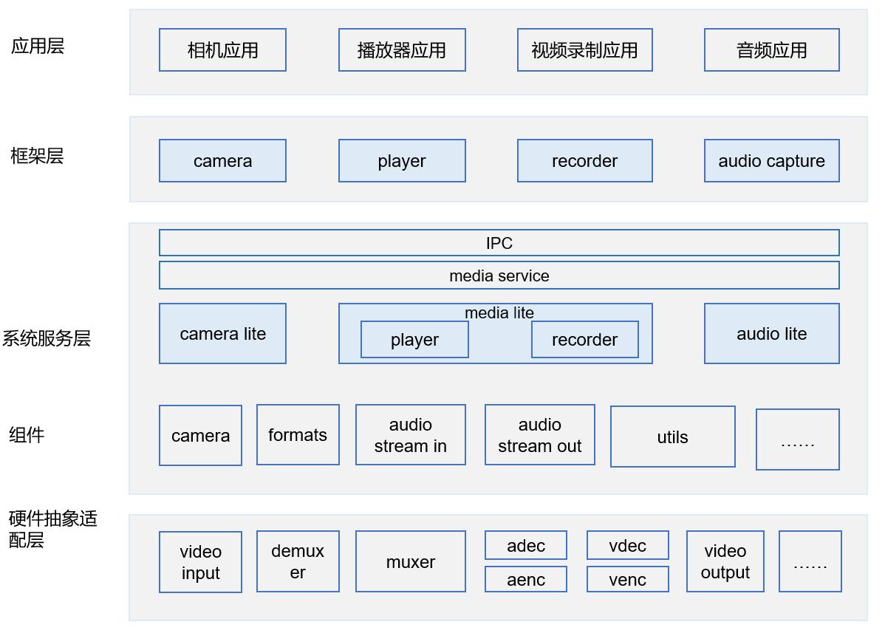
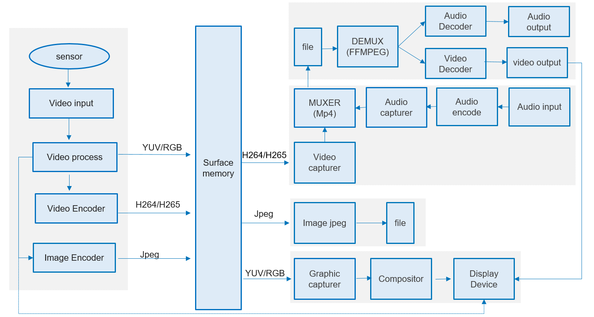

# 媒体子系统<a name="ZH-CN_TOPIC_0000001083456986"></a>

-   [简介](#section38510214395)
-   [目录结构](#section1937963913399)
-   [约束](#section722512541395)
-   [安装](#section11914418405)
-   [使用](#section1467220266400)
-   [涉及仓](#section7666411192217)

## 简介<a name="section38510214395"></a>

该仓主要用于存放媒体子系统的源码信息，旨在为多媒体应用开发者开发者提供统一的开发接口，使得开发者可以专注于应用业务的开发，轻松使用多媒体的资源。下图分别展现媒体子系统的框架及业务流程。

**图 1**  媒体子系统框架图<a name="fig14437165910531"></a>  


媒体子系统框架支持相机、录像和播放业务功能，这些功能支持JS应用开发及各种使用媒体能力的KIT模块开发，媒体子系统框架包括框架层，框架层对外提供应用调用的native接口及其对应的业务实现，针对相机、录像及播放业务，框架层实现了音视频输入输出，音视频编解码，视频文件的打包及解复用等功能。系统服务层，系统服务层利用平台提供的能力去实现对底层硬件及相关驱动使用。

**图 2**  媒体子系统业务流程图<a name="fig69091712152911"></a>  


多媒体包括camera，recorder和player，camera提供YUV、RGB、JPEG以及H264，H265数据到共享内存surface中，recorder模块将surface中h264/h265数据和音频aac数据打包成mp4文件，player模块把mp4文件解复用成音频和视频数据，分别送入对应编码器解码，然后进行播放。

## 目录结构<a name="section1937963913399"></a>

其中媒体子系统框架的源代码目录结构如下（只列举了主要部分）：

```
foundation/multimedia                                      # 媒体子系统主目录
├── audio_lite 
│   ├── frameworks                                     # 音频框架模块实现
│   └── interfaces                                     # 音频框架模块接口定义
├── camera_lite
│   ├── frameworks                                     # 相机框架模块实现
│   └── interfaces                                     # 相机框架模块接口定义
├── media_lite
│   ├── frameworks                                     
│   │   ├── player_lite                               # 播放框架模块实现
│   │   └── recorder_lite                             # 录制框架模块实现
│   └── interfaces
│   │   └── kits
│   │       ├── player_lite                            # 播放框架模块接口实现
│   │       └── recorder_lite                          # 录制框架模块接口实现
│   ├── services                                        # 服务启动代码
│   └── test                                            # 测试代码
└── utils
    └── lite                                            # 应用接口通用模块实现
         └── hals                                       # 定义媒体适配的接口头文件
```

## 约束<a name="section722512541395"></a>

-   C++11版本或以上

## 安装<a name="section11914418405"></a>

-   请提前加载内核及相关驱动，参考内核及驱动子系统readme。
-   配置合适的配置文件，可以参考applications/sample/camera/media下配置文件，如果适配其他sensor可在开源社区中求助。用户使用时将配置文件放入到开发板/storage/data目录，开发者通过该配置文件可以去适配sensor及分辨率、帧率等能力。

## 使用<a name="section1467220266400"></a>

Native应用接口调用可以参考applications/sample/camera/media下demo实现

应用开发者使用多媒体接口实现录像、预览和播放音视频，使用可以参考《多媒体开发指南》。

开发者先创建camerakit组件对象，注册各种事件回调，这些事件回调是用来响应多媒体模块中事件响应的，之后调用创建camera就可以创建一个操作camera资源的对象，使用这个对象可以启动预览、录像或抓拍取流，及设置取流的相关参数。

重写事件类的代码实例如下：

```
#include "camera_kit.h"
#include "recorder.h"

#include <algorithm>
#include <cstring>
#include <fcntl.h>
#include <fstream>
#include <iostream>
#include <sstream>
#include <sys/stat.h>
#include <sys/time.h>
#include <sys/types.h>
#include <unistd.h>

using namespace std;
using namespace OHOS;
using namespace OHOS::Media;

static int32_t SampleGetRecordFd()
{
    struct timeval tv = {};
    gettimeofday(&tv, nullptr);
    struct tm *ltm = localtime(&tv.tv_sec);
    int32_t fd = -1;
    if (ltm != nullptr) {
        ostringstream ss("Capture_");
        ss << "Record" << ltm->tm_hour << "-" << ltm->tm_min << "-" << ltm->tm_sec << ".mp4";
        fd = open(("/sdcard/" + ss.str()).c_str(), O_RDWR | O_CREAT, S_IRUSR | S_IWUSR);
        cout << "Open "
             << "/sdcard/" << ss.str() << endl;

        if (fd == -1) {
            cout << "Open recorder file failed. strerr=" << strerror(errno) << endl;
        }
    }
    return fd;
}

static void SampleSaveCapture(const char *p, uint32_t size)
{
    cout << "Start saving picture" << endl;
    struct timeval tv = {};
    gettimeofday(&tv, nullptr);
    struct tm *ltm = localtime(&tv.tv_sec);
    if (ltm != nullptr) {
        ostringstream ss("Capture_");
        ss << "Capture" << ltm->tm_hour << "-" << ltm->tm_min << "-" << ltm->tm_sec << ".jpg";

        ofstream pic("/sdcard/" + ss.str(), ofstream::out | ofstream::trunc);
        cout << "write " << size << " bytes" << endl;
        pic.write(p, size);
        pic.close();
        cout << "Saving picture end" << endl;
    }
}

Recorder *SampleCreateRecorder()
{
    int ret = 0;
    int32_t sampleRate = 48000;
    int32_t channelCount = 1;
    AudioCodecFormat audioFormat = AAC_LC;
    AudioSourceType inputSource = AUDIO_MIC;
    int32_t audioEncodingBitRate = sampleRate;
    VideoSourceType source = VIDEO_SOURCE_SURFACE_ES;
    int32_t frameRate = 30;
    double fps = 30;
    int32_t rate = 4096;
    int32_t sourceId = 0;
    int32_t audioSourceId = 0;
    int32_t width = 1920;
    int32_t height = 1080;
    VideoCodecFormat encoder;
    encoder = HEVC;
    width = 1920;
    height = 1080;
    Recorder *recorder = new Recorder();
    if ((ret = recorder->SetVideoSource(source, sourceId)) != SUCCESS) {
        cout << "SetVideoSource failed." << ret << endl;
        goto ERROR;
    }
    if ((ret = recorder->SetVideoEncoder(sourceId, encoder)) != SUCCESS) {
        cout << "SetVideoEncoder failed." << ret << endl;
        goto ERROR;
    }
    if ((ret = recorder->SetVideoSize(sourceId, width, height)) != SUCCESS) {
        cout << "SetVideoSize failed." << ret << endl;
        goto ERROR;
    }
    if ((ret = recorder->SetVideoFrameRate(sourceId, frameRate)) != SUCCESS) {
        cout << "SetVideoFrameRate failed." << ret << endl;
        goto ERROR;
    }
    if ((ret = recorder->SetVideoEncodingBitRate(sourceId, rate)) != SUCCESS) {
        cout << "SetVideoEncodingBitRate failed." << ret << endl;
        goto ERROR;
    }
    if ((ret = recorder->SetCaptureRate(sourceId, fps)) != SUCCESS) {
        cout << "SetCaptureRate failed." << ret << endl;
        goto ERROR;
    }
    if ((ret = recorder->SetAudioSource(inputSource, audioSourceId)) != SUCCESS) {
        cout << "SetAudioSource failed." << ret << endl;
        goto ERROR;
    }
    if ((ret = recorder->SetAudioEncoder(audioSourceId, audioFormat)) != SUCCESS) {
        cout << "SetAudioEncoder failed." << ret << endl;
        goto ERROR;
    }
    if ((ret = recorder->SetAudioSampleRate(audioSourceId, sampleRate)) != SUCCESS) {
        cout << "SetAudioSampleRate failed." << ret << endl;
        goto ERROR;
    }
    if ((ret = recorder->SetAudioChannels(audioSourceId, channelCount)) != SUCCESS) {
        cout << "SetAudioChannels failed." << ret << endl;
        goto ERROR;
    }
    if ((ret = recorder->SetAudioEncodingBitRate(audioSourceId, audioEncodingBitRate)) != SUCCESS) {
        cout << "SetAudioEncodingBitRate failed." << ret << endl;
        goto ERROR;
    }
    if ((ret = recorder->SetMaxDuration(36000)) != SUCCESS) { // 36000s=10h
        cout << "SetAudioEncodingBitRate failed." << ret << endl;
        goto ERROR;
    }
    return recorder;

ERROR:
    delete recorder;
    return nullptr;
}

class SampleFrameStateCallback : public FrameStateCallback {
    void OnFrameFinished(Camera &camera, FrameConfig &fc, FrameResult &result) override
    {
        cout << "Receive frame complete inform." << endl;
        if (fc.GetFrameConfigType() == FRAME_CONFIG_CAPTURE) {
            cout << "Capture frame received." << endl;
            list<Surface *> surfaceList = fc.GetSurfaces();
            for (Surface *surface : surfaceList) {
                SurfaceBuffer *buffer = surface->AcquireBuffer();
                if (buffer != nullptr) {
                    char *virtAddr = static_cast<char *>(buffer->GetVirAddr());
                    if (virtAddr != nullptr) {
                        SampleSaveCapture(virtAddr, buffer->GetSize());
                    }
                    surface->ReleaseBuffer(buffer);
                }
                delete surface;
            }
        }
        delete &fc;
    }
};

class SampleCameraStateMng : public CameraStateCallback {
public:
    SampleCameraStateMng() = delete;
    SampleCameraStateMng(EventHandler &eventHdlr) : eventHdlr_(eventHdlr) {}
    ~SampleCameraStateMng()
    {
        CloseRecorder();
    }
    void OnCreated(Camera &c) override
    {
        cout << "Sample recv OnCreate camera." << endl;
        auto config = CameraConfig::CreateCameraConfig();
        config->SetFrameStateCallback(&fsCb_, &eventHdlr_);
        c.Configure(*config);
        cam_ = &c;
    }
    void OnCreateFailed(const std::string cameraId, int32_t errorCode) override {}
    void OnReleased(Camera &c) override {}

    void CloseRecorder()
    {
        if (recorder_ != nullptr) {
            recorder_->Stop(true);
            recorder_->Release();
            delete recorder_;
            recorder_ = nullptr;
        }
        if (recordFd_ != -1) {
            close(recordFd_);
            recordFd_ = -1;
        }
    }

    int PrepareRecorder()
    {
        if (cam_ == nullptr) {
            cout << "Camera is not ready." << endl;
            return -1;
        }
        if (recorder_ == nullptr) {
            recorder_ = SampleCreateRecorder();
        }
        if (recorder_ == nullptr) {
            cout << "Recorder not available." << endl;
            return -1;
        }
        if (recordFd_ == -1) {
            recordFd_ = SampleGetRecordFd();
        }
        if (recordFd_ == -1) {
            cout << "Create fd failed." << endl;
            return -1;
        }
        return SUCCESS;
    }

    void StartRecord()
    {
        if (recordState_ == STATE_RUNNING) {
            cout << "Camera is already recording." << endl;
            return;
        }
        int ret = PrepareRecorder();
        if (ret != SUCCESS) {
            cout << "PrepareRecorder failed." << endl;
            CloseRecorder();
            return;
        }
        ret = recorder_->SetOutputFile(recordFd_);
        if (ret != SUCCESS) {
            cout << "SetOutputPath failed. ret=" << ret << endl;
            CloseRecorder();
            return;
        }
        ret = recorder_->Prepare();
        if (ret != SUCCESS) {
            cout << "Prepare failed. ret=" << ret << endl;
            CloseRecorder();
            return;
        }
        ret = recorder_->Start();
        if (ret != SUCCESS) {
            cout << "recorder start failed. ret=" << ret << endl;
            CloseRecorder();
            return;
        }
        FrameConfig *fc = new FrameConfig(FRAME_CONFIG_RECORD);
        Surface *surface = (recorder_->GetSurface(0)).get();
        surface->SetWidthAndHeight(1920, 1080);
        surface->SetQueueSize(3);
        surface->SetSize(1024 * 1024);
        fc->AddSurface(*surface);
        ret = cam_->TriggerLoopingCapture(*fc);
        if (ret != 0) {
            delete fc;
            CloseRecorder();
            cout << "camera start recording failed. ret=" << ret << endl;
            return;
        }
        recordState_ = STATE_RUNNING;
        cout << "camera start recording succeed." << endl;
    }

    void StartPreview()
    {
        if (cam_ == nullptr) {
            cout << "Camera is not ready." << endl;
            return;
        }
        if (previewState_ == STATE_RUNNING) {
            cout << "Camera is already previewing." << endl;
            return;
        }
        FrameConfig *fc = new FrameConfig(FRAME_CONFIG_PREVIEW);
        Surface *surface = Surface::CreateSurface();
        if (surface == nullptr) {
            delete fc;
            cout << "CreateSurface failed" << endl;
            return;
        }
        surface->SetWidthAndHeight(1920, 1080); /* 1920:width,1080:height */
        surface->SetUserData("region_position_x", "0");
        surface->SetUserData("region_position_y", "0");
        surface->SetUserData("region_width", "480");
        surface->SetUserData("region_height", "480");
        fc->AddSurface(*surface);
        int32_t ret = cam_->TriggerLoopingCapture(*fc);
        if (ret != 0) {
            delete fc;
            cout << "camera start preview failed. ret=" << ret << endl;
            return;
        }
        delete surface;
        previewState_ = STATE_RUNNING;
        cout << "camera start preview succeed." << endl;
    }
    void Capture()
    {
        if (cam_ == nullptr) {
            cout << "Camera is not ready." << endl;
            return;
        }
        FrameConfig *fc = new FrameConfig(FRAME_CONFIG_CAPTURE);
        Surface *surface = Surface::CreateSurface();
        if (surface == nullptr) {
            delete fc;
            cout << "CreateSurface failed" << endl;
            return;
        }
        surface->SetWidthAndHeight(1920, 1080); /* 1920:width,1080:height */
        fc->AddSurface(*surface);
        cam_->TriggerSingleCapture(*fc);
    }
    void Stop()
    {
        if (cam_ == nullptr) {
            cout << "Camera is not ready." << endl;
            return;
        }
        cam_->StopLoopingCapture();
        if (recordState_ == STATE_RUNNING) {
            CloseRecorder();
        }
        recordState_ = STATE_IDLE;
        previewState_ = STATE_IDLE;
    }

private:
    enum State : int32_t { STATE_IDLE, STATE_RUNNING, STATE_BUTT };
    State previewState_ = STATE_IDLE;
    State recordState_ = STATE_IDLE;
    EventHandler &eventHdlr_;
    Camera *cam_ = nullptr;
    int32_t recordFd_ = -1;
    Recorder *recorder_ = nullptr;
    SampleFrameStateCallback fsCb_;
};

class SampleCameraDeviceCallback : public CameraDeviceCallback {
};

void SampleHelp()
{
    cout << "*******************************************" << endl;
    cout << "Select the behavior of avrecorder." << endl;
    cout << "1: Capture" << endl;
    cout << "2: Record(Press s to stop)" << endl;
    cout << "3: Preview(Press s to stop)" << endl;
    cout << "q: quit the sample." << endl;
    cout << "*******************************************" << endl;
}

int main()
{
    cout << "Camera sample begin." << endl;
    SampleHelp();
    CameraKit *camKit = CameraKit::GetInstance();
    if (camKit == nullptr) {
        cout << "Can not get CameraKit instance" << endl;
        return 0;
    }
    list<string> camList = camKit->GetCameraIds();
    string camId;
    for (auto &cam : camList) {
        cout << "camera name:" << cam << endl;
        const CameraAbility *ability = camKit->GetCameraAbility(cam);
        /* find camera which fits user's ability */
        list<CameraPicSize> sizeList = ability->GetSupportedSizes(0);
        for (auto &pic : sizeList) {
            if (pic.width == 1920 && pic.height == 1080) {
                camId = cam;
                break;
            }
        }
    }

    if (camId.empty()) {
        cout << "No available camera.(1080p wanted)" << endl;
        return 0;
    }

    EventHandler eventHdlr; // Create a thread to handle callback events
    SampleCameraStateMng CamStateMng(eventHdlr);

    camKit->CreateCamera(camId, CamStateMng, eventHdlr);

    char input;
    while (cin >> input) {
        switch (input) {
            case '1':
                CamStateMng.Capture();
                break;
            case '2':
                CamStateMng.StartRecord();
                break;
            case '3':
                CamStateMng.StartPreview();
                break;
            case 's':
                CamStateMng.Stop();
                break;
            case 'q':
                CamStateMng.Stop();
                goto EXIT;
            default:
                SampleHelp();
                break;
        }
    }
EXIT:
    cout << "Camera sample end." << endl;
    return 0;
}
```

## 涉及仓<a name="section7666411192217"></a>

/hmf/multimedia/camera\_lite

/hmf/multimedia/audio\_lite

/hmf/multimedia/media\_lite

/hmf/multimedia/utils\_lite

