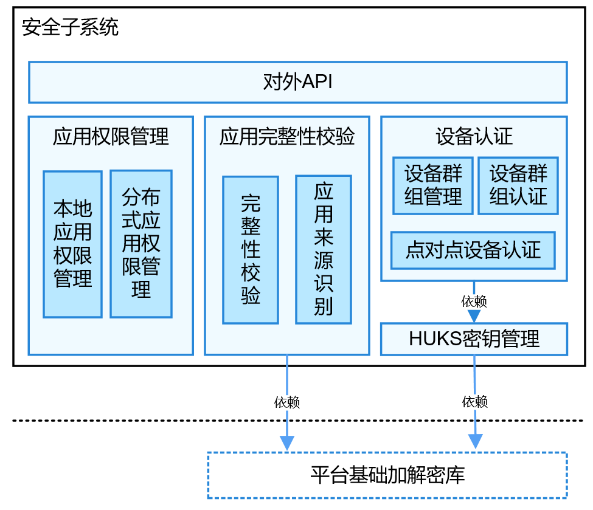

# 安全子系统<a name="ZH-CN_TOPIC_0000001087014383"></a>

-   [简介](#section11660541593)
-   [系统架构](#section342962219551)
-   [目录](#section92711824195113)
-   [约束](#section7715171045219)
-   [使用](#section2057642312536)
-   [相关仓](#section155556361910)

## 简介<a name="section11660541593"></a>

安全子系统包括系统安全、数据安全、应用安全等功能，为OpenHarmony提供有效保护应用和用户数据的能力。

安全子系统当前开源的功能，包括应用完整性保护、应用权限管理、设备认证、密钥管理服务、数据传输管控。

## 系统架构<a name="section342962219551"></a>

**图 1**  子系统架构图<a name="fig4460722185514"></a>  




**对外API**：安全子系统的对外API，部分API只针对系统应用开放；

**应用权限管理**：为程序框架子系统提供权限管理功能，并且为上层应用提供权限申请和授权状态查询接口；

**应用完整性校验**：提供对应用完整性校验的能力，为应用签名、应用安装校验提供能力支撑；

**设备认证**：为分布式设备互联提供密钥协商和可信设备管理能力；

**HUKS密钥管理**：为系统提供密钥管理服务，用于支撑基础的设备认证。

**数据传输管控**：提供了数据传输管控相关的接口定义。

## 目录<a name="section92711824195113"></a>

```
/base/security
├── appverify                       # 应用完整性校验
├── dataclassification              # 数据传输管控
├── device_auth                     # 设备认证
├── huks                            # HUKS密钥管理
└── permission                      # 权限管理
```

## 约束<a name="section7715171045219"></a>

-   应用权限管理的约束说明：本期开源包括应用本地权限管理；分布式应用权限管理在本期不开源（使用打桩实现的方式支持上层分布式业务进行联调）。
-   设备认证的约束说明：设备认证包括同帐号设备认证与帐号无关点对点设备认证；当前已开源的是帐号无关点对点认证能力，同帐号设备认证在本期不开源（使用打桩实现的方式支持上层分布式业务进行联调）。
-   应用完整性校验说明：应用完整性校验在OpenHarmony中使用的证书，是专为OpenHarmony生成的，涉及的公钥证书和对应的私钥均预置在OpenHarmony开源代码仓中，为开源社区提供离线签名和校验能力；在商用版本中应替换此公钥证书和对应的私钥。

## 使用<a name="section2057642312536"></a>

**应用权限管理**

OpenHarmony中应用和系统服务均运行在独立的沙箱中，进程空间和程序数据都是相互隔离的，以保护应用数据的安全性；但是运行在独立沙箱中的服务或应用同时需要对外提供一些API以实现所需功能，其他独立沙箱中的应用在跨进程访问这些API时，需要系统提供一种权限管理机制对这些API的访问者进行授权。

应用权限管理提供了权限定义机制，允许系统服务和应用为自己的敏感API定义新的权限，其他应用必须申请此权限才能访问此敏感API；

应用权限管理提供了权限申请机制，允许应用申请权限，这些权限由系统或者其他应用定义，权限申请通过后就能访问这个权限相关的系统或其他应用提供的敏感API；

应用权限管理也为用户提供了一些必需的功能，方便用户查看和管理权限授予情况。

**应用完整性校验**

OpenHarmony允许应用安装。为了确保应用的完整性和来源可靠，需要对安装的应用进行签名和验签。

应用开发阶段：开发者完成开发并生成安装包后，需要开发者对安装包进行签名，以证明安装包发布到设备的过程中没有被篡改。OpenHarmony的应用完整性校验模块提供了签名工具、签名证书生成规范，以及签名所需的公钥证书等完整的机制，支撑开发者对应用安装包签名。为了方便开源社区开发者，版本中预置了公钥证书和对应的私钥，为开源社区提供离线签名和校验能力；在商用版本中应替换此公钥证书和对应的私钥。

应用安装阶段：OpenHarmony程序框架子系统负责应用的安装。在接收到应用安装包之后，应用程序框架子系统需要解析安装包的签名数据，然后使用应用完整性校验模块的API对签名进行验证，只有校验成功之后才允许安装此应用.  应用完整性校验模块在校验安装包签名数据时，会使用系统预置的公钥证书进行验签。

**设备认证与HUKS**

设备认证的目标是实现归一化的设备认证方案，实现覆盖1+8+N设备的设备绑定/认证方案。通常来讲，设备认证在认证阶段用于支撑软总线，不直接对上层应用提供服务。设备认证的使用主要包括如下内容：

1. 统一可信关系建立：支持账号无关设备群组关系的建立并统一维护。业务启动/通过扫码绑定等方式与其他设备建立互信关系后，请求在本地创建帐号无关设备互信群组；业务可以通过API对可信设备群组进行查询

2. 统一设备认证：基于已建立的可信设备群组，提供统一的设备群组认证方案，支撑软总线的统一设备发现、连接认证、端到端加密的会话秘钥协商；

3. 设备认证用到的相关凭证和密钥协商协议所需的算法，依赖HUKS提供支撑；

**数据传输管控**

在OpenHarmony中，数据传输管控模块负责为分布式服务提供数据跨设备传输时的管控策略。数据传输管控模块提供了数据传输管控相关的接口定义。

数据传输管控模块当前提供如下接口定义：

-   数据传输管控接口：为分布式服务提供数据跨设备传输时的管控策略，获取允许发送到对端设备的数据的最高风险等级。

## 相关仓<a name="section155556361910"></a>

安全子系统

[security_dataclassification](https://gitee.com/openharmony/security_dataclassification)

[security_access_token](https://gitee.com/openharmony/security_access_token)

[security_huks](https://gitee.com/openharmony/security_huks)

[security_selinux](https://gitee.com/openharmony/security_selinux)

[security](https://gitee.com/openharmony/security)

[security_device_auth](https://gitee.com/openharmony/security_device_auth)

[security_permission_lite](https://gitee.com/openharmony/security_permission_lite)

[security_device_security_level](https://gitee.com/openharmony/security_device_security_level)

[security_appverify](https://gitee.com/openharmony/security_appverify)

[security_itrustee_ree_lite](https://gitee.com/openharmony/security_itrustee_ree_lite)
