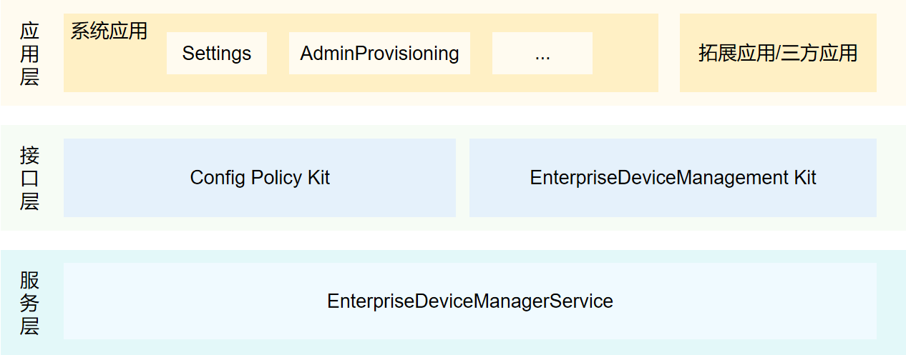

# 定制子系统

-   [简介](#简介)
-   [系统架构](#系统架构)
-   [目录](#目录)
-   [相关仓](相关仓)

## 简介

当OpenHarmony设备或应用在特定行业、地域等场景下使用时，需要对系统进行不同程度的定制以满足特定场景的使用需求。定制子系统提供支持企业设备管理和配置策略的能力。

|    子模块名称    | 职责                                                         |
| :--------------: | ------------------------------------------------------------ |
|     配置策略     | 为各业务模块提供获取各配置层级的配置目录或配置文件路径的接口。 |
| 企业设备管理组件 | 为企业MDM（Mobile Device Management）应用开发者提供管理应用的开发框架，设定管理模式，提供企业设备管理功能能力集。同时为企业环境下的应用提供系统级别的API。 |


## 系统架构

**图 1**  定制子系统架构图





-   应用层

    系统应用，拓展应用/三方应用调用接口层的接口，来配置功能或获取指定的数据。

-   接口层

    EnterpriseDeviceManagement Kit为企业环境下的应用提供系统级别的管理功能API。Config Policy Kit为各业务模块提供获取各配置层级的配置目录或配置文件路径的API。
    
- 服务层

    EnterpriseDeviceManagerService为EnterpriseDeviceManagement Kit接口层提供具体的实现能力，保证业务正常运行。

## 目录

定制子系统源代码在/base/customization目录下。目录结构如下所示：

```
/base/customization/
├── config_policy           		# 配置策略代码仓
│   ├── frameworks          		# 配置策略核心代码
│   │   ├── config_policy   		# 配置策略模块
│   │   │   └── src         		# 实现代码
│   ├── interfaces          		# 配置策略接口
│   │   ├── inner_api       		# 配置策略子系统间接口
│   │   └── kits            		# 配置策略JavaScript接口
│   └── test                		# 测试代码
├── enterprise_device_management    # 企业设备管理代码仓
│   ├── common                   	# 公共代码
│   ├── etc                      	# 组件包含的进程的配置文件
│   ├── interfaces               	# EdmKits代码
│   │   └── inner_api            	# 子系统接口
│   │   └── kits                 	# 开发者接口
│   ├── profile                  	# 组件包含的系统服务的配置文件
│   └── services                 	# 企业设备管理服务实现
```

## 相关仓

**定制子系统**

[customization_config_policy](https://gitee.com/openharmony/customization_config_policy)

[customization_enterprise_device_management](https://gitee.com/openharmony/customization_enterprise_device_management)

[applications_admin_provisioning](https://gitee.com/openharmony/applications_admin_provisioning)
