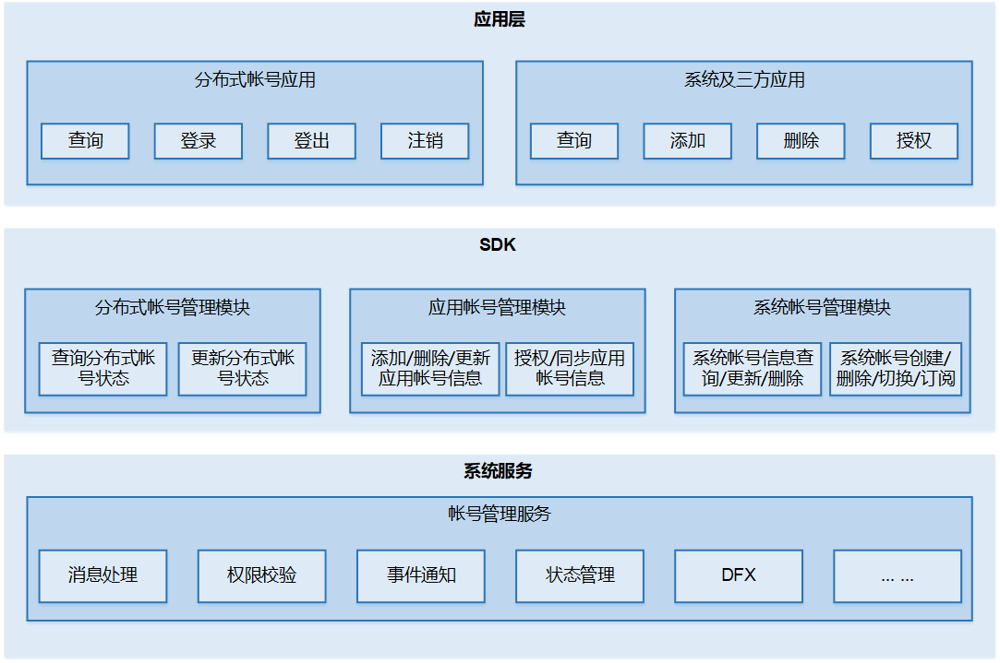

# 账号子系统

## 简介

在标准系统上，账号子系统主要提供系统账号生命周期管理，分布式账号登录状态管理和应用账号信息管理等基础能力。

## 架构图

**图 1**  账号子系统架构图




## 目录

```
/base/account/os_account
├── dfx                      
│   ├── hidumper_adapter     系统服务信息导出适配器代码          
│   ├── hisysevent_adapter   系统事件打点适配器代码          
├── figures                  README图片
├── frameworks               账号子系统kit代码
│   ├── account_iam          账号身份认证和访问管理内部API代码
│   │   └── src              账号身份认证和访问管理内部API实现代码          
│   ├── appaccount           应用账号内部API代码
│   │   └── native           应用账号内部API实现代码
│   ├── common               共通模块代码
│   │   ├── account_error    错误码
│   │   ├── database         数据库基础代码
│   │   ├── file_operator    文件操作代码
│   │   ├── log              打印日志代码
│   │   ├── perf_stat        性能统计
│   │   └── test             共通模块测试代码
│   ├── ohosaccount          分布式账号内部API代码
│   │   ├── native           分布式账号内部API实现代码
│   │   └── test             分布式账号内部API测试代码
│   └── osaccount            系统账号内部API代码
│       ├── core             系统账号ipc
│       └── native           系统账号内部API实现代码
├── interfaces               账号子系统对外公开的API
│   ├── innerkits            内部API头文件
│   │   ├── account_iam      账号身份认证和访问管理
│   │   ├── appaccount       应用账号内部API头文件
│   │   ├── ohosaccount      分布式账号内部API头文件
│   │   └── osaccount        系统账号内部API头文件
│   └── kits                 对外API封装
│       └── napi             账号子系统对外API封装代码
├── sa_profile               账号子系统SA配置文件定义目录
├── services                 账号子系统accountmgr服务代码
│   └── accountmgr           账号子系统服务代码
│       ├── include          账号子系统服务代码头文件
│       ├── src              账号子系统服务代码源文件
│       └── test             账号子系统服务测试
├── test                     测试代码
│   ├── fuzztest             模糊测试代码
│   ├── resource             测试资源文件
│   └── systemtest           系统测试代码
└── tools                    acm工具代码
    ├── acm                  acm工具代码
    │   ├── include          acm工具代码头文件
    │   └── src              acm工具代码源文件
    └── test                 acm工具测试代码
```

## 说明

### 模块说明
|**模块名**  |**描述**    |
|---|---|
|系统账号 |提供系统账号的添加、删除、查询、修改、订阅和启动等功能。 |
|分布式账号 |提供分布式账号登录状态管理能力，支持在端侧对接厂商云账号应用，提供云账号登录状态查询和更新能力。 |
|应用账号 |提供应用账号的添加、删除、查询、修改和鉴权等功能。 |

### 使用说明

[1. 系统账号](https://gitee.com/openharmony/docs/blob/master/zh-cn/application-dev/reference/apis-basic-services-kit/js-apis-osAccount.md)

[2. 分布式账号](https://gitee.com/openharmony/docs/blob/master/zh-cn/application-dev/reference/apis-basic-services-kit/js-apis-distributed-account.md)

[3. 应用账号](https://gitee.com/openharmony/docs/blob/master/zh-cn/application-dev/reference/apis-basic-services-kit/js-apis-appAccount.md)

## 相关仓

**账号子系统**

[account_os_account](https://gitee.com/openharmony/account_os_account)

