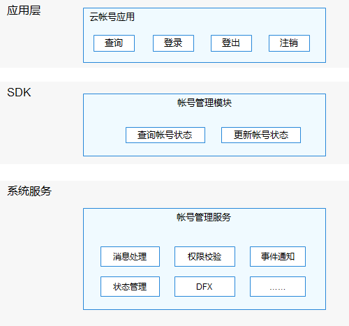

# 帐号子系统<a name="ZH-CN_TOPIC_0000001078092678"></a>

-   [简介](#section11660541593)
-   [子系统架构图](#section1412183212132)
-   [目录](#section161941989596)
-   [使用说明](#section1312121216216)
-   [相关仓](#section1371113476307)

## 简介<a name="section11660541593"></a>

在标准系统上，帐号子系统主要提供分布式帐号登录状态管理能力，支持在端侧对接厂商云帐号应用，提供云帐号登录状态查询和更新的管理能力。

## 子系统架构图<a name="section1412183212132"></a>

**图 1**  帐号子系统架构图<a name="fig4460722185514"></a>




## 目录<a name="section161941989596"></a>

```
/base/account
└── os_account              # 系统帐号组件
    ├── common              # 公共基础模块
    ├── interfaces          # 对外接口存放目录
    ├── kits                # 系统帐号组件开发框架
    ├── sa_profile          # 帐号SA配置文件定义目录
    ├── services            # 系统帐号组件服务代码
    └── test                # 系统帐号组件测试代码
        └── resource        # 系统帐号组件测试资源
```

## 使用说明<a name="section1312121216216"></a>

通过提供的分布式帐号管理类，可以查询和更新帐号登录状态，包括登录、登出、注销及Token失效。

查询和更新分布式帐号登录状态，需要系统权限，仅支持系统应用。

## 相关仓<a name="section1371113476307"></a>

**帐号子系统**

[account_os_account](https://gitee.com/openharmony/account_os_account)

