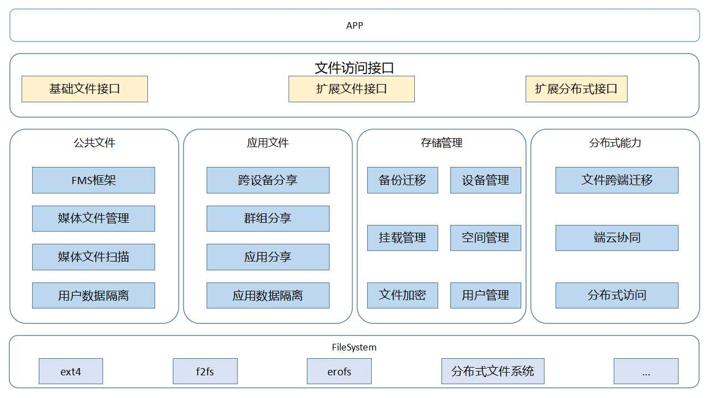

# 文件管理子系统

## 简介

文件管理子系统为OpenHarmony提供一套完整的文件数据管理解决方案，提供安全、易用的文件访问能力和完善的文件存储管理能力，包括：

1. 为应用提供安全的沙箱隔离技术，保证应用数据安全基础上权限最小化；
2. 统一的公共文件管理能力，统一公共数据访问入库，保证用户数据安全、纯净；
3. 分布式文件系统和云接入文件系统访问框架，应用可以像使用本地文件一样使用分布式和云端文件；
4. 支持公共数据、跨应用、跨设备的系统级文件分享能力；
5. 提供系统的存储管理能力和基础文件系统能力。

**图 1**  文件管理子系统架构图

文件管理子系统对应用提供文件访问框架、文件分享框架、存储管理框架能力。

| 模块         | 详细描述                                                     |
| ------------ | ------------------------------------------------------------ |
| 文件访问接口 | 1. 提供完整文件JS 接口，支持基础文件访问能力；  2. 提供本地文件、分布式文件扩展接口。 |
| 存储管理     | 1. 提供数据备份恢复框架能力，支持系统和应用数据备份克隆等场景；  2. 提供应用空间清理和统计、配额管控等空间管理能力； 3. 提供挂载管理、外卡管理、设备管理及多用户管理等存储存储管理能力。 |
| 公共文件     | 1.  公共数据沙箱隔离，保证用户数据安全、纯净；  2. 统一公共数据访问入口，仅medialibrary；  3. 提供统一的FMF的文件管理框架。 |
| 应用文件     | 1. 为应用提供安全的沙箱隔离技术，保证应用数据安全基础上权限最小化；  2. 支持应用间文件分享和文件跨设备分享，支持群组分享。 |
| 分布式能力   | 1. 提供基础分布式跨端访问能力，支持同账号分布式访问和异账号临时访问；  2. 支持文件跨端迁移能力，支撑应用迁移、分布式剪切板等分布式场景。 |
| 基础文件系统 | 1. 支持ext4、f2fs、exfat、ntfs等本地文件系统；  2. 支持分布式文件系统、nfs等网络文件系统； 3. 文件系统相关工具。 |

## 相关仓

公共文件管理

[filemanagement_user_file_service](https://gitee.com/openharmony/filemanagement_user_file_service)

应用文件管理

[filemanagement_app_file_service](https://gitee.com/openharmony/filemanagement_app_file_service)

文件接口

[filemanagement_file_api](https://gitee.com/openharmony/filemanagement_file_api)

存储管理

[filemanagement_storage_service](https://gitee.com/openharmony/filemanagement_storage_service)

分布式文件

 [filemanagement_dfs_service](https://gitee.com/openharmony/filemanagement_dfs_service)

