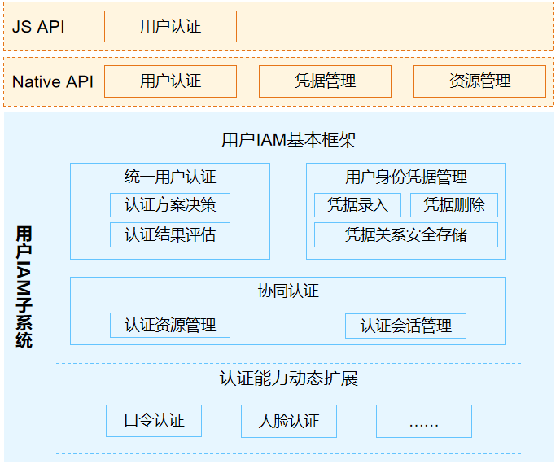

# 用户IAM子系统

## 简介

用户身份和访问管理子系统，下称用户IAM（Identity and Access Management），旨在为OpenHarmony提供统一用户身份凭据管理和身份认证的能力，支持多用户分别设置凭据信息，并根据用户设置的凭据信息提供用户身份认证功能，支撑锁屏和支付等安全场景。同时，用户IAM子系统也提供对外的接口供三方应用调用，实现业务对用户的访问控制要求。

**图1**  子系统架构图



用户IAM子系统分为统一用户认证框架和认证执行器两个部分，其中**统一用户认证框架**部分包含：

- **统一用户认证：** 对外提供统一用户身份认证功能，并且开放生物特征认证相关功能给三方应用调用。
- **用户身份凭据管理：** 向上提供系统内统一的用户身份凭据信息管理接口，向下通过认证执行器管理模块，调用系统内的认证资源，完成用户身份凭据的生命周期管理和安全存储。
- **认证执行器管理：** 提供认证资源管理和认证会话管理功能，支持系统内身份认证相关**执行器**<sup>注</sup>统一管理和协同调度，支持不同类型的身份认证执行器灵活对接。

基于统一用户认证框架，系统可以扩展支持多种认证能力。OpenHarmony框架当前已经支持的**认证执行器**包含口令执行器和人脸执行器，开发者如果想实现新的认证执行器，只需要在新的部件内实现认证相关功能，并且按照执行器管理模块定义的接口与统一用户认证框架对接即可。

*注：在用户IAM子系统内，将一个用户身份认证操作的最小执行单元称为**执行器**，如一个口令认证模块，包含口令采集、处理、安全存储和口令比对的全过程，因此可以抽象为一个口令认证的全功能执行器。*

## 目录

```undefined
//base/useriam
├── user_auth_framework	        # 用户认证框架，包括用户认证、凭据管理和执行器管理
├── face_auth			# 人脸认证部件，与认证执行器管理对接，支持人脸录入、删除和人脸认证功能
├── pin_auth 			# 口令认证部件，与认证执行器管理对接，支持口令录入、删除和口令认证功能

```

## 约束

1. 用户身份凭据信息管理类操作，是系统内的关键操作，相关接口只支持系统基础应用的调用。
2. 执行器内部真正完成用户凭据信息的处理，因此只支持系统服务实现执行器的功能，与认证执行器管理模块对接。

## 说明

### 使用说明

1. 统一用户认证框架必须配合一个认证执行器才可以使用。
2. 系统内默认存在的第一个认证执行器是口令执行器。

## 相关仓

[useriam_user_auth_framework](https://gitee.com/openharmony/useriam_user_auth_framework)

[useriam_pin_auth](https://gitee.com/openharmony/useriam_pin_auth)

[useriam_face_auth](https://gitee.com/openharmony/useriam_face_auth)

[drivers_interface](https://gitee.com/openharmony/drivers_interface)

[drivers_peripheral](https://gitee.com/openharmony/drivers_peripheral)