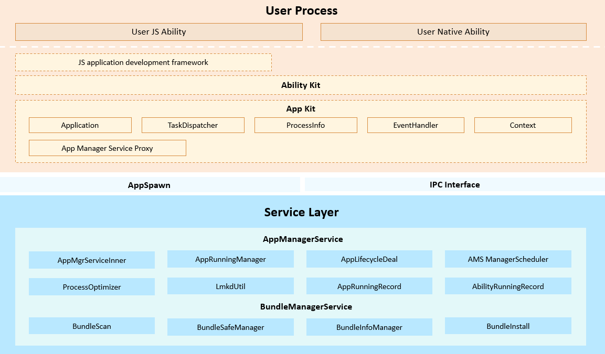

# **用户程序框架子系统**

## 简介

用户程序框架子系统是OpenHarmony为开发者提供的一套开发OpenHarmony应用程序的框架。

**包含以下模块**：

- **AppKit**：是用户程序框架提供给开发者的开发包，开发者基于该开发包可以开发出基于Ability组件的应用。

- **AppManagerService**：应用管理服务，用于管理应用运行关系、调度应用进程生命周期及状态的系统服务。

- **BundleManagerService**：是负责管理安装包的系统服务，常见的比如包安装、更新，卸载和包信息查询等，运行在Foundation进程。

应用程序框架子系统架构如下图所示：




## 目录

```
foundation/appexecfwk/standard
├── kits
│   └── appkit						   # Appkit实现的核心代码
├── common
│   └── log							   # 日志组件目录
├── interfaces
│   └── innerkits					   # 内部接口存放目录
├── services
│   ├── appmgr						   # 用户程序管理服务框架代码
│   └── bundlemgr	                   # 包管理服务框架代码
├── test						       # 测试目录
└── tools                              # bm命令存放目录
```

### 使用说明

当前版本用户程序框架不具备权限管理的能力。

以下模块的JS接口为非正式API，仅供Launcher、Settings、SystemUI等系统应用使用，不排除对这些接口进行变更的可能性，后续版本将提供正式API。

- @ohos.bundle_mgr.d.ts
- bundleinfo.d.ts
- common.d.ts
- installresult.d.ts
- moduleinfo.d.ts


### bm工具命令
| 命令    | 描述       |
| ------- | ---------- |
|  help | 帮助命令，显示bm支持的命令信息 |
| install | 安装命令，用来安装应用|
| uninstall | 卸载命令，用来卸载应用|
| dump | 查询命令，用来查询应用的相关信息|
| clean | 清理命令，用来清理应用的缓存和数据 |
| enable | 使能命令，用来使能应用 |
| disable | 禁用命令，用来禁用应用 |
| get | 获取udid命令，用来获取设备的udid |
#### 帮助命令
| 命令    | 描述       |
| ------- | ---------- |
| bm help | 显示bm工具的能够支持的命令信息 |
#### 安装命令
命令可以组合，下面列出部分命令。
| 命令                                | 描述                       |
| ----------------------------------- | -------------------------- |
| bm install -h, --help | 显示install支持的命令信息 |
| bm install -p <hap-file-path>    | 安装hap包，支持指定路径和多个hap同时安装 |
| bm install -p <hap-file-path> -u <user-id>   |给指定用户安装一个hap包 |
| bm install -r -p <hap-file-path> | 覆盖安装一个hap包 |
| bm install -f -p <hap-file-path> | 强制安装一个hap包 |
| bm install -r -p <hap-file-path> -u <user-id> | 给指定用户覆盖安装一个hap包 |

```
示例如下：
bm install -p /data/app/ohosapp.hap
bm install -p /data/app/ohosapp.hap -r
bm install -p /data/app/ohosapp.hap -f
```
#### 卸载命令
命令可以组合，下面列出部分命令。-u未指定情况下，默认为所有用户。
| 命令                          | 描述                     |
| ----------------------------- | ------------------------ |
| bm uninstall -h | 显示uninstall支持的命令信息 |
| bm uninstall -n <bundle-name> | 通过指定包名卸载应用 |
| bm uninstall -n <bundle-name> -u <user-id>| 通过指定包名和用户卸载应用 |
| bm uninstall -n <bundle-name> -m <moudle-name> | 通过指定包名卸载应用的一个模块 |
```
示例如下：
bm uninstall -n com.ohos.app
bm uninstall -n com.ohos.app -m com.ohos.app.MainAbility
```
#### 查询命令
命令可以组合，下面列出部分命令。-u未指定情况下，默认为所有用户。
| 命令       | 描述                       |
| ---------- | -------------------------- |
| bm dump -h | 显示dump支持的命令信息 |
| bm dump -a | 查询系统已经安装的所有应用 |
| bm dump -i | 查询系统已经安装的所有应用的详细信息 |
| bm dump -n <bundle-name> | 查询指定包名的详细信息 |
| bm dump -n <bundle-name> -s | 查询指定包名下的快捷方式信息 |
| bm dump -n <bundle-name> -d <device-id> | 跨设备查询包信息 |
| bm dump -n <bundle-name> -u <user-id> | 查询指定用户下指定包名的详细信息 |
```
示例如下：
bm dump -a
bm dump -n com.ohos.app
```
#### 清理命令
-u未指定情况下，默认为当前活跃用户。
| 命令       | 描述                       |
| ---------- | -------------------------- |
| bm clean -h | 显示clean支持的命令信息 |
| bm clean -n <bundle-name> -c | 清除指定包名的缓存数据 |
| bm clean -n <bundle-name> -d | 清除指定包名的数据目录 |
| bm clean -n <bundle-name> -c -u <user-id> | 清除指定用户下包名的缓存数据 |
| bm clean -n <bundle-name> -d -u <user-id> | 清除指定用户下包名的数据目录 |
```
示例如下：
bm clean -n com.ohos.app -c
bm clean -n com.ohos.app -d
```
#### 使能命令
-u未指定情况下，默认为当前活跃用户。
| 命令       | 描述                       |
| ---------- | -------------------------- |
| bm enable -h | 显示enable支持的命令信息 |
| bm enable -n <bundle-name> | 使能指定包名的应用 |
| bm enable -n <bundle-name> -a <ability-name> | 使能指定包名下的元能力模块 |
| bm enable -n <bundle-name> -u <user-id>| 使能指定用户和包名的应用 |
```
示例如下：
bm enable -n com.ohos.app
```
#### 禁用命令
-u未指定情况下，默认为当前活跃用户。
| 命令       | 描述                       |
| ---------- | -------------------------- |
| bm disable -h | 显示disable支持的命令信息 |
| bm disable -n <bundle-name> | 禁用指定包名的应用 |
| bm disable -n <bundle-name> -a <ability-name> | 禁用指定包名下的元能力模块 |
| bm disable -n <bundle-name> -u <user-id>| 禁用指定用户和包名下的应用 |
```
示例如下：
bm disable -n com.ohos.app
```
#### 获取udid命令
| 命令       | 描述                       |
| ---------- | -------------------------- |
| bm get -h | 显示get支持的命令信息 |
| bm get -u | 获取设备的udid |
```
示例如下：
bm get -u
```

## 相关仓

用户程序框架子系统

**appexecfwk_standard**

aafwk_standard

startup_appspawn
