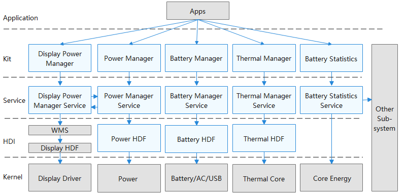

# 电源管理子系统<a name="ZH-CN_TOPIC_0000001121107655"></a>

-   [简介](#section11660541593)
-   [目录](#section19472752217)
-   [使用说明](#section19959125052315)
-   [相关仓](#section63151229062)

## 简介<a name="section11660541593"></a>

电源管理子系统提供如下功能：

1.  重启系统。
2.  管理休眠运行锁。
3.  系统电源状态查询。
4.  充电和电池状态查询和上报。
5.  亮灭屏管理和亮度调节。

**图 1**  电源管理子系统架构图<a name="fig7607759319"></a>  




## 目录<a name="section19472752217"></a>

```
/base/powermgr
├── battery_manager            # 电池服务组件
│   ├── hdi                    # HDI层
│   ├── interfaces             # 接口层
│   ├── sa_profile             # SA配置文件
│   ├── services               # 服务层
│   └── utils                  # 工具和通用层
├── display_manager            # 显示控制组件
│   ├── interfaces             # 接口层
│   └── sa_profile             # SA配置文件
│   └── services               # 服务层
│   └── utils                  # 工具和通用层
├── powermgr_lite              # 轻量级电源管理组件
│   ├── interfaces             # 接口层
│   └── services               # 服务层
└── power_manager              # 电源管理服务组件
    ├── interfaces             # 接口层
    ├── sa_profile             # SA配置文件
    └── services               # 服务层
    └── utils                  # 工具和通用层
```

## 使用说明<a name="section19959125052315"></a>

开发者通过电源管理子系统提供的接口可以进行申请和释放休眠运行锁RunningLock、获取电池信息、亮度调节、重启设备、关机等操作。

## 相关仓<a name="section63151229062"></a>

**电源管理子系统**

powermgr\_battery\_manager

powermgr\_power\_manager

powermgr\_display\_manager

