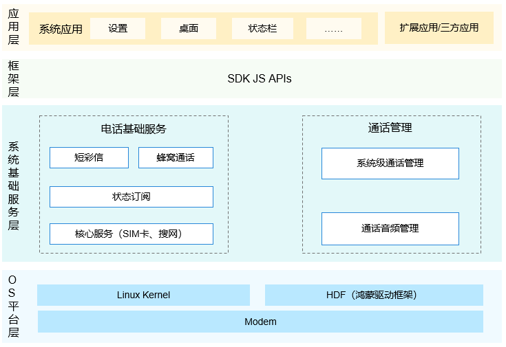

# 电话服务子系统<a name="ZH-CN_TOPIC_0000001162422291"></a>

-   [简介](#section104mcpsimp)
-   [目录](#section119mcpsimp)
-   [约束](#section123mcpsimp)
-   [使用说明](#section128mcpsimp)
    -   [获取当前蜂窝网络信号信息](#section1458213210369)
    -   [观察蜂窝网络状态变化](#section750135512369)

-   [相关仓](#section152mcpsimp)

## 简介<a name="section104mcpsimp"></a>

电话服务子系统，提供了一系列的API用于获取无线蜂窝网络和SIM卡相关的一些信息。应用可以通过调用API来获取当前注册网络名称、网络服务状态、信号强度以及SIM卡的相关信息。

各个模块主要作用如下：

-   核心服务模块：主要功能是初始化RIL管理、SIM卡和搜网模块。
-   通话管理模块：主要功能是管理CS（Circuit Switch，电路交换）、IMS（IP Multimedia Subsystem，IP多媒体子系统）和OTT（over the top，OTT解决方案）三种类型的通话，申请通话所需要的音视频资源，处理多路通话时产生的各种冲突。
-   蜂窝通话模块：主要功能是实现基于运营商网络的基础通话。
-   蜂窝数据模块：主要功能是实现基于运营商网络的蜂窝数据上网。
-   短彩信模块：主要功能是短信收发和彩信编解码。
-   状态订阅模块：主要功能是提供电话服务子系统各种消息事件的订阅以及取消订阅的API。
-   数据存储模块：主要功能是持久化数据存储，提供DataAbility访问接口。
-   RIL Adapter模块： 主要功能是与modem通信接口的适配。

**图 1**   子系统架构图



## 目录<a name="section119mcpsimp"></a>

```
base/telephony/
├── core_service            # 核心服务
├── call_manager            # 通话管理
├── cellular_call           # 蜂窝通话
├── cellular_data           # 蜂窝数据
├── sms_mms                 # 短彩信
├── state_registry          # 状态订阅
├── data_storage            # 数据存储
└── ril_adapter             # RIL Adapter
```

## 约束<a name="section123mcpsimp"></a>

1.  目前开源的范围包括蜂窝通话（仅支持CS通话）、短信、数据上网，支持双SIM卡框架。
2.  南向HDI依赖芯片厂商适配，详见：[电话服务南向开发指导](../device-dev/subsystems/subsys-tel-overview.md)。

## 使用说明<a name="section128mcpsimp"></a>

具体请参考子模块README，下面以获取当前蜂窝网络信号信息和观察蜂窝网络状态变化为例，说明电话服务子系统接口调用请求和状态订阅的使用方法。

### 获取当前蜂窝网络信号信息<a name="section1458213210369"></a>

1.  从@ohos.telephony.radio.d.ts中导入radio命名空间。
2.  可以通过callback的方式调用[getSignalInformation\(slotId: number\)](../application-dev/reference/apis-telephony-kit/js-apis-radio.md#radiogetsignalinformation7)方法或Promise的方式调用[getSignalInformation\(slotId: number\)](../application-dev/reference/apis-telephony-kit/js-apis-radio.md#radiogetsignalinformation7-1)方法。
3.  该接口为异步接口，结果会从callback中返回SignalInformation数组。
4.  遍历SignalInformation数组，获取不同制式（signalType）的信号强度（signalLevel）。

    ```
    // 引入包名
    import radio from "@ohos.telephony.radio";
    
    // 参数赋值
    let slotId = 0;
    
    // 调用接口【callback方式】
    radio.getSignalInformation(slotId, (err, value) => {
      if (err) {
        // 接口调用失败，err非空
        console.error(`failed to getSignalInformation because ${err.message}`);
        return;
      }
      // 接口调用成功，err为空
      for (let i = 0; i < value.length; i++) {
        console.log(`success to getSignalInformation: type is ${value[i].signalType}, level is ${value[i].signalLevel}`);
      }
    });
    
    // 调用接口【Promise方式】
    let promise = radio.getSignalInformation(slotId);
    promise.then((value) => {
      // 接口调用成功，此处可以实现成功场景分支代码。
      for (let i = 0; i < value.length; i++) {
        console.log(`success to getSignalInformation: type is ${value[i].signalType}, level is ${value[i].signalLevel}`);
      }
    }).catch((err) => {
      // 接口调用失败，此处可以实现失败场景分支代码。
      console.error(`failed to getSignalInformation because ${err.message}`);
    });
    ```


### 观察蜂窝网络状态变化<a name="section750135512369"></a>

**添加观察事件**

1.  从@ohos.telephony.observer.d.ts中导入observer命名空间。
2.  调用[on\(type:'networkStateChange'\)](../application-dev/reference/apis-telephony-kit/js-apis-observer.md#observeronnetworkstatechange-1)方法，传入卡槽id（slotId）和收到事件的回调处理函数（callback），其中slotId为可选参数。
3.  当网络状态发生变更时，调用者会收到回调。

    ```
    // 引入包名
    import observer from '@ohos.telephony.observer';
    
    // 开启订阅
    observer.on('networkStateChange', {slotId: 0}, (value) => {
      console.log(`network state is ` + value);
    });
    ```


**停止观察**

1.  从@ohos.telephony.observer.d.ts中导入observer命名空间。
2.  调用[off\(type: 'networkStateChange'\)](../application-dev/reference/apis-telephony-kit/js-apis-observer.md#observeroffnetworkstatechange)方法，传入添加观察事件时的callback对象（可选）。

    ```
    // 引入包名
    import observer from '@ohos.telephony.observer';
    
    // 关闭订阅
    observer.off('networkStateChange');
    ```


## 相关仓<a name="section152mcpsimp"></a>

**电话服务子系统**

[telephony\_core\_service](https://gitee.com/openharmony/telephony_core_service/blob/master/README_zh.md)

[telephony\_call\_manager](https://gitee.com/openharmony/telephony_call_manager/blob/master/README_zh.md)

[telephony\_cellular\_call](https://gitee.com/openharmony/telephony_cellular_call/blob/master/README_zh.md)

[telephony\_cellular\_data](https://gitee.com/openharmony/telephony_cellular_data/blob/master/README_zh.md)

[telephony\_sms\_mms](https://gitee.com/openharmony/telephony_sms_mms/blob/master/README_zh.md)

[telephony\_state\_registry](https://gitee.com/openharmony/telephony_state_registry/blob/master/README_zh.md)

[telephony\_data\_storage](https://gitee.com/openharmony/telephony_data_storage/blob/master/README_zh.md)

[telephony\_ril\_adapter](https://gitee.com/openharmony/telephony_ril_adapter/blob/master/README_zh.md)