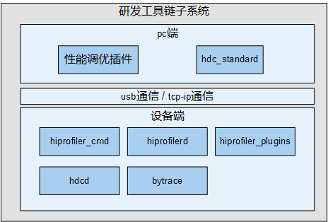

# 研发工具链子系统<a name="ZH-CN_TOPIC_0000001089932323"></a>

-   [简介](#section11660541593)
-   [系统架构](#section342962219551)
-   [目录](#section71879353610)
-   [使用说明](#section3199114314427)
-   [相关仓](#section1371113476307)

## 简介<a name="section11660541593"></a>

在OpenHarmony中，研发工具链子系统主要为开发人员提供了开发时用于调试的命令行以及追踪性能轨迹、查看性能的工具。

本子系统主要实现了以下功能：

-   bytrace，开发人员用于追踪进程轨迹、查看性能的一种工具，主要对内核ftrace进行了封装和扩展，来支持用户态的打点。
-   hdc，开发人员用于调试的命令行工具，通过该工具可以在windows/linux/mac等系统上与开发机或者模拟器进行交互。
-   profiler，旨在为开发者提供一套性能调优平台，可以用来分析内存、性能等问题。

## 系统架构<a name="section342962219551"></a>

工具链子系统的架构图如下：

**图 1**  研发工具链子系统架构图<a name="fig4460722185514"></a>  




## 目录<a name="section71879353610"></a>

```
/developtools             # 研发工具链子系统目录结构
├── bytrace_standard      # bytrace组件代码目录
│   └── bin               # bytrace组件功能实现目录
│   └── innerkits         # 对内部子系统暴露的头文件存放目录
├── hdc_standard          # hdc组件代码目录
│   └── src               # hdc组件功能实现目录
│   └── prebuilt          # 预编译目录
├── profiler              # 性能调优组件代码目录
│   └── device            # 设备侧代码目录
│   └── host              # host端代码目录
│   └── interfaces        # 模块间和对外提供的接口代码目录
│   └── trace_analyzer    # bytrace解析模块的代码目录
│   └── protos            # proto格式文件的代码目录
```

## 使用说明<a name="section3199114314427"></a>

**1. bytrace**

bytrace当前支持如下命令：

**表 1**  命令行列表

<a name="table16968161192218"></a>
<table><thead align="left"><tr id="row1796810110224"><th class="cellrowborder" valign="top" width="50%" id="mcps1.2.3.1.1"><p id="p19686142212"><a name="p19686142212"></a><a name="p19686142212"></a>Option</p>
</th>
<th class="cellrowborder" valign="top" width="50%" id="mcps1.2.3.1.2"><p id="p169681311225"><a name="p169681311225"></a><a name="p169681311225"></a>Description</p>
</th>
</tr>
</thead>
<tbody><tr id="row14968118227"><td class="cellrowborder" valign="top" width="50%" headers="mcps1.2.3.1.1 "><p id="p1696819114221"><a name="p1696819114221"></a><a name="p1696819114221"></a>-h，--help</p>
</td>
<td class="cellrowborder" valign="top" width="50%" headers="mcps1.2.3.1.2 "><p id="p1896813132220"><a name="p1896813132220"></a><a name="p1896813132220"></a>查看帮助信息</p>
</td>
</tr>
<tr id="row1396816117229"><td class="cellrowborder" valign="top" width="50%" headers="mcps1.2.3.1.1 "><p id="p1496871152211"><a name="p1496871152211"></a><a name="p1496871152211"></a>-b <em id="i13968181112216"><a name="i13968181112216"></a><a name="i13968181112216"></a>n</em>，--buffer_size <em id="i896891152212"><a name="i896891152212"></a><a name="i896891152212"></a>n</em></p>
</td>
<td class="cellrowborder" valign="top" width="50%" headers="mcps1.2.3.1.2 "><p id="p139682017228"><a name="p139682017228"></a><a name="p139682017228"></a>指定<em id="i496841112217"><a name="i496841112217"></a><a name="i496841112217"></a>n</em>(KB)内存大小用于存取trace日志，默认2MB</p>
</td>
</tr>
<tr id="row196941152212"><td class="cellrowborder" valign="top" width="50%" headers="mcps1.2.3.1.1 "><p id="p29691917228"><a name="p29691917228"></a><a name="p29691917228"></a>-t <em id="i196931152213"><a name="i196931152213"></a><a name="i196931152213"></a>n</em>，--time <em id="i17969201142218"><a name="i17969201142218"></a><a name="i17969201142218"></a>n</em></p>
</td>
<td class="cellrowborder" valign="top" width="50%" headers="mcps1.2.3.1.2 "><p id="p1396913162213"><a name="p1396913162213"></a><a name="p1396913162213"></a>用来指定trace运行的时间（单位：s），取决于需要分析过程的时间</p>
</td>
</tr>
<tr id="row6969211227"><td class="cellrowborder" valign="top" width="50%" headers="mcps1.2.3.1.1 "><p id="p5969141112217"><a name="p5969141112217"></a><a name="p5969141112217"></a>--trace_clock <em id="i1096917113223"><a name="i1096917113223"></a><a name="i1096917113223"></a>clock</em></p>
</td>
<td class="cellrowborder" valign="top" width="50%" headers="mcps1.2.3.1.2 "><p id="p39696116229"><a name="p39696116229"></a><a name="p39696116229"></a>trace输出的时钟类型，一般设备支持boot、global、mono、uptime、perf等，默认为boot</p>
</td>
</tr>
<tr id="row39691110223"><td class="cellrowborder" valign="top" width="50%" headers="mcps1.2.3.1.1 "><p id="p4969161112211"><a name="p4969161112211"></a><a name="p4969161112211"></a>--trace_begin</p>
</td>
<td class="cellrowborder" valign="top" width="50%" headers="mcps1.2.3.1.2 "><p id="p8969617229"><a name="p8969617229"></a><a name="p8969617229"></a>启动抓trace</p>
</td>
</tr>
<tr id="row129693111224"><td class="cellrowborder" valign="top" width="50%" headers="mcps1.2.3.1.1 "><p id="p19693132216"><a name="p19693132216"></a><a name="p19693132216"></a>--trace_dump</p>
</td>
<td class="cellrowborder" valign="top" width="50%" headers="mcps1.2.3.1.2 "><p id="p4969161122217"><a name="p4969161122217"></a><a name="p4969161122217"></a>将数据输出到指定位置（默认控制台）</p>
</td>
</tr>
<tr id="row1296920110224"><td class="cellrowborder" valign="top" width="50%" headers="mcps1.2.3.1.1 "><p id="p1296961202217"><a name="p1296961202217"></a><a name="p1296961202217"></a>--trace_finish</p>
</td>
<td class="cellrowborder" valign="top" width="50%" headers="mcps1.2.3.1.2 "><p id="p69691614229"><a name="p69691614229"></a><a name="p69691614229"></a>停止抓trace，并将数据输出到指定位置（默认控制台）</p>
</td>
</tr>
<tr id="row15969813223"><td class="cellrowborder" valign="top" width="50%" headers="mcps1.2.3.1.1 "><p id="p10969181132217"><a name="p10969181132217"></a><a name="p10969181132217"></a>-l，--list_categories</p>
</td>
<td class="cellrowborder" valign="top" width="50%" headers="mcps1.2.3.1.2 "><p id="p20969516221"><a name="p20969516221"></a><a name="p20969516221"></a>输出手机能支持的trace模块</p>
</td>
</tr>
<tr id="row096921142218"><td class="cellrowborder" valign="top" width="50%" headers="mcps1.2.3.1.1 "><p id="p119691714221"><a name="p119691714221"></a><a name="p119691714221"></a>--overwrite</p>
</td>
<td class="cellrowborder" valign="top" width="50%" headers="mcps1.2.3.1.2 "><p id="p109693162215"><a name="p109693162215"></a><a name="p109693162215"></a>当缓冲区满的时候，将丢弃最新的信息。（默认丢弃最老的日志）</p>
</td>
</tr>
<tr id="row119698110224"><td class="cellrowborder" valign="top" width="50%" headers="mcps1.2.3.1.1 "><p id="p9970318228"><a name="p9970318228"></a><a name="p9970318228"></a>-o <em id="i10970113229"><a name="i10970113229"></a><a name="i10970113229"></a>filename</em>，--output <em id="i39705111227"><a name="i39705111227"></a><a name="i39705111227"></a>filename</em></p>
</td>
<td class="cellrowborder" valign="top" width="50%" headers="mcps1.2.3.1.2 "><p id="p697017110220"><a name="p697017110220"></a><a name="p697017110220"></a>指定输出的目标文件名称</p>
</td>
</tr>
<tr id="row16970412224"><td class="cellrowborder" valign="top" width="50%" headers="mcps1.2.3.1.1 "><p id="p397017114221"><a name="p397017114221"></a><a name="p397017114221"></a>-z</p>
</td>
<td class="cellrowborder" valign="top" width="50%" headers="mcps1.2.3.1.2 "><p id="p149704113226"><a name="p149704113226"></a><a name="p149704113226"></a>抓取trace后进行压缩</p>
</td>
</tr>
</tbody>
</table>

以下是常用bytrace命令示例，供开发者参考：

-   查询支持的label。

    ```
    bytrace -l 
    或者
    bytrace --list_categories
    ```


-   设置4M缓存，抓取10秒，抓取label为ability的trace信息。

    ```
    bytrace -b 4096 -t 10 --overwrite ability > /data/mytrace.ftrace
    ```


-   设置trace的输出时钟为mono。

    ```
    bytrace --trace_clock mono  -b 4096 -t 10 --overwrite ability > /data/mytrace.ftrace
    ```


-   抓取trace后进行压缩。

    ```
    bytrace -z  -b 4096 -t 10 --overwrite ability > /data/mytrace.ftrace
    ```


**2. hdc**

hdc当前支持如下命令：

**表 2**  hdc命令列表

<a name="table12971913225"></a>
<table><thead align="left"><tr id="row129711413225"><th class="cellrowborder" valign="top" width="50%" id="mcps1.2.3.1.1"><p id="p20971914227"><a name="p20971914227"></a><a name="p20971914227"></a>Option</p>
</th>
<th class="cellrowborder" valign="top" width="50%" id="mcps1.2.3.1.2"><p id="p29716117225"><a name="p29716117225"></a><a name="p29716117225"></a>Description</p>
</th>
</tr>
</thead>
<tbody><tr id="row199713117228"><td class="cellrowborder" valign="top" width="50%" headers="mcps1.2.3.1.1 "><p id="p149713122214"><a name="p149713122214"></a><a name="p149713122214"></a>-t <em id="i89715114222"><a name="i89715114222"></a><a name="i89715114222"></a>key</em></p>
</td>
<td class="cellrowborder" valign="top" width="50%" headers="mcps1.2.3.1.2 "><p id="p29713110221"><a name="p29713110221"></a><a name="p29713110221"></a>用于<span>指定连接该指定设备标识key</span></p>
</td>
</tr>
<tr id="row19711111221"><td class="cellrowborder" valign="top" width="50%" headers="mcps1.2.3.1.1 "><p id="p199711819225"><a name="p199711819225"></a><a name="p199711819225"></a>-s <em id="i129711811227"><a name="i129711811227"></a><a name="i129711811227"></a>socket</em></p>
</td>
<td class="cellrowborder" valign="top" width="50%" headers="mcps1.2.3.1.2 "><p id="p1597101162218"><a name="p1597101162218"></a><a name="p1597101162218"></a>用于<span>指定服务监听的socket配置</span></p>
</td>
</tr>
<tr id="row6971191132217"><td class="cellrowborder" valign="top" width="50%" headers="mcps1.2.3.1.1 "><p id="p8971121112219"><a name="p8971121112219"></a><a name="p8971121112219"></a>-h/help -v/version</p>
</td>
<td class="cellrowborder" valign="top" width="50%" headers="mcps1.2.3.1.2 "><p id="p697261142216"><a name="p697261142216"></a><a name="p697261142216"></a><span>用于显示hdc相关的帮助、版本信息</span></p>
</td>
</tr>
<tr id="row20972415226"><td class="cellrowborder" valign="top" width="50%" headers="mcps1.2.3.1.1 "><p id="p69722019226"><a name="p69722019226"></a><a name="p69722019226"></a>list targets[-v]</p>
</td>
<td class="cellrowborder" valign="top" width="50%" headers="mcps1.2.3.1.2 "><p id="p11972151152217"><a name="p11972151152217"></a><a name="p11972151152217"></a><span>显示所有已经连接的目标设备列表</span></p>
</td>
</tr>
<tr id="row2972181192217"><td class="cellrowborder" valign="top" width="50%" headers="mcps1.2.3.1.1 "><p id="p79729132213"><a name="p79729132213"></a><a name="p79729132213"></a>target mount</p>
</td>
<td class="cellrowborder" valign="top" width="50%" headers="mcps1.2.3.1.2 "><p id="p1197217117221"><a name="p1197217117221"></a><a name="p1197217117221"></a><span>以读写模式挂载/system等分区</span></p>
</td>
</tr>
<tr id="row1997213112229"><td class="cellrowborder" valign="top" width="50%" headers="mcps1.2.3.1.1 "><p id="p149728117225"><a name="p149728117225"></a><a name="p149728117225"></a>target boot [bootloader|recovery]</p>
</td>
<td class="cellrowborder" valign="top" width="50%" headers="mcps1.2.3.1.2 "><p id="p149721818223"><a name="p149721818223"></a><a name="p149721818223"></a><span>重启目标设备，默认启动系统，可支持bootloader，recover等引导模式</span></p>
</td>
</tr>
<tr id="row9972191202215"><td class="cellrowborder" valign="top" width="50%" headers="mcps1.2.3.1.1 "><p id="p179721518220"><a name="p179721518220"></a><a name="p179721518220"></a>smode [off]</p>
</td>
<td class="cellrowborder" valign="top" width="50%" headers="mcps1.2.3.1.2 "><p id="p1397216111225"><a name="p1397216111225"></a><a name="p1397216111225"></a>授予后台服务进程root权限， 使用off参数取消授权</p>
</td>
</tr>
<tr id="row159721418223"><td class="cellrowborder" valign="top" width="50%" headers="mcps1.2.3.1.1 "><p id="p697291172215"><a name="p697291172215"></a><a name="p697291172215"></a>kill</p>
</td>
<td class="cellrowborder" valign="top" width="50%" headers="mcps1.2.3.1.2 "><p id="p2097212117225"><a name="p2097212117225"></a><a name="p2097212117225"></a><span>终止服务进程</span></p>
</td>
</tr>
<tr id="row597211110226"><td class="cellrowborder" valign="top" width="50%" headers="mcps1.2.3.1.1 "><p id="p179728192214"><a name="p179728192214"></a><a name="p179728192214"></a>tconn <em id="i179731172210"><a name="i179731172210"></a><a name="i179731172210"></a>host</em>[:<em id="i15973111202216"><a name="i15973111202216"></a><a name="i15973111202216"></a>port</em>][-remove]</p>
</td>
<td class="cellrowborder" valign="top" width="50%" headers="mcps1.2.3.1.2 "><p id="p1497314112218"><a name="p1497314112218"></a><a name="p1497314112218"></a>通过【ip地址：端口号】来指定连接的设置</p>
</td>
</tr>
<tr id="row129737118221"><td class="cellrowborder" valign="top" width="50%" headers="mcps1.2.3.1.1 "><p id="p1297311119225"><a name="p1297311119225"></a><a name="p1297311119225"></a>tmode usb</p>
</td>
<td class="cellrowborder" valign="top" width="50%" headers="mcps1.2.3.1.2 "><p id="p997319113226"><a name="p997319113226"></a><a name="p997319113226"></a><span>执行后设备端对应daemon进程重启，并首先选用usb连接方式</span></p>
</td>
</tr>
<tr id="row1697331192218"><td class="cellrowborder" valign="top" width="50%" headers="mcps1.2.3.1.1 "><p id="p1973116220"><a name="p1973116220"></a><a name="p1973116220"></a>tmode port <em id="i159734192213"><a name="i159734192213"></a><a name="i159734192213"></a>port-number</em></p>
</td>
<td class="cellrowborder" valign="top" width="50%" headers="mcps1.2.3.1.2 "><p id="p197314122212"><a name="p197314122212"></a><a name="p197314122212"></a><span>执行后设备端对应daemon进程重启，并优先使用网络方式连接设备，如果连接设备再选择usb连接</span></p>
</td>
</tr>
<tr id="row1597312118225"><td class="cellrowborder" valign="top" width="50%" headers="mcps1.2.3.1.1 "><p id="p897315112215"><a name="p897315112215"></a><a name="p897315112215"></a>fport <em id="i097410112211"><a name="i097410112211"></a><a name="i097410112211"></a>local remote</em> -b</p>
</td>
<td class="cellrowborder" valign="top" width="50%" headers="mcps1.2.3.1.2 "><p id="p169742111221"><a name="p169742111221"></a><a name="p169742111221"></a><span>创建端口、文件、设备转发</span></p>
</td>
</tr>
<tr id="row4974101182217"><td class="cellrowborder" valign="top" width="50%" headers="mcps1.2.3.1.1 "><p id="p997461132214"><a name="p997461132214"></a><a name="p997461132214"></a>fport list</p>
</td>
<td class="cellrowborder" valign="top" width="50%" headers="mcps1.2.3.1.2 "><p id="p159741142218"><a name="p159741142218"></a><a name="p159741142218"></a><span>查看所有已建立的映射连接列表，显示的参数包括转发配置字符串，转发类型，转发参数</span></p>
</td>
</tr>
<tr id="row18974310221"><td class="cellrowborder" valign="top" width="50%" headers="mcps1.2.3.1.1 "><p id="p15974418228"><a name="p15974418228"></a><a name="p15974418228"></a>fport rm <em id="i1797419132213"><a name="i1797419132213"></a><a name="i1797419132213"></a>local</em></p>
</td>
<td class="cellrowborder" valign="top" width="50%" headers="mcps1.2.3.1.2 "><p id="p179742115221"><a name="p179742115221"></a><a name="p179742115221"></a><span>删除已映射的给定配置字符串连接(配置字符串值可以通过list获取)，没有指定则删除所有</span></p>
</td>
</tr>
<tr id="row17974141142212"><td class="cellrowborder" valign="top" width="50%" headers="mcps1.2.3.1.1 "><p id="p1397481142212"><a name="p1397481142212"></a><a name="p1397481142212"></a>file send<em id="i797514162218"><a name="i797514162218"></a><a name="i797514162218"></a> </em><em id="i19975131192214"><a name="i19975131192214"></a><a name="i19975131192214"></a>local remote</em></p>
</td>
<td class="cellrowborder" valign="top" width="50%" headers="mcps1.2.3.1.2 "><p id="p1897531132216"><a name="p1897531132216"></a><a name="p1897531132216"></a><span>发送文件至远端设备</span></p>
</td>
</tr>
<tr id="row69758162213"><td class="cellrowborder" valign="top" width="50%" headers="mcps1.2.3.1.1 "><p id="p197519113224"><a name="p197519113224"></a><a name="p197519113224"></a>file recv [-a] <em id="i159759192217"><a name="i159759192217"></a><a name="i159759192217"></a>remote local</em></p>
</td>
<td class="cellrowborder" valign="top" width="50%" headers="mcps1.2.3.1.2 "><p id="p189754172214"><a name="p189754172214"></a><a name="p189754172214"></a><span>从远端设备接收文件至本地</span></p>
</td>
</tr>
<tr id="row39752019225"><td class="cellrowborder" valign="top" width="50%" headers="mcps1.2.3.1.1 "><p id="p89758162216"><a name="p89758162216"></a><a name="p89758162216"></a>app install<em id="i1397515112211"><a name="i1397515112211"></a><a name="i1397515112211"></a> </em>[-r/-d/-g]<em id="i1497514114225"><a name="i1497514114225"></a><a name="i1497514114225"></a> </em><em id="i1697517172212"><a name="i1697517172212"></a><a name="i1697517172212"></a>package</em></p>
</td>
<td class="cellrowborder" valign="top" width="50%" headers="mcps1.2.3.1.2 "><p id="p8975181132218"><a name="p8975181132218"></a><a name="p8975181132218"></a><span>安装</span><span id="text597619112215"><a name="text597619112215"></a><a name="text597619112215"></a>OpenHarmony</span><span> package</span></p>
</td>
</tr>
<tr id="row179764152210"><td class="cellrowborder" valign="top" width="50%" headers="mcps1.2.3.1.1 "><p id="p13976116221"><a name="p13976116221"></a><a name="p13976116221"></a>app install-multiple [-rdg] --hap <em id="i1497631152216"><a name="i1497631152216"></a><a name="i1497631152216"></a>path</em></p>
</td>
<td class="cellrowborder" valign="top" width="50%" headers="mcps1.2.3.1.2 "><p id="p1897681192216"><a name="p1897681192216"></a><a name="p1897681192216"></a><span>安装指定路径下的所有</span><span id="text129769117229"><a name="text129769117229"></a><a name="text129769117229"></a>OpenHarmony</span><span> package</span></p>
</td>
</tr>
<tr id="row29769172213"><td class="cellrowborder" valign="top" width="50%" headers="mcps1.2.3.1.1 "><p id="p1897651182210"><a name="p1897651182210"></a><a name="p1897651182210"></a>app uninstall [-k] <em id="i179761617224"><a name="i179761617224"></a><a name="i179761617224"></a>package</em></p>
</td>
<td class="cellrowborder" valign="top" width="50%" headers="mcps1.2.3.1.2 "><p id="p1297610142217"><a name="p1297610142217"></a><a name="p1297610142217"></a><span>卸载</span><span id="text29761218227"><a name="text29761218227"></a><a name="text29761218227"></a>OpenHarmony</span><span>应用</span></p>
</td>
</tr>
<tr id="row1297713132213"><td class="cellrowborder" valign="top" width="50%" headers="mcps1.2.3.1.1 "><p id="p17977171182218"><a name="p17977171182218"></a><a name="p17977171182218"></a>hilog</p>
</td>
<td class="cellrowborder" valign="top" width="50%" headers="mcps1.2.3.1.2 "><p id="p997711192216"><a name="p997711192216"></a><a name="p997711192216"></a><span>支持查看抓取log调试信息</span></p>
</td>
</tr>
<tr id="row209773116224"><td class="cellrowborder" valign="top" width="50%" headers="mcps1.2.3.1.1 "><p id="p897711102214"><a name="p897711102214"></a><a name="p897711102214"></a>bugreport [<em id="i4977918221"><a name="i4977918221"></a><a name="i4977918221"></a>PATH</em>]</p>
</td>
<td class="cellrowborder" valign="top" width="50%" headers="mcps1.2.3.1.2 "><p id="p139777116227"><a name="p139777116227"></a><a name="p139777116227"></a><span>支持抓取bugreport调试信息</span></p>
</td>
</tr>
<tr id="row149772115228"><td class="cellrowborder" valign="top" width="50%" headers="mcps1.2.3.1.1 "><p id="p179771017220"><a name="p179771017220"></a><a name="p179771017220"></a>shell<em id="i11977131112211"><a name="i11977131112211"></a><a name="i11977131112211"></a> </em>[<em id="i497721172211"><a name="i497721172211"></a><a name="i497721172211"></a>command</em>]</p>
</td>
<td class="cellrowborder" valign="top" width="50%" headers="mcps1.2.3.1.2 "><p id="p1697710162213"><a name="p1697710162213"></a><a name="p1697710162213"></a><span>远程执行命令或进入交互命令环境</span></p>
</td>
</tr>
</tbody>
</table>

以下是常用hdc命令示例，供开发者参考：

-   往设备中推送文件

    ```
    hdc file send  E:\c.txt  /sdcard
    ```

-   重启设备

    ```
    hdc target boot
    ```


-   查看日志

    ```
    hdc hilog
    ```

-   进入命令行交互模式

    ```
    hdc shell
    ```

-   配置服务监听的socket。

    ```
    hdc -s 192.168.1.100:1234 
    ```


-   重启至bootloader模式。

    ```
    hdc target boot bootloader
    ```

-   网络连接。

    ```
    hdc tconn 192.168.0.100:8710
    ```


**3. profiler**

性能调优组件包含系统和应用调优框架，旨在为开发者提供一套性能调优平台，可以用来分析内存、性能等问题。

该组件整体分为PC端和设备端两部分:

- PC端最终作为deveco studio的插件进行发布，内部主要包括分为UI绘制、设备管理、进程管理、插件管理、数据导入、数据存储、 数据分析、Session管理、配置管理等模块。

- 设备端主要包括命令行工具、服务进程、插件集合、应用程序组件等模块。设备端提供了插件扩展能力，对外提供了插件接口，基于该扩展能力可以按需定义自己的能力，并集成到框架中来，目前基于插件能力已经完成了实时内存插件和trace插件。详细内容见性能调优组件。

## 相关仓<a name="section1371113476307"></a>

**研发工具链子系统**

[developtools\_hdc\_standard](https://gitee.com/openharmony/developtools_hdc_standard)

[developtools\_bytrace\_standard](https://gitee.com/openharmony/developtools_bytrace_standard)

[developtools\_profiler](https://gitee.com/openharmony/developtools_profiler)

