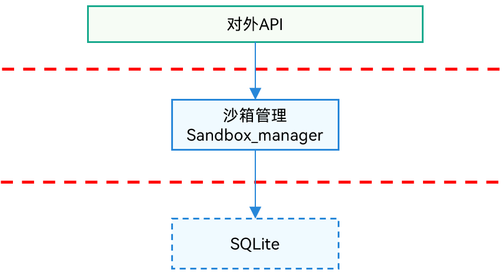

# **程序访问控制子系统**

- [简介](#简介)
- [系统架构](#系统架构)
- [目录](#目录)
- [约束](#约束)
- [使用](#使用)
- [相关仓](#相关仓)

## 简介

程序访问控制子系统负责管理操作系统的权限管控机制和隔离访问控制等能力。

现程序访问控制子系统开源的功能，包括沙箱管理模块。

## 系统架构

**图 1** 子系统架构图



**对外API**：程序访问控制子系统的对外API，部分API只针对系统应用开放

**沙箱管理模块**: 为对沙箱间文件共享规则进行持久化管理。主要包括如下功能：对系统应用提供临时规则的使能接口、对系统应用提供添加/删除/查询持久化规则接口、对系统应用提供持久化规则的使能/禁用接口。

## 目录
```
/base/accesscontrol
├── sandbox_manager              # 沙箱管理模块
```

## 约束
- 沙箱管理的约束说明：该模块仍在开发中，无法提供规则使能的功能。因该模块依赖于系统内核的MAC机制，须待MAC机制上线后进行后续开发。

## 使用

**沙箱管理**

OpenHarmony中应用均运行在独立的沙箱中，程序数据都是相互隔离的。沙箱管理模块负责提供
1. 添加/删除/查询持久化规则接口（已实现）
2. 对系统应用提供持久化规则的使能/禁用接口（功能待实现）

沙箱管理模块仅提供InnerAPI供系统应用进行调用。若应用开发者需要使用相关功能，设置文件持久化规则，请通过[file\_app\_file\_service](https://gitee.com/openharmony/filemanagement_app_file_service/blob/master/README_ZH.md)的相关接口进行使用。若需通过拉起应用的方式进行文件共享，请通过[ability\_ability\_runtime](https://gitee.com/openharmony/ability_ability_runtime/blob/master/README_zh.md)的相应方式进行设置。

## 相关仓

程序访问控制子系统

[accesscontrol_sandbox_manager](https://gitee.com/openharmony/accesscontrol_sandbox_manager)