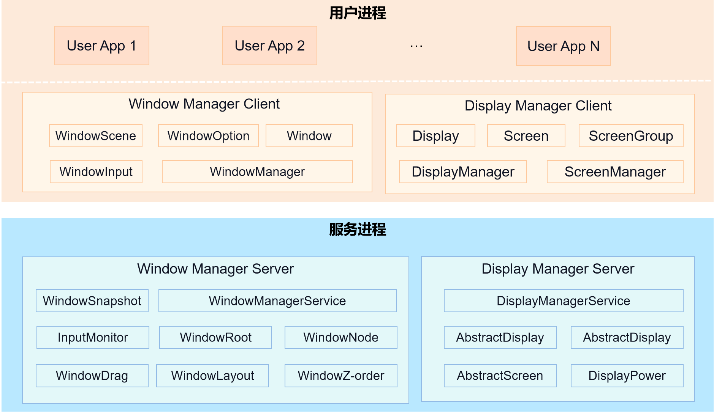

# 窗口子系统

## 简介

**窗口子系统** 提供窗口管理和Display管理的基础能力，是系统图形界面显示所需的基础子系统。其主要的结构如图1所示。

**图 1**  窗口子系统架构图



- **Window Manager Client**

    应用进程窗口管理接口层，提供窗口对象抽象和窗口管理接口，对接元能力和UI框架。

- **Display Manager Client**

    应用进程Display管理接口层，提供Display信息抽象和Display管理接口。

- **Window Manager Server**

    窗口管理服务，提供窗口布局、Z序控制、窗口树结构、窗口拖拽、窗口快照等能力，并提供窗口布局和焦点窗口给多模输入。

- **Display Manager Server**

    Display管理服务，提供Display信息、屏幕截图、屏幕亮灭和亮度处理控制，并处理Display与Screen映射关系。

## 目录

```text
foundation/window/window_manager/
├── dm                      # Display Manager Client实现代码
├── dmserver                # Display Manager Server实现代码
├── interfaces              # 对外接口存放目录
│   ├── innerkits           # native接口存放目录
│   └── kits                # js/napi接口存放目录
├── resources               # 框架使用资源文件存放目录
├── sa_profile              # 系统服务配置文件
├── snapshot                # 截屏命令行工具实现代码
├── utils                   # 工具类存放目录
├── wm                      # Window Manager Client实现代码
├── wmserver                # Window Manager Server实现代码
```

## 约束

- 语言版本：C++11或以上

## 接口说明

- [@ohos.window (窗口)](../application-dev/reference/apis-arkui/js-apis-window.md)
- [@ohos.window (窗口)(系统接口)](../application-dev/reference/apis-arkui/js-apis-window-sys.md)
- [@ohos.display (屏幕属性)](../application-dev/reference/apis-arkui/js-apis-display.md)
- [@ohos.display (屏幕属性)(系统接口)](../application-dev/reference/apis-arkui/js-apis-display-sys.md)

## 相关仓

- [graphic_graphic_2d](https://gitee.com/openharmony/graphic_graphic_2d)
- [arkui_ace_engine](https://gitee.com/openharmony/arkui_ace_engine)
- [ability_ability_runtime](https://gitee.com/openharmony/ability_ability_runtime)
- [multimodalinput_input](https://gitee.com/openharmony/multimodalinput_input)
