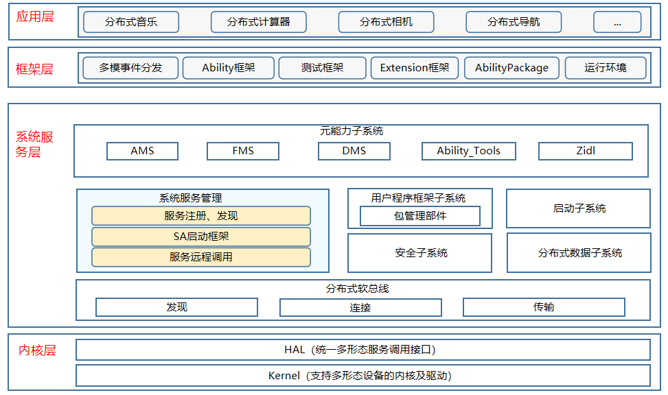

# 系统服务管理子系统<a name="ZH-CN_TOPIC_0000001115719369"></a>

## 简介<a name="section11660541593"></a>

系统服务管理子系统实现系统服务框架，提供系统服务的启动、注册、查询功能，提供查询跨设备的分布式系统服务。

## 系统架构<a name="section13587185873516"></a>

系统服务管理子系统架构如下图所示。

**图 1**  子系统架构图<a name="fig4460722185514"></a>




系统服务管理子系统主要包含四个组件：

- safwk组件
  
  在系统服务管理子系统中safwk组件定义OpenHarmony中SystemAbility的实现方法，并提供启动、注册等接口实现。

- samgr组件
  
  OpenHarmony的核心组件，提供OpenHarmony系统服务启动、注册、查询等功能。

- safwk_lite组件
  
  轻量foundation进程实现，负责提供基础服务运行的空进程。

- samgr_lite组件
  
  轻量系统服务管理模块，主要提供服务的注册与发现能力。

## 目录<a name="section161941989596"></a>

```
/foundation/systemabilitymgr
├── safwk                       # 系统服务框架模块
├── samgr                       # 系统服务管理模块
├── safwk_lite                  # 轻量foundation进程
├── samgr_lite                  # 轻量系统服务管理模块
```

## 相关仓<a name="section1371113476307"></a>

**系统服务管理子系统**

[systemabilitymgr\_safwk](https://gitee.com/openharmony/systemabilitymgr_safwk)

[systemabilitymgr\_samgr](https://gitee.com/openharmony/systemabilitymgr_samgr)

[systemabilitymgr\_safwk\_lite](https://gitee.com/openharmony/systemabilitymgr_safwk_lite)

[systemabilitymgr\_samgr\_lite](https://gitee.com/openharmony/systemabilitymgr_samgr_lite)
