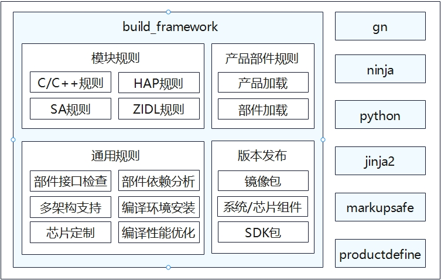

# 编译构建子系统<a name="ZH-CN_TOPIC_0000001162500073"></a>

编译构建子系统提供了一个基于gn和ninja的编译构建框架，主要提供以下功能：

-   构建不同芯片平台的产品，如：Hi3516DV300平台。

-   根据产品配置可以按照组件组装打包产品需要的能力。

## 简介<a name="section175012297491"></a>

在了解编译构建子系统的能力前，应了解如下基本概念：

-   平台

    开发板和内核的组合，不同平台支持的子系统和组件不同。

-   子系统

    OpenHarmony整体遵从分层设计，从下向上依次为：内核层、系统服务层、框架层和应用层。系统功能按照“系统 \> 子系统 \> 组件”逐级展开，在多设备部署场景下，支持根据实际需求裁剪某些非必要的子系统或组件。子系统是一个逻辑概念，是由对应组件构成的逻辑系统。

-   组件

    对子系统的进一步拆分，可复用的软件单元，它包含源码、配置文件、资源文件和编译脚本；能独立构建，以二进制方式集成，具备独立验证能力的二进制单元。

-   gn

    Generate ninja的缩写，用于产生ninja文件。

-   ninja

    ninja是一个专注于速度的小型构建系统。


## 目录

```text
/build                            # 编译构建主目录

├── __pycache__                   
├── build_scripts/                # 编译相关的python脚本
├── common/                       
├── config/                       # 编译相关的配置项
├── core
│   ├── gn/                       # 编译入口BUILD.gn配置
│   └── build_scripts/            
├── docs                          
├── gn_helpers.py*                
├── lite/                         # hb和preloader入口                      
├── misc/                         
├── ohos                          # OpenHarmony编译打包流程配置
│   ├── kits                      # kits编译打包模板和处理流程
│   ├── ndk                       # ndk模板和处理流程
│   ├── notice                    # notice模板和处理流程
│   ├── packages                  # 版本打包模板和处理流程
│   ├── sa_profile                # sa模板和处理流程
│   ├── sdk                       # sdk模板和处理流程，包括sdk中包含的模块配置
│   └── testfwk                   # 测试相关的处理
├── ohos.gni*                     # 汇总了常用的gni文件，方便各个模块一次性import
├── ohos_system.prop              
├── ohos_var.gni*                 
├── prebuilts_download.sh*        # 预编译脚本
├── print_python_deps.py*         
├── scripts/                      
├── subsystem_config.json         
├── subsystem_config_example.json 
├── templates/                    # c/c++编译模板定义
├── test.gni*                     
├── toolchain                     # 编译工具链配置
├── tools                         # 常用工具
├── version.gni                   
├── zip.py*                       
```

  
**图 1**  编译构建子系统架构图<a name="fig16488143010409"></a>  



## 运作机制<a name="section193961322175011"></a>

OpenHarmony侧的编译构建流程主要包括以下三个步骤：

1. 命令行解析：解析待编译的产品名称，加载相关配置。

2. 调用gn: 根据命令行解析的产品名称和编译类型，配置编译工具链和全局的编译选项。

3. 执行ninja：启动编译并生成对应的产品版本。

## 轻量和小型系统<a name="section119041639115811"></a>

轻量和小型系统的编译构建相关介绍请见[build\_lite](https://gitee.com/openharmony/build_lite)仓的Readme文档。

## 标准系统<a name="section8750514195912"></a>

标准系统的编译构建相关介绍请见[build](https://gitee.com/openharmony/build)仓的Readme文档。

## 相关仓<a name="section44651652878"></a>

[build\_lite](https://gitee.com/openharmony/build_lite/blob/master/README_zh.md)

[build](https://gitee.com/openharmony/build/blob/master/README_zh.md)

