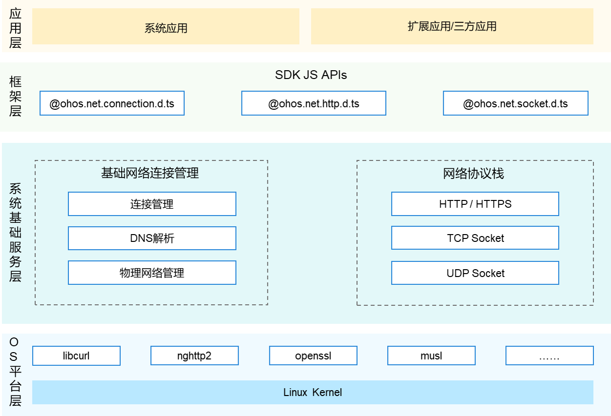

# 网络管理子系统<a name="ZH-CN_TOPIC_0000001162422291"></a>


## 简介<a name="section104mcpsimp"></a>

网络管理子系统，作为设备联网的必备组件，提供了对不同类型网络连接的统一管理、流量管理、策略管理、网络共享，并提供了网络协议栈能力。应用可以通过调用API来获取数据网络的连接信息，查询和订阅数据网络的连接状态，网络流量数据，网络策略以及网络共享等，并可通过网络协议栈进行数据传输。

下图所示为网络管理子系统架构图。各个部件主要作用如下：

-   网络管理基础部件：主要功能是提供基础网络连接管理能力和对应的JS/Native API，包括不同网络连接优先级管理、网络连接信息查询、网络连接状态变化、DNS解析、流量统计管理、联网策略管理以及物理网络管理等。
-   网络管理扩展部件：主要功能是提供网络管理扩展能力和对应的JS/Native API，包括以太网连接、热点网络共享等。
-   网络协议栈部件：主要功能是提供基础的网络协议栈和对应的JS API，包括HTTP、HTTPS、WebSocket、TCP/UDP/TLS Socket等基础网络协议栈能力。

**图 1**   子系统架构图



## 目录<a name="section119mcpsimp"></a>

```
foundation/communication/
├── netmanager_base            # 网络管理基础
├── netmanager_ext             # 网络管理扩展
└── netstack                   # 网络协议栈
```

## 使用说明<a name="section128mcpsimp"></a>

### 接收指定网络的状态变化通知<a name="section1458213210369"></a>

1. 从@ohos.net.connection.d.ts中导入connection命名空间。

2. 调用[createNetConnection](../application-dev/reference/apis-network-kit/js-apis-net-connection.md#connectioncreatenetconnection)方法，指定网络能力、网络类型和超时时间（可选，如不传入代表默认网络），创建一个NetConnection对象。

3. 调用该对象的[on()](../application-dev/reference/apis-network-kit/js-apis-net-connection.md#onnetavailable)方法，传入type和callback，订阅关心的事件。

4. 调用该对象的[register()](../application-dev/reference/apis-network-kit/js-apis-net-connection.md#register)方法，订阅指定网络状态变化的通知。

5. 当网络可用时，会收到netAvailable事件的回调。

6. 当不使用该网络时，可以调用该对象的[unregister()](../application-dev/reference/apis-network-kit/js-apis-net-connection.md#unregister)方法，取消订阅。

   ```
   // 引入包名
   import connection from '@ohos.net.connection'
   
   let netCap = {
       // 指定网络类型为蜂窝网络
       bearerTypes: [connection.NetBearType.BEARER_CELLULAR],
       // 指定网络能力为Internet
       networkCap: [connection.NetCap.NET_CAPABILITY_INTERNET],
   };
   let netSpec = {
       netCapabilities: netCap,
   };
   // 指定超时时间为10s
   let timeout = 10 * 1000;
   // 创建NetConnection对象
   let conn = connection.createNetConnection(netSpec, timeout);
   // 订阅事件，以on_netAvailable为例
   conn.on('netAvailable', (data=> {
       console.log("net is available, netId is " + data.netId);
   }));
   // 订阅指定网络状态变化的通知
   conn.register((err, data) => {});
   // 当不使用该网络时，可以调用该对象的unregister()方法，取消订阅
   conn.unregister((err, data) => {});
   ```

### 网络共享<a name="section2458213210369"></a>

1. 从@ohos.net.sharing中导入sharing命名空间。
2. [设定共享类型](../application-dev/network/net-sharing.md#基本概念)
3. [开始共享](../application-dev/network/net-sharing.md#开启网络共享)
4. [停止共享](../application-dev/network/net-sharing.md#停止网络共享)
```
// 引入包名
import sharing from '@ohos.net.sharing';
// 设定共享类型
this.sharingType = 0； // 0: WIFI 1: USB 2: BLUETOOTH
// 开始共享
sharing.startSharing(this.sharingType,(err)=>{
    this.callBack(err);
})
// 停止共享
sharing.stopSharing(this.sharingType,(err)=>{
    this.callBack(err);
})
```

### 发起网络请求<a name="section750135512369"></a>

1. 从@ohos.net.http.d.ts中导入http命名空间。
2. 调用[createHttp()](../application-dev/reference/apis-network-kit/js-apis-http.md#httpcreatehttp)方法，创建一个HttpRequest对象。
3. 调用该对象的[on()](../application-dev/reference/apis-network-kit/js-apis-http.md#onheadersreceive8)方法，订阅http响应头事件，此接口会比request请求先返回。可以根据业务需要订阅此消息。
4. 调用该对象的[request()](../application-dev/reference/apis-network-kit/js-apis-http.md#request)方法，传入http请求的url地址和可选参数，发起网络请求。
5. 按照实际业务需要，解析返回结果。
6. 调用该对象的[off()](../application-dev/reference/apis-network-kit/js-apis-http.md#offheadersreceive8)方法，取消订阅http响应头事件。
7. 当该请求使用完毕时，调用[destroy()](../application-dev/reference/apis-network-kit/js-apis-http.md#destroy)方法主动销毁。

```
// 引入包名
import http from '@ohos.net.http';

// 每一个httpRequest对应一个HTTP请求任务，不可复用
let httpRequest = http.createHttp();
// 用于订阅HTTP响应头，此接口会比request请求先返回。可以根据业务需要订阅此消息
// 从API 8开始，使用on('headersReceive', Callback)替代on('headerReceive', AsyncCallback)。 8+
httpRequest.on('headersReceive', (header) => {
    console.info('header: ' + JSON.stringify(header));
});
httpRequest.request(
    // 填写HTTP请求的URL地址，可以带参数也可以不带参数。URL地址需要开发者自定义。请求的参数可以在extraData中指定
    "EXAMPLE_URL",
    {
        method: http.RequestMethod.POST, // 可选，默认为http.RequestMethod.GET
        // 开发者根据自身业务需要添加header字段
        header: {
            'Content-Type': 'application/json'
        },
        // 当使用POST请求时此字段用于传递内容
        extraData: {
            "data": "data to send",
        },
        expectDataType: http.HttpDataType.STRING, // 可选，指定返回数据的类型
        usingCache: true, // 可选，默认为true
        priority: 1, // 可选，默认为1
        connectTimeout: 60000, // 可选，默认为60000ms
        readTimeout: 60000, // 可选，默认为60000ms
        usingProtocol: http.HttpProtocol.HTTP1_1, // 可选，协议类型默认值由系统自动指定
        usingProxy: false, //可选，默认不使用网络代理，自API 10开始支持该属性
    }, (err, data) => {
        if (!err) {
            // data.result为HTTP响应内容，可根据业务需要进行解析
            console.info('Result:' + JSON.stringify(data.result));
            console.info('code:' + JSON.stringify(data.responseCode));
            // data.header为HTTP响应头，可根据业务需要进行解析
            console.info('header:' + JSON.stringify(data.header));
            console.info('cookies:' + JSON.stringify(data.cookies)); // 8+
        } else {
            console.info('error:' + JSON.stringify(err));
            // 取消订阅HTTP响应头事件
            httpRequest.off('headersReceive');
            // 当该请求使用完毕时，调用destroy方法主动销毁。
            httpRequest.destroy();
        }
    }
);
```

## 相关仓<a name="section152mcpsimp"></a>

**网络管理子系统**

[communication_netmanager_base](https://gitee.com/openharmony/communication_netmanager_base/blob/master/README_zh.md)
[communication_netmanager_ext](https://gitee.com/openharmony/communication_netmanager_ext/blob/master/README_zh.md)
[communication_netstack](https://gitee.com/openharmony/communication_netstack/blob/master/README_zh.md)