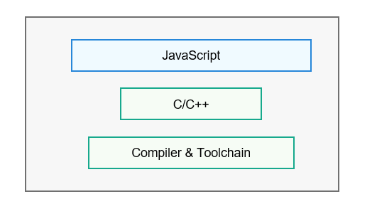

# 语言运行时子系统<a name="ZH-CN_TOPIC_0000001124628397"></a>


## 简介<a name="section15963162310012"></a>

语言运行时子系统提供了JS、C/C++语言程序的编译、执行环境，提供支撑运行时的基础库，以及关联的API接口、编译器和配套工具。当前支持的编程语言包括JS、C/C++。子系统中的组件划分也是基于编程语言维度，每个组件支持单独编译，可以基于场景进行组合和分离。

如下图所示，子系统提供编译器及相关工具链支撑JS、C/C++语言的运行，并提供了语言相关基础库、API 接口、JS Engine能力。

**图 1**  子系统架构图<a name="fig4166312527"></a>  





## 目录<a name="section971210485617"></a>

```
/prebuilts/mingw-w64/ohos/linux-x86_64     # 提供Linux平台交叉编译工具链
    └── clang-mingw
        ├── bin
        ├── lib
        ├── libexec
        ├── NOTICE
        ├── share
        └── x86_64-w64-mingw32
```

## 约束<a name="section119744591305"></a>

1.  相关API接口不能擅自新增、修改和调整。
2.  JS Engine的实现由子系统内部约束，不对外提供配置项。

## 说明<a name="section1312121216216"></a>

语言基础能力支持通过库文件方式支持，部分能力会整合到Native、JS的SDK中，集成到DevEco Studio中发布使用。

## 相关仓<a name="section1371113476307"></a>

涉及引用的三方软件及预编译工具链仓如下：

[third_party_jerryscript](https://gitee.com/openharmony/third_party_jerryscript)

[third_party_mingw-w64](https://gitee.com/openharmony/third_party_mingw-w64)
