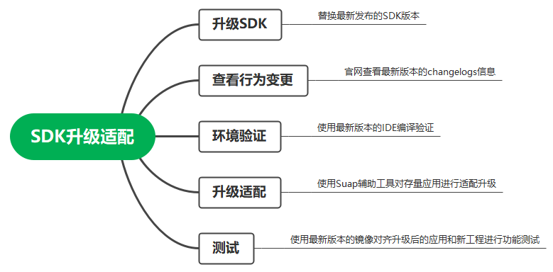
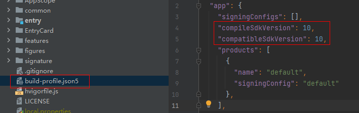

# Sdk-Upgrade-Guide

## 指导概述

版本更新发布后，开发者不清楚怎么该升级和替换新版本的SDK，而且替换新SDK后，会有一些存量应用发生编译和功能问题，本文将针对在新版本SDK发布后，提供完整的SDK升级及存量应用适配指导。

## 升级流程

SDK升级适配包含五个阶段：

1.升级SDK——获取最新发布的SDK版本，并替换安装

2.查看行为变更——查看对应版本Changelogs等信息

3.环境验证——使用最新版本的IDE来编译验证

4.升级适配——使用通过Suap工具对存量应用进行适配升级

5.测试——使用最新版本的镜像对其升级后的应用和新工程进行功能测试

### 升级SDK

升级SDK的方式有两种：

1）IDE中自动升级

2）官网下载最新发布SDK版本并替换升级

SDK版本获取地址：[SDK-版本获取地址](https://docs.openharmony.cn/pages/v4.0/zh-cn/release-notes/OpenHarmony-v4.0-beta2.md/#从镜像站点获取)

SDK替换指导：[SDK-替换指导](https://docs.openharmony.cn/pages/v4.0/zh-cn/application-dev/faqs/full-sdk-switch-guide.md/)

确保SDK版本升级后，需要更新IDE中build-profile.json5文件下的compileSdkVersion和compatibleSdkVersion配置项。

### 查看行为变更

每个版本发布时，官网上都会随着版本发布最新版本的Changelogs，方便开发者第一时间知晓升级后的行为变更和不兼容变更，以及变更影响和适配指导更新说明。

Changelogs归档地址：[OpenHarmony Changelogs](https://docs.openharmony.cn/pages/v4.0/zh-cn/release-notes/OpenHarmony-v4.0-beta2.md/#版本概述)

### 环境验证

在替换最新版本SDK后，不兼容变更的接口在IDE上编译会发生编译报错，这边推荐开发者使用最新发布的IDE版本进行编译验证。

IDE下载地址：[IDE集成开发环境 (openharmony.cn)](https://docs.openharmony.cn/pages/v4.0/zh-cn/device-dev/get-code/gettools-ide.md/#获取设备开发工具huawei-deveco-device-tool)

### 升级适配

新版本发布后，接口发生不兼容变更会导致应用编译失败和相关功能问题，为了保障开发者能够快速便捷的适配最新的SDK，我们建议开发者使用Suap辅助工具来对应用进行升级适配，Suap辅助工具可以在IDE上生成一个UpdateReport更新报告，报告里面体现了新版本SDK的修改和变更信息以及代码所在位置，开发者可以直接在IDE上点击“代码所在位置”跳转到相应页面进行查看和修改适配。

Suap工具获取：IDE插件市场搜索 OpenHarmony SDK Upgrade Assistant

Suap工具使用指导：[SDK Upgrade Assistant-使用指导](https://gitee.com/openharmony/docs/blob/master/zh-cn/application-dev/tools/openharmony_sdk_upgrade_assistant.md)

### 测试

升级SDK并适配完成后，开发者需要下载最新版本的镜像，在设备上进行功能测试，确保适配成功，这边也推荐使用IDE中自带的真机模拟器来测试。

真机模拟器使用指导：[使用真机进行调试-应用/服务调试-DevEco Studio使用指南](https://developer.harmonyos.com/cn/docs/documentation/doc-guides/ohos-debugging-and-running-0000001263040487#section168792815516)