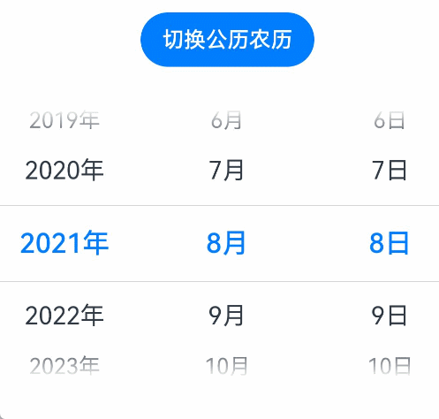

# arkui子系统ChangeLog

## cl.arkui.1 状态变量数据类型声明使用限制。

1. 所有的状态装饰器变量需要显式声明变量类型，不允许声明any，不支持Date数据类型。

    示例：

    ```ts
    // xxx.ets
    @Entry
    @Component
    struct DatePickerExample {
      // 错误写法: @State isLunar: any = false
      @State isLunar: boolean = false
      // 错误写法: @State selectedDate: Date = new Date('2021-08-08')
      private selectedDate: Date = new Date('2021-08-08')

      build() {
        Column() {
          Button('切换公历农历')
            .margin({ top: 30 })
            .onClick(() => {
              this.isLunar = !this.isLunar
            })
          DatePicker({
            start: new Date('1970-1-1'),
            end: new Date('2100-1-1'),
            selected: this.selectedDate
          })
            .lunar(this.isLunar)
            .onChange((value: DatePickerResult) => {
              this.selectedDate.setFullYear(value.year, value.month, value.day)
              console.info('select current date is: ' + JSON.stringify(value))
            })

        }.width('100%')
      }
    }
    ```

    

2. @State、@Provide、 @Link和@Consume四种状态变量的数据类型声明只能由简单数据类型或引用数据类型的其中一种构成。

    类型定义中的Length、ResourceStr、ResourceColor三个类型是简单数据类型或引用数据类型的组合，所以不能被以上四种状态装饰器变量使用。
    Length、ResourceStr、ResourceColor的定义请看文档[arkui-ts类型定义](../../../application-dev/reference/arkui-ts/ts-types.md)。

    示例：

    ```ts
    // xxx.ets
    @Entry
    @Component
    struct IndexPage {
      // 错误写法: @State message: string | Resource = 'Hello World'
      @State message: string = 'Hello World'
      // 错误写法: @State message: ResourceStr = $r('app.string.hello')
      @State resourceStr: Resource = $r('app.string.hello')

      build() {
        Row() {
          Column() {
            Text(`${this.message}`)
              .fontSize(50)
              .fontWeight(FontWeight.Bold)
          }
          .width('100%')
        }
        .height('100%')
      }
    }
    ```

    

**变更影响**

1. 如果状态装饰器变量没有显式声明变量类型，声明any，编译拦截报错；
    ```ts
    // ArkTS:ERROR Please define an explicit type, not any.
    @State isLunar: any = false
    ```
2. 状态装饰器变量声明变量类型为Date，编译拦截报错；
    ```ts
    // ArkTS:ERROR The @State property 'selectedDate' cannot be a 'Date' object.
    @State selectedDate: Date = new Date('2021-08-08')
    ```
3. @State、@Provide、 @Link和@Consume四种状态变量使用框架提供的Length、ResourceStr、ResourceColor，
  编译拦截报错。
    ```ts
    /* ArkTS:ERROR The state variable type here is 'ResourceStr', it contains both a simple type and an object type,
      which are not allowed to be defined for state variable of a struct.*/
    @State message: ResourceStr = $r('app.string.hello')
    ```

**关键的接口/组件变更**

不涉及。

**适配指导**

1. 状态装饰器变量声明具体的变量类型替代any;
2. 使用Date对象的状态装饰器变量，修改为不加状态装饰器修饰的常规变量；
3. 因为Length(string|number|Resource), ResourceStr(string|Resource), ResourceColor(string|number|Color|Resource)
  的三个类型是简单数据类型或引用数据类型的组合，使用@State、@Provide、 @Link和@Consume四种状态变量场景参考以下修改：
    ```ts
    // 错误写法:
    @State message: ResourceStr = $r('app.string.hello')
    // 修正后的写法：
    @State resourceStr: Resource = $r('app.string.hello')
    ```

## cl.arkui.2 自定义组件成员变量初始化的规则与约束。

通过构造函数方法初始化成员变量，需要遵循如下规则：

| **从父组件中的变量(右)到子组件中的变量(下)** | **regular** | **@State** | **@Link** | **@Prop** | **@Provide** | **@Consume** | **@ObjectLink** |
| -------------------------- | ----------- | ---------- | --------- | --------- | ------------ | ------------ | --------------- |
| **regular**                | 支持          | 支持         | 支持        | 支持        | 不支持          | 不支持          | 支持              |
| **@State**                 | 支持          | 支持         | 支持        | 支持        | 支持           | 支持           | 支持              |
| **@Link**                  | 不支持         | 支持(1)      | 支持(1)     | 支持(1)     | 支持(1)        | 支持(1)        | 支持(1)           |
| **@Prop**                  | 支持          | 支持         | 支持        | 支持        | 支持           | 支持           | 支持              |
| **@Provide**               | 支持          | 支持         | 支持        | 支持        | 支持           | 支持           | 支持              |
| **@Consume**               | 不支持         | 不支持        | 不支持       | 不支持       | 不支持          | 不支持          | 不支持             |
| **@ObjectLink**            | 不支持         | 不支持        | 不支持       | 不支持       | 不支持          | 不支持          | 不支持             |

| **从父组件中的变量(右)到子组件中的变量(下)** | **@StorageLink** | **@StorageProp** | **@LocalStorageLink** | **@LocalStorageProp** |
| -------------------------- | ---------------- | ---------------- | --------------------- | --------------------- |
| **regular**                | 支持               | 不支持              | 不支持                   | 不支持                   |
| **@State**                 | 支持               | 支持               | 支持                    | 支持                    |
| **@Link**                  | 支持(1)            | 支持(1)            | 支持(1)                 | 支持(1)                 |
| **@Prop**                  | 支持               | 支持               | 支持                    | 支持                    |
| **@Provide**               | 支持               | 支持               | 支持                    | 支持                    |
| **@Consume**               | 不支持              | 不支持              | 不支持                   | 不支持                   |
| **@ObjectLink**            | 不支持              | 不支持              | 不支持                   | 不支持                   |

> **说明**
>
> **支持(1)**：必须使用`$`, 例如 `this.$varA`。  
> **regular**：未加修饰的常规变量。

不允许从父组件初始化`@StorageLink`, `@StorageProp`, `@LocalStorageLink`, `@LocalStorageProp`修饰的变量。

**变更影响**

1. 不允许从父组件初始化`@LocalStorageLink`, `@LocalStorageProp`修饰的变量。
    ```ts
    @Entry
    @Component
    struct LocalStorageComponent {
        build() {
            Column() {
                Child({
                  /* ArkTS:ERROR Property 'simpleVarName' in the custom component 'Child' cannot
                    initialize here (forbidden to specify). */
                  simpleVarName: 1,
                  /* ArkTS:ERROR Property 'objectName' in the custom component 'Child' cannot
                    initialize here (forbidden to specify). */
                  objectName: new ClassA("x")
                })
            }
        }
    }
    @Component
    struct Child {
        @LocalStorageLink("storageSimpleProp") simpleVarName: number = 0;
        @LocalStorageProp("storageObjectProp") objectName: ClassA = new ClassA("x");
        build() {}
    }
    ```
2. 子组件的@ObjectLink变量不支持父组件装饰器变量的直接赋值，其父组件的源必须是数组的项或对象的属性，该数组或对象必现用`@State`、`@Link`、`@Provide`、`@Consume`或`@ObjectLink`装饰器修饰。
    ```ts
    let NextID : number = 0;

    @Observed class ClassA {
      public id : number;
      public c: number;
      constructor(c: number) {
        this.id = NextID++;
        this.c = c;
      }
    }

    @Component
    struct Child {
      @ObjectLink varA : ClassA;
      build() {
        Row() {
          Text('ViewA-' + this.varA.id)
        }
      }
    }

    @Component
    struct Parent {
      @Link linkValue: ClassA
      build() {
        Column() {
          /* ArkTS:ERROR The @Link property 'linkValue' cannot be assigned to
            the @ObjectLink property 'varA'.*/
          Child({ varA: this.linkValue })
        }
      }
    }
    ```

**关键的接口/组件变更**

不涉及。

**适配指导**
1. 构造子组件时，不对子组件的`@LocalStorageLink`, `@LocalStorageProp`修饰的变量进行。
  如果需要在父组件中修改子组件的`@LocalStorageLink`, `@LocalStorageProp`修饰的变量，则使用LocalStorage提供的API接口方法(比如set方法)赋值。
2. @ObjectLink的使用指导请参考文档[@ObjectLink使用指导](../../../application-dev/quick-start/arkts-observed-and-objectlink.md)。
