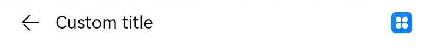
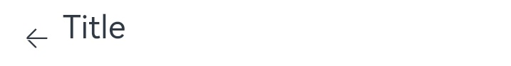

# arkui子系统ChangeLog

## cl.arkui.1 Navigation标题自定义位置变更

1. NavigationTitleMode设置为Full、Free或者Mini不带返回键场景。

   API Version 9：保持左边距 24vp。

   API Version 10: 左边距发生更改，由24vp更改为0。上边距由居中显示更改为上边距0。

2. NavigationTitleMode设置为Mini并且显示返回键。

   API Version 9: 自定义标题与返回键间距为16vp。

   API Version 10: 自定义标题栏与返回键间距变更：16vp变更为12vp。

3. 自定义Menu场景。

   API Version 9：右边距为24vp。

   API Version 10: 右边距由24vp变更为0。

**变更原因**

从API Version 9开始，会对Navigation的自定义标题以及自定义Menu添加边距，影响开发者对自定义组件的使用。从4.0.10.6版本对该问题进行优化，针对API Version 10的应用去掉自定义标题标题和自定义Menu的偏移。

**变更影响**

该变更会导致API Version 10中使用Navigation自定义标题位置发生变化，显示会偏左和偏上。针对API Version 9及以下应用无影响。

**适配方法**

1. 针对NavigationTitleMode.Full、Free模式以及NavigationTitleMode.Mini,添加左间距偏移：$r('sys.float.ohos_id_max_padding_start')。
实现自定标题的居中效果: .height('100%').alignItems(VerticalAlign.Center)

2. 针对NavigationTitleMode设置为Mini模式，并且显示返回键场景: 添加左偏移：.margin({left: 4}),居中效果同上。

3. 针对自定义Menu适配：添加右边距配置: .margin({right: $r('sys.float.ohos_id_max_padding_end')})


**示例：**
```ts
@Entry
@Component
struct Index {
  @State titleMode: NavigationTitleMode = NavigationTitleMode.Free
  @State backButton: boolean = false;
  @Builder CustomMenu() {
    Column() {
      Image($r('app.media.icon')).width(24).height(24)
    }
  }

  @Builder CustomTitle() {
    Column() {
      Text('Custom title').fontSize(20)
    }
  }

  build() {
    Column() {
      Navigation() {
        Column() {
          Text(`Change current title mode: ${this.titleMode}`)
            .onClick(()=>{
              if (this.titleMode == NavigationTitleMode.Free) {
                this.titleMode = NavigationTitleMode.Full;
              } else if (this.titleMode == NavigationTitleMode.Full) {
                this.titleMode = NavigationTitleMode.Mini;
              } else {
                this.titleMode = NavigationTitleMode.Free;
              }
            })

          Text(`Change back button: ${this.backButton}`).onClick(()=>{
            this.backButton = !this.backButton;
          }).margin({top: 10})
        }.margin({top: 40})
      }.title(this.CustomTitle)
      .titleMode(this.titleMode)
      .menus(this.CustomMenu)
      .hideBackButton(this.backButton)
    }
  }
}
```
API Version 9：NavigationTitleMode.Full自定义标题栏以及自定义Menu显示


API Version 10: NavigationTitleMode.Full自定义标题栏以及自定义Menu显示


API Version 9: NavigationTitleMode.Mini带返回键自定义标题栏显示



API Version 10: NavigationTitleMode.Mini带返回键自定义标题栏显示


API Version 9: NavigationTitleMode.Mini不带返回键标题栏显示


API Version 10: NavigationTitleMode.Mini不带返回键标题栏显示


## cl.arkui.2 NavDestination标题栏变更

针对自定义标题：

1. 带返回键场景。

   API Version 9：返回键与标题栏间距为16vp，标题栏居中。

   API Version 10：标题栏与返回键间距变更由16vp变更为12vp，标题栏上偏移该为0。

2. 不带返回键场景。

   API Version 9: 标题栏左间距为24vp，标题栏居中。

   API Version 10：标题栏左间距变更24vp变更为0,标题栏上偏移该为0。

**变更原因**

从API Version 9开始，会对Navigation的自定义标题添加边距，影响开发者对自定义组件的使用。从4.0.10.6版本对该问题进行优化，针对API Version 10的应用去掉自定义标题标题的偏移。

**变更影响**
NavDestination自定义标题栏会移到左上

**适配方法**

应用如果要保持之前的显示效果，可以采用如下方案适配：

1. 针对不带返回键的场景，添加左偏移： margin({left: $r('sys.float.ohos_id_max_padding_start')}),
添加居中效果 .height('100%').alignItems(VerticalAlign.Center)

2. 针对带返回键场景，添加做偏移：margin（{left: 4})，居中实现效果同上。

**示例：**
```ts
@Entry
@Component
struct Index {
  @Builder NavigationTile() {
    Column() {
      Text('title').fontColor('#182431').fontSize(30).lineHeight(41)
      Text('subTitle').fontColor('#182431').fontSize(14).lineHeight(19).margin(top:2, bottom: 20)
    }
  }

  build() {
    Column() {
      Navigation() {
        Text('Navigation')
      }.title(this.NavigationTitle)
       .titleMode(NavigationTitleMode.Free)
       .menus([
        {icon: 'common/image/icon.png', value: 'menu1'}
       ])
    }
  }
}
```

API Version 9：带返回键自定义标题页面


API Version 10: 带返回键自定义标题页面



API9: 不带返回键自定义标题页面


API10: 不带返回键自定义标题页面


## cl.arkui.3 NavRouter回调OnStateChange变更

OnStateChange调用次数修复：

针对目标显示NavDestination的OnStateChange回调由调用2次，修复为调用1次，调用顺序不受影响。

**变更影响**

利用OnStateChange调用时序处理的应用会受到影响。

   更改之前调用时序：目标显示NavRouter触发OnStateChange(true) -> 退出NavRouter触发OnStateChange(false) -> 目标显示NavRouter触发OnStateChange(true)

   更改之后调用时序：目标显示NavRouter触发OnStateChange(true) -> 退出NavRouter触发OnStateChange(false)