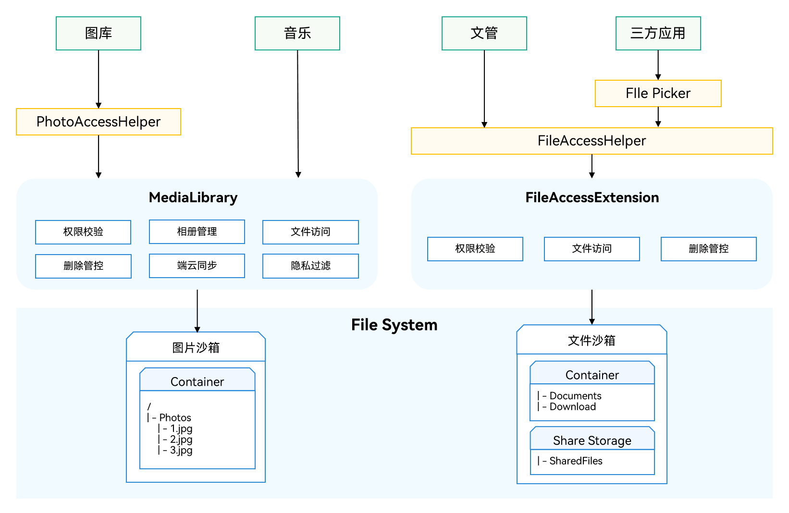

# 文件子系统ChangeLog

## cl.file.1 mediaLibrary相关接口支持范围兼容性变更

[mediaLibrary](../../../application-dev/reference/apis/js-apis-medialibrary.md)部分接口支持范围兼容性变更。

1. 因文件子系统目录框架调整，开发者在访问文档类目录（Documents、Download）不应再使用媒体库（mediaLibrary）的接口，建议使用[FilePicker](../../../application-dev/reference/apis/js-apis-file-picker.md)接口替代。

- 调整前属于媒体库管控的目录有：

  相机（Camera）、视频（Videos）、图片（Pictures）、音频（Audios）、文档（Documents、Download）。

- 调整后属于媒体库管控的目录有：

  相机（Camera）、视频（Videos）、图片（Pictures）、音频（Audios）。

2. 对应的资源uri格式发生变化，参见：[文件子系统ChangeLog](../OpenHarmony_4.0.11.2/changelogs-filemanagement.md)。

**变更影响**

基于此前版本开发的应用，请排查是否有通过调用媒体库接口对文档类目录（Documents、Download）和目录下的文件进行操作的情况，如有请尽快进行适配修改。

**关键接口/组件变更**

| 模块名                    | 方法/属性/枚举/常量                                          | 变更类型 |
| ------------------------- | ------------------------------------------------------------ | -------- |
| medialibrary   |  **function** getFileAssets(options: MediaFetchOptions, callback: AsyncCallback&lt;FetchFileResult&gt;): void | 接口支持范围兼容性变更     |
| medialibrary   |  **function** getFileAssets(options: MediaFetchOptions): Promise&lt;FetchFileResult&gt; | 接口支持范围兼容性变更     |
| medialibrary   |  **function** createAsset(mediaType: MediaType, displayName: string, relativePath: string, callback: AsyncCallback&lt;FileAsset&gt;): void | 接口支持范围兼容性变更     |
| medialibrary   |  **function** createAsset(mediaType: MediaType, displayName: string, relativePath: string): Promise&lt;FileAsset&gt; | 接口支持范围兼容性变更     |
| medialibrary   |  **function** deleteAsset(uri: string, callback: AsyncCallback&lt;void&gt;): void | 接口支持范围兼容性变更     |
| medialibrary   |  **function** deleteAsset(uri: string): Promise&lt;void&gt; | 接口支持范围兼容性变更     |
| medialibrary   |  **function** getPublicDirectory(type: DirectoryType, callback: AsyncCallback&lt;string&gt;): void | 接口支持范围兼容性变更     |
| medialibrary   |  **function** getPublicDirectory(type: DirectoryType): Promise&lt;string&gt; | 接口支持范围兼容性变更     |
| medialibrary   |  **function** storeMediaAsset(option: MediaAssetOption, callback: AsyncCallback&lt;string&gt;): void | 接口支持范围兼容性变更     |
| medialibrary   |  **function** storeMediaAsset(option: MediaAssetOption): Promise&lt;string&gt; | 接口支持范围兼容性变更     |
| medialibrary   |  **interface** DirectoryType | 接口支持范围兼容性变更     |
| medialibrary   |  **interface** MediaAssetOption | 接口支持范围兼容性变更     |

**getFileAssets接口支持范围兼容性变更影响：**

由于API version 10上文件子系统目录框架调整，getFileAssets将无法获取到文档类目录（Documents、Download）下的文件资源。推荐使用[FilePicker](../../../application-dev/reference/apis/js-apis-file-picker.md)获取文件资源。

**createAsset接口支持范围兼容性变更影响：**

由于API version 10上文件子系统目录框架调整，createAsset接口参数中relativePath填写文档类目录（Documents、Download）及其以下的路径将无法在对应目录下创建文件资源。推荐使用[FilePicker](../../../application-dev/reference/apis/js-apis-file-picker.md)创建文件资源。

**deleteAsset接口支持范围兼容性变更影响：**

由于API version 10上文件子系统目录框架调整，deleteAsset接口参数中uri指向的是文档类目录（Documents、Download）下的文件资源将无法删除对应文件资源。推荐使用[fileAccess.delete](../../../application-dev/reference/apis/js-apis-fileAccess.md)删除文件资源

**getPublicDirectory接口支持范围兼容性变更影响：**

由于API version 10上文件子系统目录框架调整，getPublicDirectory接口参数中type填写mediaLibrary.DirectoryType.DIR_DOCUMENTS和mediaLibrary.DirectoryType.DIR_DOWNLOAD将无法获取对应的公共目录路径。

**storeMediaAsset接口支持范围兼容性变更影响：**

由于API version 10上文件子系统目录框架调整，storeMediaAsset接口参数中MediaAssetOption.relativePath填写文档类目录（Documents、Download）及其以下的路径将无法在对应目录下保存创建文件资源。推荐使用[FilePicker](../../../application-dev/reference/apis/js-apis-file-picker.md)保存文件资源。

**DirectoryType接口支持范围兼容性变更影响：**

由于API version 10上文件子系统目录框架调整，DirectoryType属性中mediaLibrary.DirectoryType.DIR_DOCUMENTS和mediaLibrary.DirectoryType.DIR_DOWNLOAD表示的目录类型不再归媒体库管控，请不要继续使用此目录类型。

**MediaAssetOption接口支持范围兼容性变更影响：**

由于API version 10上文件子系统目录框架调整，MediaAssetOption属性中relativePath填写文档类目录（Documents、Download）及其以下的路径在使用storeMediaAsset接口保存文件时将无法保存，请不要在填写与其相关的路径。

**适配指导**

在API version 10上，对文件子系统目录框架调整，文档类目录（Documents、Download）和此目录下的文件不再属于媒体库管控。继续通过媒体库接口对其进行操作会存在无法达到预期效果的情况，推荐使用[FilePicker](../../../application-dev/reference/apis/js-apis-file-picker.md)对文档类目录（Documents、Download）下的文件进行文件选择和保存等操作。



以下为典型的场景适配指导和示例：

**变更前，使用mediaLibrary接口编辑公共目录下的文件示例（公共目录Documents和Download后续不支持）：**

1. 使用getMediaLibrary接口获取媒体库实例。
2. 创建MediaFetchOptions检索条件使用mediaLibrary实例调用getFileAssets接口获取公共目录下的文件。
3. 使用FetchFileResult相应接口获取目的文件的fileAsset。
4. 使用fileAsset.open接口打开这个文件得到fd。
5. 通过fd使用[fs.writeSync](../../../application-dev/reference/apis/js-apis-file-fs.md#writesync)接口对这个文件进行编辑修改。
6. 修改完成后使用fileAsset.close接口关闭这个文件的fd。
7. 使用fetchFileResult.close接口释放getFileAssets时占用的资源。
8. 使用release接口释放媒体库实例。

**示例：**

```js
import mediaLibrary from '@ohos.multimedia.mediaLibrary';
import fs from '@ohos.file.fs';

async function example() {
  try {
    let context = getContext(this);
    let media = mediaLibrary.getMediaLibrary(context);
    let fileKeyObj = mediaLibrary.FileKey;
    let imageType = mediaLibrary.MediaType.IMAGE;
    let getImageOp = {
      selections: fileKeyObj.MEDIA_TYPE + '= ?',
      selectionArgs: [imageType.toString()],
      order: fileKeyObj.DATE_ADDED + ' DESC',
    };
    const fetchFileResult = await media.getFileAssets(getImageOp);
    const fileAsset = await fetchFileResult.getFirstObject();
    console.info('mediaLibrary fileAsset displayName: ' + fileAsset.displayName);
    let fd = await fileAsset.open('rw');
    console.info('mediaLibrary fileAsset open fd: ' + fd);
    let writeLen = fs.writeSync(fd, 'hello, world');
    console.info('write data to file succeed and size is: ' + writeLen);
    fileAsset.close(fd);
    fetchFileResult.close();
    media.release();
  } catch (err) {
    console.error('mediaLibrary fail, err: ' + err);
  }
}
```

**变更后，使用FilePicker编辑公共目录下的文件示例：**

1. 获取DocumentViewPicker文件选择器对象。
2. 拉起DocumentViewPicker.select接口选择目的文件。
3. 用户选择完后返回目的文件的uri。
4. 待界面从DocumentViewPicker返回后在其他函数中使用[fs.openSync](../../../application-dev/reference/apis/js-apis-file-fs.md#fsopensync)接口通过uri打开这个文件得到fd。
5. 通过fd使用[fs.writeSync](../../../application-dev/reference/apis/js-apis-file-fs.md#writesync)接口对这个文件进行编辑修改。
6. 编辑修改完毕后使用[fs.closeSync](../../../application-dev/reference/apis/js-apis-file-fs.md#closesync)接口关闭这个fd。

**示例：**

```js
import picker from '@ohos.file.picker';
import fs from '@ohos.file.fs';

let uri;

async function example() {
  try {
    let DocumentSelectOptions = new picker.DocumentSelectOptions();
    let documentPicker = new picker.DocumentViewPicker();
    documentPicker.select(DocumentSelectOptions).then((DocumentSelectResult) => {
      console.info('DocumentViewPicker.select successfully, DocumentSelectResult uri: ' + JSON.stringify(DocumentSelectResult));
      uri = DocumentSelectResult[0];
    }).catch((err) => {
      console.error('DocumentViewPicker.select failed with err: ' + err);
    });
  } catch (err) {
    console.error('DocumentViewPicker failed with err: ' + err);
  }
}

async function writeFile() {
  try {
    let file = fs.openSync(uri, fs.OpenMode.READ_WRITE);
    console.info('DocumentViewPicker file fd: ' + file.fd);
    let writeLen = fs.writeSync(file.fd, 'hello, world');
    console.info('write data to file succeed and size is: ' + writeLen);
    fs.closeSync(file);
  } catch (err) {
    console.error('DocumentViewPicker fail, err: ' + err);
  }
}
```

**变更前，使用mediaLibrary接口在公共目录下创建文件示例（公共目录Documents和Download后续不支持）：**

1. 使用getMediaLibrary接口获取媒体库实例。
2. 使用getPublicDirectory接口获取公共目录路径。
3. 使用createAsset接口创建文件得到这个文件的fileAsset。
4. 使用fileAsset.open接口打开这个文件得到fd。
5. 通过fd使用fs.write接口对这个文件进行编辑修改。
6. 修改完成后使用fileAsset.close接口关闭这个文件的fd。
7. 使用release接口释放媒体库实例。

**示例：**

```js
import mediaLibrary from '@ohos.multimedia.mediaLibrary';
import fs from '@ohos.file.fs';

async function example() {
  try {
    let context = getContext(this);
    let media = mediaLibrary.getMediaLibrary(context);
    let mediaType = mediaLibrary.MediaType.FILE;
    let DIR_DOWNLOAD = mediaLibrary.DirectoryType.DIR_DOWNLOAD;
    const path = await media.getPublicDirectory(DIR_DOWNLOAD);
    const fileAsset = await media.createAsset(mediaType, 'test.txt', path);
    console.info('mediaLibrary fileAsset displayName: ' + fileAsset.displayName);
    let fd = await fileAsset.open('rw');
    console.info('mediaLibrary fileAsset open fd: ' + fd);
    let writeLen = fs.writeSync(fd, 'hello, world');
    console.info('write data to file succeed and size is: ' + writeLen);
    fileAsset.close(fd);
    media.release();
  } catch (err) {
    console.error('mediaLibrary fail, err: ' + err);
  }
}
```

**变更后，使用FilePicker在公共目录下创建文件示例：**

1. 获取DocumentViewPicker文件选择器对象。
2. 拉起DocumentViewPicker.save接口创建保存一个空的文件。
3. 用户保存完后返回目的文件的uri。
4. 待界面从DocumentViewPicker返回后在其他函数中使用[fs.openSync](../../../application-dev/reference/apis/js-apis-file-fs.md#fsopensync)接口通过uri打开这个文件得到fd。
5. 通过fd使用[fs.writeSync](../../../application-dev/reference/apis/js-apis-file-fs.md#writesync)接口对这个文件进行编辑修改。
6. 编辑修改完毕后使用[fs.closeSync](../../../application-dev/reference/apis/js-apis-file-fs.md#closesync)接口关闭这个fd。

**示例：**

```js
import picker from '@ohos.file.picker';
import fs from '@ohos.file.fs';

let uri;

async function example() {
  try {
    let DocumentSaveOptions = new picker.DocumentSaveOptions();
    DocumentSaveOptions.newFileNames = ['DocumentViewPicker01.txt'];
    let documentPicker = new picker.DocumentViewPicker();
    documentPicker.save(DocumentSaveOptions).then((DocumentSaveResult) => {
      console.info('DocumentViewPicker.save successfully, DocumentSaveResult uri: ' + JSON.stringify(DocumentSaveResult));
      uri = DocumentSaveResult[0];
    }).catch((err) => {
      console.error('DocumentViewPicker.save failed with err: ' + err);
    });
  } catch (err) {
    console.error('DocumentViewPicker failed with err: ' + err);
  }
}

async function writeFile() {
  try {
    let file = fs.openSync(uri, fs.OpenMode.READ_WRITE);
    console.info('DocumentViewPicker file fd: ' + file.fd);
    let writeLen = fs.writeSync(file.fd, 'hello, world');
    console.info('write data to file succeed and size is: ' + writeLen);
    fs.closeSync(file);
  } catch (err) {
    console.error('DocumentViewPicker fail, err: ' + err);
  }
}
```
