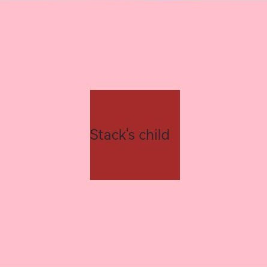

# arkui子系统ChangeLog

## cl.arkui.1 stack组件alignContent属性和通用属性align生效顺序

**说明**
属性之间的处理原则：如果功能相同，属性按覆盖处理即后设置的生效。alignContent和align功能相同，都是子组件在stack容器组件的对齐方式。

**示例：**
```ts
// xxx.ets
@Entry
@Component
struct StackExample {
  build() {
    Stack({alignContent:Alignment.Start}){
      Text("Stack's child").backgroundColor(Color.Brown).height("100").width(100)
    }
    .width(300).height(300)
    .backgroundColor(Color.Pink)
    .align(Alignment.Center)
    .alignContent(Alignment.TopEnd)
  }
}
```

API version 9：子组件按照通用属性align布局




API version 10及以后：子组件按照后设置的alignContent布局


**变更影响**

alignContent和align都设置时，API version 9及以前是align生效，API version 10及以后是后设置的生效。

## cl.arkui.2 canvas组件fillText接口和strokeText接口行为变更

**说明**
fillText和strokeText接口在绘制文字时，不会换行。

**示例：**
```ts
// xxx.ets
@Entry
@Component
struct FillText {
  private settings: RenderingContextSettings = new RenderingContextSettings(true)
  private context: CanvasRenderingContext2D = new CanvasRenderingContext2D(this.settings)

  build() {
    Flex({ direction: FlexDirection.Column, alignItems: ItemAlign.Center, justifyContent: FlexAlign.Center }) {
      Canvas(this.context)
        .width('100%')
        .height('100%')
        .backgroundColor('#ffff00')
        .onReady(() =>{
          this.context.font = '50px sans-serif'
          this.context.fillText("Hello World!", 0, 100)
          this.context.fillText("Hello World! This is a long string to fully show", 0, 150)
          this.context.strokeText("Hello World!", 0, 250)
          this.context.strokeText("Hello World! This is a long string to fully show", 0, 300)
        })
    }
    .width('100%')
    .height('100%')
  }
}
```

API version 9：fillText和strokeText接口在绘制文字时，会根据组件宽度换行。


API version 10及以后：fillText和strokeText接口在绘制文字时，不会换行。


**变更影响**

fillText和strokeText接口在绘制文字时，API version 9及以前是根据组件宽度换行，API version 10及以后是不会换行。