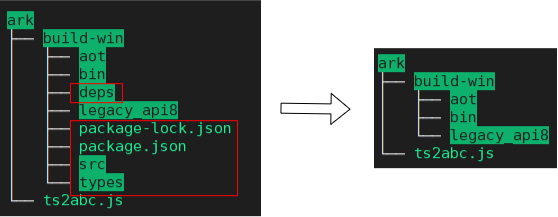

# arkcompiler子系统ChangeLog

## cl.arkcompiler.1 sdk中ts2abc编译器下线

sdk中arkcompiler原有两个编译器支持ets/js的编译，分别是ts2abc编译器和es2abc编译器。在这个版本的迭代中，ts2abc编译器已经下线，无法调用ts2abc编译器生成abc文件。开发者可以在sdk的ets\build-tools\ets-loader\bin以及js\build-tools\ets-loader\bin目录下发现如下图所示的变更。

**变更影响** 
升级新版本的sdk后，使用DevEco进行应用开发时不会有任何影响。如果利用脚本调用sdk中的ts2abc编译器进行编译生成abc操作时，需要调用es2abc编译器进行开发。

**关键的接口/组件变更**
arkcompiler前端编译器中的ts2abc下线

**适配指导**
1. 对于利用DevEco进行应用开发的开发者而言，ts2abc编译器的下线不会造成任何影响，不需要做适配
2. 对于自己开发脚本调用sdk中的ts2abc编译器的开发者而言，需要切换为调用es2abc编译器来生成abc文件。es2abc编译器的使用说明以及与ts2abc编译器的对比请参考[es2abc和ts2abc使用说明](https://gitee.com/openharmony/arkcompiler_ets_frontend#%E4%BD%BF%E7%94%A8%E8%AF%B4%E6%98%8E). 假设编译的文件名叫a.js文件，对于使用频率最高的生成abc文件，两者的编译命令如下：
    - script模式编译
        1. es2abc: es2abc a.js --output a.abc
        2. ts2abc: node --expose-gc pathToIndex/index.js a.js --output a.abc
    - module模式编译
        1. es2abc: es2abc a.js --module --output a.abc
        2. ts2abc: node --expose-gc pathToIndex/index.js a.js --module --output a.abc