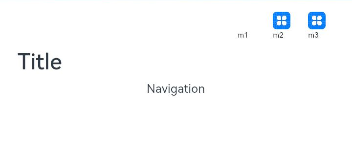
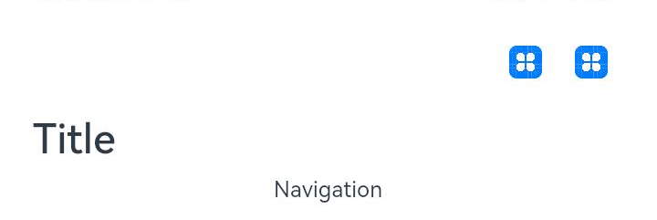
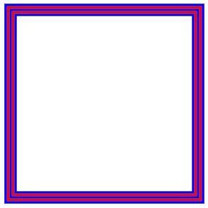
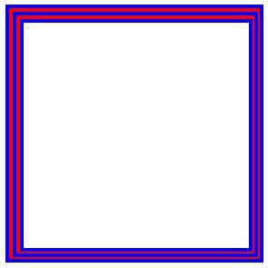

# arkui子系统ChangeLog

## cl.arkui.1 Navigation menus属性显示变更

**变更影响**

menus的value属性值不做显示，如果需要显示，可以使用自定义Builder显示。

**示例：**
```ts
@Entry
@Component
struct Index {
  build() {
    Column() {
      Navigation() {
        Text('Navigation')
      }.title("Navigation Menu")
      .menus([
        {icon: 'common/image/icon.png', value: 'menu1'},
        {icon: 'common/image/icon.png', value: 'menu2'},
        {icon: 'common/image/icon.png', value: 'menu3'}
      ])
    }
  }
}
```
API Version 9：menus的value属性会显示



API Version 10: menus中的value属性不显示


## cl.arkui.2 Navigation的titleMode属性Free模式默认显示位置变更

**变更影响**
1. Navigation组件自定义标题并titleMode设置为Full模式或Free模式显示位置相同
2. 使用自定义title结合Free模式的标签会出现标签位置向右偏移

**示例：**
```ts
@Entry
@Component
struct Index {
  @Builder NavigationTile() {
    Column() {
      Text('title').fontColor('#182431').fontSize(30).lineHeight(41)
      Text('subTitle').fontColor('#182431').fontSize(14).lineHeight(19).margin(top:2, bottom: 20)
    }
  }

  build() {
    Column() {
      Navigation() {
        Text('Navigation')
      }.title(this.NavigationTitle)
       .titleMode(NavigationTitleMode.Free)
       .menus([
        {icon: 'common/image/icon.png', value: 'menu1'}
       ])
    }
  }
}
```

API Version 9: Free模式显示位置


API Version 10: Free模式显示位置与Full模式显示位置相同


## cl.arkui.3 字符串异常值默认变更

**变更影响**

包含数字的非法字符串不会解析为数字部分，而是视为非法值，按照规则设定为默认值

**示例：**
```ts
@Entry
@Component
struct GridRowExample {
  @State bgColors: Color[] = [Color.Red, Color.Orange, Color.Yellow, Color.Green, Color.Pink, Color.Grey, Color.Blue, Color.Brown]
  @State currentBp: string = 'unknown'

  build() {
    Column() {
      GridRow({
        columns: 5,
        gutter: { x: 5, y: 10 },
        breakpoints: { value: ["400vp", "600vp", "800vp"],
          reference: BreakpointsReference.WindowSize },
        direction: GridRowDirection.Row
      }) {
        ForEach(this.bgColors, (color) => {
          GridCol({ span: { xs: 1, sm: 2, md: 3, lg: 4 } }) {
            Row().width("100%").height("20vp")
          }.borderColor(color).borderWidth(2)
        })
      }.width("100%").height("100%")
    }.width("80pv").margin({ left: 10, top: 5, bottom: 5 }).height(200)
    .border({ color: '#880606', width: 2 })
  }
}
```

API Version 9：上方示例中的GridRow设定width中的"80pv"会等同于width设定字符串"80"

API Version 10: 上方示例中的GridRow的width中的"80pv"会被视为异常值，所以GridRow的width设定为默认值，相当于未设定

## cl.arkui.4 Swiper的loop属性设置非法值时使用默认值true

**变更影响**

Swiper的loop属性设置非法值时原先使用false，现更改为true

API Version 9: loop属性设置非法值时使用false

API Version 10: loop属性设置非法值时使用true

## cl.arkui.5 Swiper的翻页速度阈值由180px/s调整为1200px/s

**变更影响**

需要更快的速度才能满足翻页的条件

## cl.arkui.6 Swiper的isShowBackground属性名称变更为showBackground

**变更影响**

Swiper组件中,是否显示底板的属性名称由isShowBackground变更为showBackground

**示例：**

```ts
class MyDataSource implements IDataSource {
  private list: number[] = []
  private listener: DataChangeListener

  constructor(list: number[]) {
    this.list = list
  }

  totalCount(): number {
    return this.list.length
  }

  getData(index: number): any {
    return this.list[index]
  }

  registerDataChangeListener(listener: DataChangeListener): void {
    this.listener = listener
  }

  unregisterDataChangeListener() {
  }
}

@Entry
@Component
struct SwiperExample {
  private swiperController: SwiperController = new SwiperController()
  private data: MyDataSource = new MyDataSource([])

  aboutToAppear(): void {
    let list = []
    for (var i = 1; i <= 10; i++) {
      list.push(i.toString());
    }
    this.data = new MyDataSource(list)
  }

  build() {
    Column({ space: 5 }) {
      Swiper(this.swiperController) {
        LazyForEach(this.data, (item: string) => {
          Text(item)
            .width('90%')
            .height(160)
            .backgroundColor(0xAFEEEE)
            .textAlign(TextAlign.Center)
            .fontSize(30)
        }, item => item)
      }
      .cachedCount(2)
      .index(1)
      .autoPlay(true)
      .indicator(true)
      .displayArrow({
        showBackground: true,
        isSidebarMiddle: true,
        backgroundSize: 24,
        backgroundColor: Color.White,
        arrowSize: 18,
        arrowColor: Color.Blue
      }, false)

      Row({ space: 12 }) {
        Button('showNext')
          .onClick(() => {
            this.swiperController.showNext()
          })
        Button('showPrevious')
          .onClick(() => {
            this.swiperController.showPrevious()
          })
      }.margin(5)
    }.width('100%')
    .margin({ top: 5 })
  }
}
```

## cl.arkui.7 Navigation menus最右图标距离右边缘间距变更

**变更影响**

menus整体向右侧偏移12vp，最右图标距离右边缘的间距由原36vp变更为24vp。

## cl.arkui.8 像素取整变更

**变更影响**

对于有小数的坐标点和宽高值会四舍五入为整数。

API Version 9：像素点坐标、控件宽高、边框宽度不会取整。

API Version 10: 像素点坐标、控件宽高、边框宽度会取整。

**示例：**
```ts
@Entry
@Component
struct Index {
  build() {
    Column() {
      Row() {
        Row() {
          Row() {
            Row() {
              Row()
                .width('100%')
                .height('100%')
                .border({width: '1', color: 'blue'})
            }
            .width('100%')
            .height('100%')
            .border({width: '1', color: 'red'})
          }
          .width('100%')
          .height('100%')
          .border({width: '1', color: 'blue'})
        }
        .width('100%')
        .height('100%')
        .border({width: '1', color: 'red'})
      }
      .width('81')
      .height('81')
      .border({width: '1', color: 'blue'})
    }
    .width('100%')
    .height('100%')
  }
}
```
API Version 9：像素点坐标、控件宽高、边框宽度不会取整。

 

API Version 10: 左边框、上边框宽度向上取整，右边框、下边框宽度向下取整。


