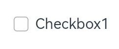

# ArkUI子系统ChangeLog

## cl.arkui.1 默认焦点行为变更

当开发者未配置通用属性：defaultFocus 时，默认焦点获取策略：

API 11之前：给到当前页面上首个可获焦的非容器组件。

API 11及之后：给到当前页面的根容器上。

**变更影响**

未配置defaultFocus属性的情况下，当页面首次打开时，原先默认第一个可获焦的非容器组件会立即获取焦点。变更后，该组件不会在此刻获取到焦点，此时焦点在当前页面的根容器上。

例如：
1. 页面内首个可获焦的非容器组件为一个输入框组件，且无任何组件绑定defaultFocus属性。

   API 11之前：在页面打开时该输入框组件获焦并拉起输入法。

   API 11及之后：在页面打开时该输入框组件不处于获焦状态，无法自动拉起输入法。需要按一次TAB键才可以使其获焦。

2. 开发者在页面内首个可获焦的非容器组件上绑定了onKeyEvent事件，用以监听按键事件然后做对应的业务处理。
   
   API 11之前：在页面打开时该组件默认获焦，无需其他任何操作，onKeyEvent回调可立即监听键盘的按键事件。

   API 11及之后：在页面打开时该组件不处于获焦状态，此时它的onKeyEvent回调无法响应键盘按键事件，需要按一次TAB键使其获焦后，才可继续使用onKeyEvent功能。


**适配指导**

若希望应用保持变更前的效果，则需要给目标组件绑定defaultFocus(true)属性，使能其成为页面内的默认焦点，这样当页面首次打开时，焦点会自动给到首个绑定了defaultFocus(true)属性的组件上。


## cl.arkui.2 输入框类组件软键盘交互行为变更

输入框获焦后会拉起输入法，在输入法的软键盘上，有两个位置的点击可使软键盘收起，一个是软键盘右上角的倒三角收起按钮，另一个是软键盘右下角的EnterKey按钮。

API 11之前：按钮点击时可使软键盘收起，但不会使对应拉起方的输入框组件失焦。

API 11及之后：按钮点击时既可以使软键盘收起，也会使对应拉起方的输入框组件失焦。

影响的输入框组件包括：TextInput、TextArea、Search、RichEditor。

**变更影响**

影响焦点的逻辑行为：

API 11之前，点击按钮后输入框仍处于获焦状态，此时输入框组件上的onKeyEvent事件仍可正常响应、应用先后台再前台，会重新拉起输入法、按TAB键走焦可立即走到下一个组件。

API 11及之后，点击按钮后输入框会立即失焦，此时输入框组件上的onKeyEvent事件无法响应、应用先后台再前台，不会重新拉起输入法、按TAB键会使该输入框组件重新获焦，而非走焦到下一个组件。

**适配指导**

默认行为变更，无需适配，但应注意变更后的行为是否对整体应用逻辑产生影响。

## cl.arkui.3 Checkbox组件默认形状变更

**访问级别**

公开接口

**变更原因**

增强视觉、交互效果。

**变更影响**

该变更为兼容性变更。

**API Level**

11

**变更发生版本**

从OpenHarmony SDK 4.1.3.2 版本开始。

**变更的接口/组件**

checkbox组件。

当开发者未配置Checkbox组件的shape属性，默认形状变更。

**变更影响**

默认形状策略：

API version 11及之后：Checkbox组件的形状默认为圆形。

  

API version 11之前：Checkbox组件的形状默认为圆角方形。

  

**适配指导**

若希望API version 11及之后Checkbox组件的形状为变更前的圆角方形，则需要Checkbox组件绑定shape(CheckBoxShape.ROUNDED_SQUARE)属性，这样Checkbox组件的形状就变成圆角方形。


## cl.arkui.4 rawfile文件资源校验等级变更

**访问级别**

所有$rawfile()的使用校验。

**变更影响**

$rawfile()引用不存在的资源，报错等级由WARN变更成ERROR。

**变更发生版本**

从OpenHarmony SDK 4.1.3.2 开始。

**示例：**

```
@Entry
@Component
struct Index {
  build() {
    Button(){
      // ERROR: No such 'app_icon.ong' resource in current module.
      Image($rawfile('app_icon.png'))
    }
  }
}
```

**变更的接口/组件**

不涉及。

**适配指导**

不涉及。