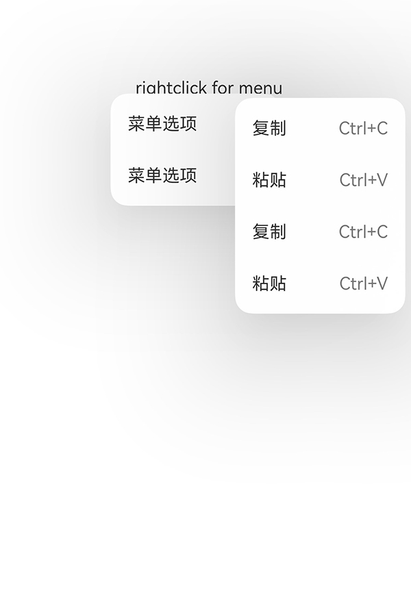
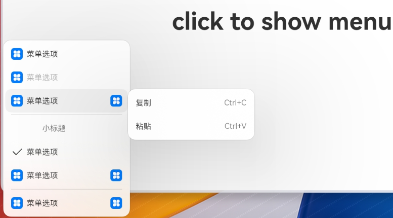

# ArkUI子系统变更说明

## cl.arkui.1 Menu组件宽度设置效果变更，避让规则变更

**访问级别**

公开接口

**变更原因**

UX一致性需求变更

1、为开发者提供配置小于最小宽度后的视觉变化。

2、跟随点击位置菜单的交互效果变更。

3、为开发者提供左键菜单跨应用显示的属性，在不配置此属性时菜单会根据设备类型决定是否跨越应用显示。

**变更影响**

变更为兼容性变更

1、增加左键菜单可跨越应用显示的能力。

2、影响跟随点击位置菜单弹出的避让逻辑。

**API Level**

11

**变更发生版本**

从OpenHarmony SDK 4.1.3.5版本开始。

**变更的接口/组件**

涉及到菜单组件:

- 变更前：

  a) 用户定义菜单实际宽度小于64vp时，则设定为64vp。

  b) 跟随点击位置弹出类型的菜单，如下方空间不足，向上翻转显示。

  c) 跟随点击位置弹出类型的菜单，如果绑定子菜单，会贴近边缘显示。一级菜单带有边距margin，左右方向为12vp，上下方向为24vp。

  d) 左键菜单能力为窗口内显示。

- 变更后：

  a) 用户定义菜单实际宽度小于64vp时，菜单宽度恢复为默认值2个columns。

  b) 跟随点击位置弹出类型的菜单，如下方空间不足，则垂直方向向上平移，直到将菜单完整显示（菜单底部与边界按要求保留最小边距限制）。

  c) 如果配置菜单在应用内弹出，左右方向的margin为16vp，上下侧默认规避状态栏与导航条,不额外增加避让距离；如果配置菜单在应用窗口外弹出，左右方向的margin为8vp，上下侧默认规避状态栏与Dock区域，不额外增加避让距离。如果绑定子菜单，margin与一级菜单一致。

  
  
  d) 左键菜单可通过showInSubWindow设定klv设置是否显示在窗口外。如果未进行设置，则按照设备类型自适应显示，klv设备为应用外显示，非klc设备为应用内显示。如果进行设置，klv设备设置为true时，菜单为应用外显示，设置为false时，菜单为应用内显示。
  
  

**适配指导**

```
/*左键菜单子窗口显示接口示例
*(showInSubWindow?: boolean;)
*条件: klv设备 
*参数:true 支持应用外子窗口显示  
*参数:false 支持应用内显示 
*/
@Entry
@Component
struct Index {
  @State select: boolean = true
  private iconStr: ResourceStr = $r("app.media.view_list_filled")
  private iconStr2: ResourceStr = $r("app.media.view_list_filled")

  @Builder
  SubMenu() {
    Menu() {
      MenuItem({ content: "复制", labelInfo: "Ctrl+C" })
      MenuItem({ content: "粘贴", labelInfo: "Ctrl+V" })
    }
  }

  @Builder
  MyMenu(){
    Menu() {
      MenuItem({ startIcon: $r("app.media.icon"), content: "菜单选项" })
      MenuItem({ startIcon: $r("app.media.icon"), content: "菜单选项" })
        .enabled(false)
      MenuItem({
        startIcon: this.iconStr,
        content: "菜单选项",
        endIcon: $r("app.media.arrow_right_filled"),
        builder: ():void=>this.SubMenu()
      })
      MenuItemGroup({ header: '小标题' }) {
        MenuItem({ content: "菜单选项" })
          .selectIcon(true)
          .selected(this.select)
          .onChange((selected) => {
            console.info("menuItem select" + selected);
            this.iconStr2 = $r("app.media.icon");
          })
        MenuItem({
          startIcon: $r("app.media.view_list_filled"),
          content: "菜单选项",
          endIcon: $r("app.media.arrow_right_filled"),
          builder: ():void=>this.SubMenu()
        })
      }
      MenuItem({
        startIcon: this.iconStr2,
        content: "菜单选项",
        endIcon: $r("app.media.arrow_right_filled")
      })
    }
  }

  build() {
    Row() {
      Column() {
        Text('click to show menu')
          .fontSize(50)
          .fontWeight(FontWeight.Bold)
      }
      .bindMenu(this.MyMenu,{showInSubWindow:true})
      .width('100%')
    }
    .height('100%')
  }
}

```