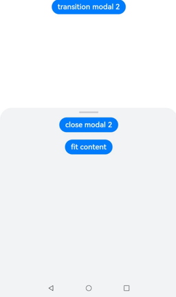
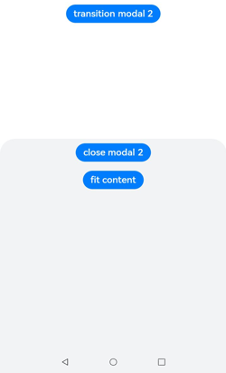

# ArkUI 子系统变更说明

## cl.arkui.1 菜单背板的默认视觉效果变更为模糊材质

**访问级别**

公开接口

**变更原因**

增强视觉效果。

**变更影响**

该变更为兼容性变更。

在**统一渲染模式**下，菜单背板的默认视觉效果变更为模糊材质。

**API Level**

11 

**变更发生版本**

从OpenHarmony SDK 4.1.5.2 版本开始。

**变更的接口/组件**

涉及到左键菜单（bindMenu）、右键菜单（bindContextMenu）、下拉选项菜单（Select）、导航组件工具栏的更多悬浮菜单（Navigation）等菜单背板的默认视觉效果：

- 变更前：菜单背景颜色显示为白色，不支持模糊材质。
- 变更后：菜单背景颜色默认为透明和模糊材质，其中bindMenu与bindContextMenu可支持开发者配置是否模糊材质及背景色。

**适配指导**

bindMenu/bindContextMenu去除模糊材质示例代码：
```ts
@Entry
@Component
struct Index {
  @State message: string = '自定义菜单';

  @Builder
  MenuBuilder() {
    Menu() {
      MenuItem({ content: "item00" })
      MenuItem({ content: "item11" })
    }
  }

  @Builder
  ContextMenuBuilder() {
    Menu() {
      MenuItem({ content: "item22" })
      MenuItem({ content: "item33" })
    }
  }

  build() {
    Row() {
      Column() {
        Text(this.message)
          .fontSize(50)
          .fontWeight(FontWeight.Bold)
          .fontColor('black')
          .bindMenu(this.MenuBuilder(), { backgroundColor: Color.White, backgroundBlurStyle: BlurStyle.NONE })
          .bindContextMenu(this.ContextMenuBuilder(), ResponseType.LongPress, {
            backgroundColor: Color.White,
            backgroundBlurStyle: BlurStyle.NONE
          })
      }
      .width('100%')
    }
    .height('100%').backgroundColor(Color.Orange)
  }
}
```
将
```ts
.bindMenu(this.MenuBuilder())
.bindContextMenu(this.ContextMenuBuilder(), ResponseType.LongPress)
```
替换为
```ts
.bindMenu(this.MenuBuilder(), { backgroundColor: Color.White, backgroundBlurStyle: BlurStyle.NONE })
.bindContextMenu(this.ContextMenuBuilder(), ResponseType.LongPress, { backgroundColor: Color.White, backgroundBlurStyle: BlurStyle.NONE })
```
即手动设置背景色与背景模糊材质枚举值。


## cl.arkui.2 bindSheet半模态面板视觉样式增加

**访问级别**

公开接口

**变更原因**

增强视觉效果。

**变更影响**

该变更为兼容性变更。

a) 设备宽度小于600vp时，默认显示底部弹窗样式。

b) 设备宽度在600-840vp间时，默认显示居中弹窗样式。

c) 设备宽度大于840vp时，默认显示跟手弹窗样式，跟手弹窗显示在bindSheet绑定的节点下方。

变更前：所有设备均为底部弹窗样式



变更后：增加居中弹窗和跟手弹窗样式


增加跟手弹窗样式。


**API Level**

11

**变更发生版本**

从OpenHarmony SDK 4.1.5.2 版本开始。

**变更的接口/组件**

bindSheet半模态面板。

**适配指导**

对于宽度大于840vp设备，如需要显示居中弹窗样式，可以设置SheetOptions中的preferType为SheetType.CENTER。


## cl.arkui.3 bindSheet半模态面板底部弹窗样式修改

**访问级别**

公开接口

**变更原因**

增强视觉效果。

**变更影响**

该变更为兼容性变更。

a) 底部弹窗SheetOptions中的SheetSize的Medium档位，设置后面板高度为屏幕高度*0.6。

变更前：


变更后：


b) 底部弹窗SheetOptions中的SheetSize增加FIT_CONTENT档位，设置后面板高度根据内容自适应调整。

变更前：



变更后：


c) 底部弹窗可通过SheetOptions中的detents设置1-3个自定义高度档位，面板可在不同档位间滑动切换，detents仅在底部弹窗并且设备为竖屏时生效。

变更前：面板滑动无法切换档位。

变更后：


d) 底部弹窗在设备横屏时，仅有一个档位高度，距离屏幕顶部8vp。

变更前：设备横屏时，底部弹窗规格与竖屏一致。

变更后：


e) 对内容区Builder设置高度为百分比时，百分比参考的依据是设置的height或detents的高度值，非屏幕高度。

**API Level**

11

**变更发生版本**

从OpenHarmony SDK 4.1.5.2 版本开始。

**变更的接口/组件**

bindSheet半模态面板。

**适配指导**

a) 设置SheetOptions中的detents时，默认高度为detents元组中的第一个元素。

b) 当在SheetOptions中设置detents后，height属性设置无效。

c) 当在height属性中设置自定义高度或FIT_CONTENT自适应的高度，大于最大高度或小于0，则显示最大高度。


## cl.arkui.4 bindSheet半模态面板增加居中弹窗与跟手弹窗样式

**访问级别**

公开接口

**变更原因**

增强视觉效果。

**变更影响**

该变更为兼容性变更。

a) 居中弹窗样式默认宽度480vp，默认高度560vp。

b) 居中弹窗内容固定时可自定义半模态面板高度，自定义高度最小为320vp，最大为设备短边长度*0.9。

c) 居中弹窗在横竖屏切换时，面板大小不会改变。

d) 跟手弹窗样式默认宽度360vp，默认高度560vp。

e) 跟手弹窗内容固定时可自定义半模态面板高度，自定义高度最小为320vp，最大为设备短边长度*0.9。

**API Level**

11

**变更发生版本**

从OpenHarmony SDK 4.1.5.2 版本开始。

**变更的接口/组件**

bindSheet半模态面板。

**适配指导**

当在height属性中设置自定义高度或FIT_CONTENT自适应的高度大于最大高度，则显示最大高度，小于最小高度，则显示最小高度，若自定义高度为负数，则显示默认高度。


## cl.arkui.5 bindSheet半模态面板操作区修改

**访问级别**

公开接口

**变更原因**

增强视觉效果。

**变更影响**

该变更为兼容性变更。

a) 增加标题区，通过SheetOptions中的title设置。设置单行标题或自定义标题时，标题区高为56vp，设置双行标题时，标题区高为72vp。

变更前：面板无标题区。


变更后：面板可设置标题区。


b) 增加关闭图标，通过SheetOptions中的showClose设置，关闭图标默认为显示。

变更前：面板没有关闭图标。

变更后：面板默认显示关闭图标。

c) 控制条的大小改变为48*4vp，控制条当面板高度为单档位时不显示，面板高度为多档位时默认显示。

变更前：控制条大小为28*4vp，默认显示。

变更后：控制条大小为48*4vp，控制条仅在底部弹窗多档位时默认显示。

d) 拖拽控制条时，控制条在一定范围内无xy方向的小幅位移动效。

变更前：拖拽控制条存在xy方向的小幅位移动效。

变更后：控制条无拖拽xy方向的动效。

**API Level**

11

**变更发生版本**

从OpenHarmony SDK 4.1.5.2 版本开始。

**变更的接口/组件**

bindSheet半模态面板。

**适配指导**

无。


## cl.arkui.6 bindSheet半模态面板内容区交互修改

**访问级别**

公开接口

**变更原因**

增强交互效果。

**变更影响**

该变更为兼容性变更。

a) 底部弹窗内容处于顶部时上滑，如有更高的档位，则优先扩展档位，如无档位，则滚动内容；底部弹窗内容处于顶部时下滑，优先向下收缩面板档位，如无档位可收缩，则关闭面板。

b) 底部弹窗内容处于底部时上滑，呈现内容区域回弹效果，不切换档位；底部弹窗内容处于底部时下滑，滚动内容直到到达顶部。

c) 底部弹窗、居中弹窗和跟手弹窗内容处于中间位置时，上/下滑时，优先滚动内容，直至页面内容到达底部/顶部，无档位变化等其他交互内容。

d) 居中弹窗如果内容处于顶部，下滑关闭面板，上滑滚动内容；如果内容处于底部，则上滑呈现内容区域回弹效果，下滑滚动内容。

e) 跟手弹窗如果内容处于顶部，下滑不关闭面板，上滑滚动内容；如果内容处于底部，则上滑呈现内容区域回弹效果，下滑滚动内容。

变更前：面板内容区上下滑无交互反馈。

变更后：


**API Level**

11

**变更发生版本**

从OpenHarmony SDK 4.1.5.2 版本开始。

**变更的接口/组件**

bindSheet半模态面板。

**适配指导**

无。


## cl.arkui.7 bindSheet半模态面板标题区交互修改

**访问级别**

公开接口

**变更原因**

增强交互效果。

**变更影响**

该变更为兼容性变更。

a) 底部弹窗标题区上滑，短滑向上切换至相邻较大档位，长滑可跨档位直接切换至最大档位，若已到最大档位呈现面板回弹效果。

b) 底部弹窗标题区下滑，短滑向下切换至相邻较小档位，长滑可跨档位直接关闭面板。

c) 居中弹窗标题区上滑，呈现面板回弹效果；下滑时，短滑且速度未到阈值呈现面板回弹效果，长滑或速度到达阈值直接关闭面板。

变更前：标题区交互仅会触发关闭事件。

变更后：


**API Level**

11

**变更发生版本**

从OpenHarmony SDK 4.1.5.2 版本开始。

**变更的接口/组件**

bindSheet半模态面板。

**适配指导**

无。

**变更示例**

底部弹窗标题区交互示例。


## cl.arkui.8 bindSheet半模态面板关闭交互修改

**访问级别**

公开接口

**变更原因**

增强交互效果。

**变更影响**

该变更为兼容性变更。

a) 可通过点击蒙层关闭半模态面板，底部弹窗和居中弹窗样式默认有蒙层，跟手弹窗样式默认无蒙层。

变更前：半模态面板默认无蒙层，点击蒙层无法关闭面板。

变更后：


b) 可通过点击关闭图标关闭半模态面板。

c) 底部弹窗、居中弹窗可通过下滑手势关闭半模态面板。

变更前：半模态面板可通过下滑手势关闭面板。

变更后：底部弹窗、居中弹窗可通过下滑手势关闭半模态面板；跟手弹窗无法通过下滑手势关闭半模态面板。

d) SheetOptions中增加shouldDismiss接口，当用户执行下拉关闭/back事件/点击蒙层关闭/关闭按钮关闭交互操作时，如果注册该回调函数，则不会立刻关闭。

变更前：如果关闭事件被触发，半模态面板立刻关闭。

变更后：注册shouldDismiss接口的回调函数，半模态面板不会立刻关闭。


**API Level**

11

**变更发生版本**

从OpenHarmony SDK 4.1.5.2 版本开始。

**变更的接口/组件**

bindSheet半模态面板。

**适配指导**

无。

## cl.arkui.9 select组件修改

**访问级别**

公开接口

**变更原因**

增强视觉效果。

**变更影响**

该变更为兼容性变更。

**API Level**

11

**变更发生版本**

从OpenHarmony SDK 4.1.5.2 版本开始。

**变更的接口/组件**

select组件。

- 变更前：
  Select组件下拉按钮文本到左边界距离与箭头图标到右边界距离为12vp。

  Select组件下拉按钮与下拉菜单之间对齐时横坐标略有偏移。

  Select组件下拉按钮与下拉菜单之间距离4vp。

  

- 变更后：
  Select组件下拉按钮文本到左边界距离与箭头图标到右边界距离为16vp。

  Select组件下拉按钮与下拉菜单之间横坐标无偏移。
  
  Select组件下拉按钮与下拉菜单之间距离8vp。

  

**适配指导**

无。


## cl.arkui.10 Refresh组件交互行为变更

**访问级别**

公开接口

**变更原因**

Refresh组件支持鼠标下拉动作进行交互，在某些场景下会与框选动作发生冲突，且该交互行为不符合UX规范，因此依照UX规范对相关交互行为做出变更。

**变更影响**

该变更为非兼容性变更，变更后Refresh组件不再支持鼠标下拉动作进行交互。

**API Level**

8

**变更发生版本**

从OpenHarmony SDK 4.1.5.2 版本开始。

**变更的接口/组件**

API 11之前，Refresh组件支持鼠标下拉动作进行交互。

API 11及之后，Refresh组件不支持鼠标下拉动作进行交互。

**适配指导**

无。