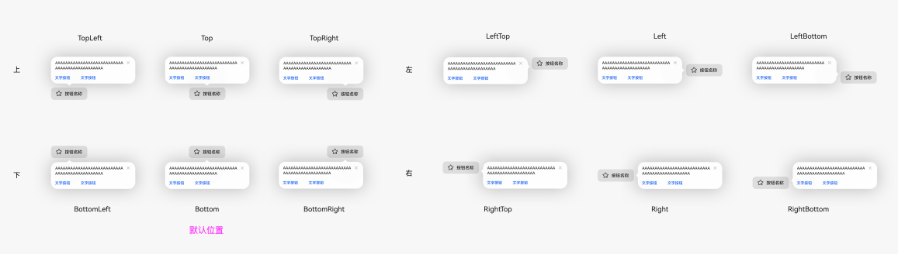
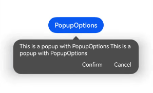

# ArkUI子系统变更说明

## cl.arkui.1 DatePickerDialog、TimePickerDialog、TextPickerDialog设置alignment参数显示效果变更

**访问级别**

公开接口

**变更原因**

规格优化。

**变更影响**

该变更为兼容性变更。

DatePickerDialog、TimePickerDialog、TextPickerDialog支持通过设置alignment参数调整滑动选择器弹窗相对于窗口的弹出位置。具体受影响的场景见下文：

a) 设置alignment为Top、TopStart、TopEnd

变更前：与窗口顶部默认有40vp的间距

变更后：与窗口顶部的间距为0

b) 设置alignment为Bottom

变更前：与窗口底部默认有16vp的间距

变更后：与窗口底部的间距为0

c) 设置alignment为Center

变更前：相对于窗口正中位置默认有16vp的向上偏移

变更后：处于窗口正中位置

**API Level** 

11

**变更发生版本**

从OpenHarmony SDK 4.1.5.3开始。

**变更的接口/组件**

日期滑动选择器弹窗（DatePickerDialog）、时间滑动选择器弹窗（TimePickerDialog）、文本滑动选择器弹窗（TextPickerDialog）

**适配指导**

DatePickerDialog、TimePickerDialog、TextPickerDialog设置alignment时与窗口边缘的间距通过offset设置来调整。

## cl.arkui.2 SegmentButton组件buttonMargin、textMargin接口命名变更

**访问级别**

公开接口

**变更原因**

原接口命名与接口实际功能不符。

**变更影响**

该变更为非兼容性变更。修改SegmentButton用于设置按钮内边距、文本内边距的接口命名：

a) 按钮内边距接口命名变更

变更前：buttonMargin

变更后：buttonPadding

b) 文本内边距接口命名变更

变更前：textMargin

变更后：textPadding

**变更发生版本**

从OpenHarmony SDK 4.1.5.3开始。

**变更的接口/组件**

分段按钮（SegmentButton）。

**适配指导**

变更前：

分段按钮通过buttonMargin、textMargin进行按钮内边距、文本内边距的设置。

变更后：

分段按钮通过buttonPadding、textPadding进行按钮内边距、文本内边距的设置。

## cl.arkui.3 TextInput组件cancelButton接口IconOptions.size参数默认值变更

**访问级别**

公开接口

**变更原因**

cancelButton接口不设置IconOptions.size参数，图片的实际尺寸与开发者获取的尺寸不符。

**变更影响**

该变更为非兼容性变更。cancelButton接口不设置IconOptions.size参数，开发者获取的图片尺寸发生变更，变更如下：

变更前：0.00px

变更后：24.00vp

**变更发生版本**

从OpenHarmony SDK 4.1.5.3开始。

**变更的接口/组件**

单行文本输入框（TextInput）

**适配指导**

TextInput设置cancelButton时不设置IconOptions.size参数可以获取正确的图片尺寸24.00vp。

## cl.arkui.4 变更@Prop和@BuilderParam初始化校验规格

**访问级别**

公开接口。

**变更原因**

@Require和@Prop或者@BuilderParam结合使用能够决定是否需要从父组件构造传参，现@Prop和@BuilderParam的初始化校验变更。

**变更影响**

该变更为非兼容性变更。变更@Prop和@BuilderParam初始化校验规格。增加当@Require装饰器和@Prop装饰器或者@BuilderParam装饰器结合使用时，@Prop装饰器或者 @BuilderParam装饰器修饰的变量值必须由父组件构造传参，如父组件未构造传参，编译报错。如果@Prop、@BuilderParam没有和@Require结合使用，不会进行构造传参初始化校验。

**API Level**

11

**变更发生版本**

从OpenHarmony SDK 4.1.5.3 开始。

**示例：**

```
@Entry
@Component
struct Index {
  build() {
    Row() {
      Child()
    }
  }
}

@Component
struct Child {
  // ERROR: Property buildText must be initialized through the component constructor.
  @Require @BuilderParam buildText: () => void;
  // ERROR: Property initBuildText must be initialized through the component constructor.
  @Require @BuilderParam initBuildText: () => void = buildFuction;
  // ERROR: Property message must be initialized through the component constructor.
  @Require @Prop message: string = 'Hello';
  // ERROR: Property initMessage must be initialized through the component constructor.
  @Require @Prop initMessage: string;
  // 删除ERROR: Property 'chindProp' in the custom component 'Child' is missing assignment or initialization.
  @Prop chindProp: string;
  // 删除ERROR: Property 'chindBuildParam' in the custom component 'Child' is missing assignment or initialization.
  @BuilderParam chindBuildParam: () => void;

  build() {
  }
}

@Builder
function buildFuction() {
}
```

**变更的接口/组件**

不涉及。

**适配指导**

当\@Require装饰器和\@Prop装饰器或者\@BuilderParam装饰器结合使用时，\@Prop和\@BuilderParam必须在构造时传参。


## cl.arkui.5 变更popup样式与避让逻辑规格

**访问级别**

公开接口。

**变更原因**

UX能力增强。

**变更影响**

该变更为兼容性变更。

1. 未设置气泡背景色，默认背景色加模糊填充效果。如果需要去掉模糊背景效果，可以通过调用backgroundBlurStyle接口，并设置BlurStyle.NONE（backgroundBlurStyle: BlurStyle.NONE）去掉即可。

   ```ts
   // xxx.ets
   @Entry
   @Component
   struct PopupExample {
     @State handlePopup: boolean = false
   
     build() {
       Column() {
         // PopupOptions 类型设置弹框内容
         Button('PopupOptions')
           .onClick(() => {
             this.handlePopup = !this.handlePopup;
           })
           .bindPopup(this.handlePopup, {
             message: 'This is a popup with PopupOptions',
             backgroundBlurStyle: BlurStyle.NONE,
           })
           .position({ x: 100, y: 150 })
       }
     }
   }
   ```

2. 增加12种对齐方式：

   - 上边：TopLeft/Top/TopRight
   - 下边：BottomLeft/Bottom/BottomRight
   - 左边：LeftTop/Left/LeftBottom
   - 右边：RightTop/Right/RightBottom

   

   ```ts
   // xxx.ets
   @Entry
   @Component
   struct PopupExample {
     @State handlePopup: boolean = false;
   
     build() {
       Column() {
         // PopupOptions 类型设置弹框内容
         Button('按钮名称')
           .onClick(() => {
             this.handlePopup = !this.handlePopup;
           })
           .bindPopup(this.handlePopup, {
             message: 'Test',
             placement: Placement.Bottom
           })
           .position({ x: 100, y: 150 })
       }
     }
   }
   ```

3. PopupOptions类型气泡有按钮时，点击气泡区域外消失。

   - 变更前：PopupOptions类型气泡有按钮时，点击气泡区域外消失。

   - 变更后：PopupOptions类型气泡有按钮时，点击气泡区域外不消失。

   > **说明：**
   >
   > PopupOptions类型气泡有按钮时，是指bindPopup传入PopupOptions数据结构时，primaryButton或secondaryButton有一个或多个不为空。

4. PopupOptions类型气泡文本超长时添加scroll可以滑动显示。

   - 变更前：PopupOptions类型气泡文本超长时被截断。

   - 变更后：PopupOptions类型气泡文本超长时添加scroll可以滑动显示。

5. PopupOptions类型气泡文本颜色取分层参数中ohos_id_color_text_primary值。

   - 变更前：PopupOptions类型气泡文本颜色取分层参数中ohos_id_color_text_primary_contrary值。

   - 变更后：PopupOptions类型气泡文本颜色取分层参数中ohos_id_color_text_primary值。

6. PopupOptions类型气泡按钮颜色取分层参数中ohos_id_color_text_primary_activated值。

   - 变更前：PopupOptions类型气泡按钮颜色取分层参数中ohos_id_color_text_primary_contrary值。

   - 变更后：PopupOptions类型气泡按钮颜色取分层参数中ohos_id_color_text_primary_activated值。

7. PopupOptions类型气泡按钮布局使用Flex可超长换行。

   - 变更前：PopupOptions类型气泡按钮布超长时显示截断。

   - 变更后：PopupOptions类型气泡按钮布局使用Flex可超长换行。

8. CustomPopupOptions类型气泡新增可配置获焦能力，需要调用CustomPopupOptions中focusable接口并设置为true。

   ```ts
   // xxx.ets
   @Entry
   @Component
   struct PopupExample {
     @State customPopup: boolean = false
   
     // popup构造器定义弹框内容
     @Builder
     popupBuilder() {
       Row({ space: 2 }) {
         Button("button1")
         Button("button2")
       }
     }
   
     build() {
       Column() {
         // CustomPopupOptions 类型设置弹框内容
         Button('CustomPopupOptions')
           .position({ x: 80, y: 300 })
           .onClick(() => {
             this.customPopup = !this.customPopup
           })
           .bindPopup(this.customPopup, {
             builder: this.popupBuilder,
             focusable: true
           })
       }
     }
   }
   ```

9. `showInSubWindow=true`（可超出窗口显示）时最大高度为设备屏幕高度，`showInSubWindow=false`（不可超出窗口）时最大高度为应用窗口高度。

   - 变更前：没有最大高度限制，文本过长会截断显示。

   - 变更后：有最大高度显示，文本过长会添加滚动条显示文本。

   `showInSubWindow=true`（可超出窗口显示）时最大高度为设备屏幕高度。即状态栏高度（无状态栏时为0）至底部Dock栏高度（无Dock栏时高度为0）。

   `showInSubWindow=false`（不可超出窗口）时最大高度为应用窗口高度。即状态栏高度（无状态栏时为0）至底部Dock栏高度（无Dock栏时高度为0）。

   > **说明：**
   >
   > 最大高度距离最上方和最下方分别有40vp的间距。

上述第1、第5和第6条变更前后样式对比如下图所示。  

- 变更前：  
  
- 变更后：  
  

> **说明：**
>
> - PopupOptions类型气泡为，bindPopup传入PopupOptions数据结构时的气泡。
>
> - CustomPopupOptions类型气泡为，bindPopup传入CustomPopupOptions数据结构时的气泡。

**API Level**

11

**变更发生版本**

从OpenHarmony SDK 4.1.5.2 开始。

**变更的接口/组件**

bindPopup属性。

**适配指导**

1.根据用户需求自定义气泡背景色，详情参考第1条。

2.根据用户需求自定气泡获焦能力，详情参考第8条。

## cl.Arkui.6 弹窗类组件支持可显示在子窗口

**访问级别**

公开接口

**变更原因**

UX能力增强

**变更影响**

该变更为兼容性变更，为AlterDialog、ActionSheet组件以及promptAction的showDialog和showActionMenu这几种弹窗的接口添加CustomDialog组件已有的showInSubWindow属性，默认值为false。手动设置为true时，该弹窗会创建在子窗口上，可显示在应用窗口外。

**API Level**

11

**变更发生版本**

从OpenHarmony SDK 4.1.5.5开始。

**变更的接口/组件**

API 11前，只有CustomDialog组件的CustomDialogControllerOptions接口有showInSubWindow属性，showInSubWindow默认值为false，手动设置为true时，该弹窗会创建在子窗口上，可显示在应用窗口外，设置为false时，弹窗创建在应用窗口上。

API 11及以后，AlterDialog、CustomDialog、ActionSheet组件以及promptAction的showDialog和showActionMenu接口创建的弹窗都有showInSubWindow属性，showInSubWindow默认值为false，手动设置为true时，该弹窗会创建在子窗口上，可显示在应用窗口外，设置为false时，弹窗创建在应用窗口上。

**适配指导**

新功能实现兼容原有功能，不涉及适配。

## cl.Arkui.7 CustomDialog组件的蒙层范围的更改

**访问级别**

公开接口

**变更原因**

UX一致性需求变更

**变更影响**

该变更为非兼容性变更。

变更前，showInSubWindow为true时，CustomDialog的蒙层范围为子窗口范围，showInSubWindow为false时，CustomDialog的蒙层范围为应用窗口范围。


变更后，无论showInSubWindow为true还是false，CustomDialog的蒙层范围都为应用窗口的范围。


**API Level**

11

**变更发生版本**

从OpenHarmony SDK 4.1.5.5开始。

**变更的接口/组件**

API 11前，showInSubWindow为true时，CustomDialog的蒙层范围为子窗口范围，showInSubWindow为false时，CustomDialog的蒙层范围为应用窗口范围。

API 11及以后，无论showInSubWindow为true还是false，CustomDialog的蒙层范围都为应用窗口的范围。

**适配指导**

原有的showInSubWindow为true时自定义弹窗蒙层范围固定为为子窗口范围，现在showInSubWindow为true时自定义弹窗弹窗蒙层范围是应用窗口的范围，可以通过控制应用窗口的范围控制蒙层范围。

## cl.Arkui.8 弹窗类组件组件的蒙层是否显示的可配置

**访问级别**

公开接口

**变更原因**

UX能力增强

**变更影响**

该变更为兼容性变更，为AlterDialog、CustomDialog、ActionSheet组件以及promptAction的showDialog和showActionMenu这几种弹窗的接口添加isModal属性，默认值为true。isModal属性为true时，弹窗有蒙层，isModal属性为false时，弹窗无蒙层。

**API Level**

11

**变更发生版本**

从OpenHarmony SDK 4.1.5.5开始。

**变更的接口/组件**

API 11前，无isModal属性，所有弹窗都有蒙层。

API 11及以后，添加isModal属性，默认值为true。isModal属性为true时，弹窗有蒙层，isModal属性为false时，弹窗无蒙层。

**适配指导**

新功能实现兼容原有功能，不涉及适配。

## cl.Arkui.9 Popup高级组件接口修改

**访问级别**

公开接口

**变更原因**

UX能力增强

**变更影响**

@ohos.arkui.advanced.Popup（气泡组件）的PopupIconOptions数据结构中，image变量不可传入PixelMap与DrawableDescriptor数据类型。

**API Level**

11

**变更发生版本**

从OpenHarmony SDK 4.1.5.2 开始。

**变更的接口/组件**

API 11前，无。

API 11及以后，@ohos.arkui.advanced.Popup（气泡组件）的PopupIconOptions数据结构中，image变量只可传入ResourceStr数据类型。

**适配指导**

@ohos.arkui.advanced.Popup（气泡组件）的PopupIconOptions数据结构中，image变量传入ResourceStr数据类型。