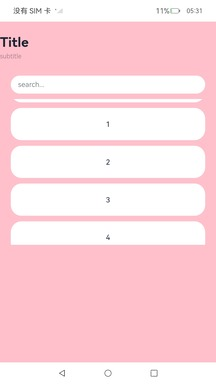
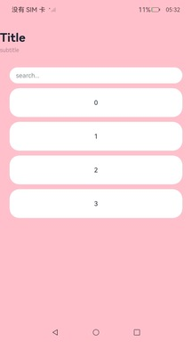

# ArkUI子系统ChangeLog

OpenHarmony 4.1.6.1 版本相较于OpenHarmony 之前的版本，Navigation、NavDestination、Tabs 组件默认行为变更如下。

## cl.arkui.1  Navigation、NavDestination组件默认扩展到非安全区

满足安全区可拓展的条件下，Navigation、NavDestination组件默认扩展到非安全区。

**访问级别**

公开接口

**变更影响**

变更前：Navigation、NavDestination组件的expandSafeArea属性默认为[SafeAreaExpandType.NONE, SafeAreaExpandEdges.NONE]。



变更后：Navigation、NavDestination组件的expandSafeArea属性默认为[SafeAreaExpandType.SYSTEM, SafeAreaExpandEdges.BOTTOM, SafeAreaEdge.TOP]，背景色延伸到顶部状态栏和底部导航栏。



**API Level**

11

**变更发生版本**

OpenHarmony SDK 4.1.6.1

**变更的接口/组件**

受影响组件有：Navigation与NavDestination

**适配指导**

默认行为变更，如果应用原先使用margin设置了Navigation或NavDestination的外边距，使其无法与顶部状态栏或底部导航栏贴边，会导致组件无法扩展到非安全区。若应用仍想生效沉浸式效果，则需要将margin改成padding，使导航组件与顶部状态栏或底部导航栏贴边，代码示例如下：

适配前：

```ts
@Entry
@Component
struct NavigationExample {
  build() {
    NavDestination() {
        ...
    }.margin({...})
  }
}
```

适配后：

```ts
@Entry
@Component
struct NavigationExample {
  build() {
    NavDestination() {
        ...
    }.padding({...})
  }
}
```

## cl.arkui.2  Tabs组件默认扩展到底部非安全区

满足安全区可拓展的条件下，Tabs组件默认扩展到底部非安全区。

**访问级别**

公开接口

**变更影响**

变更前：Tabs组件的expandSafeArea属性默认为[SafeAreaExpandType.NONE, SafeAreaExpandEdges.NONE]。

变更后：Tabs组件的expandSafeArea属性默认为[SafeAreaExpandType.SYSTEM, SafeAreaExpandEdges.BOTTOM]，背景色会延伸到底部导航栏。

**API Level**

11

**变更发生版本**

OpenHarmony SDK 4.1.6.1

**变更的接口/组件**

受影响组件有：Tabs

**适配指导**

默认满足沉浸式效果，不需要适配。

## cl.arkui.3 Image组件autoResize interpolation属性默认行为变更

**访问级别**

公开接口

**变更原因**

应用侧需要设置autoResize为false、 interpolation设置为LOW来解决图片锯齿问题

**变更影响**

该变更为非兼容性变更。

变更前，Image组件的autoResize默认值为true， interpolation为None。

变更后，Image组件的autoResize默认值为false， interpolation为LOW，该修改会提升图片显示效果，但是image组件在大图显示成小组件时，默认内存会上涨，需要应用根据实际情况进行内存优化。
说明：该修改不影响大桌面效果。

**API Level**

11

**变更发生版本**

从OpenHarmony SDK 4.1.6.1 开始。

**变更的接口/组件**

受影响的组件有：Image。

**适配指导**

默认行为变更，不涉及适配。如果开发者需要保留原来Image组件显示的效果，可以将autoResize的值设置为true， interpolation的值设置为None。

## cl.arkui.4 Swiper组件单页场景新增边缘滑动效果

**访问级别**

公开接口

**变更原因**

Swiper组件在多页非循环场景下有边缘滑动效果，但在单页场景下无边缘滑动效果，行为未保持一致。

**变更影响**

该变更为非兼容性变更。

变更前，Swiper组件在单页场景下无边缘滑动效果。

变更后，Swiper组件在单页场景下有边缘滑动效果，默认为EdgeEffect.Spring。

**API Level**

8

**变更发生版本**

从OpenHarmony SDK 4.1.6.1 开始。

**变更的接口/组件**

受影响的组件有：Swiper。

**适配指导**

默认效果变更，无需适配。若希望Swiper组件在多页非循环和单页场景下无边缘滑动效果，可设置effectMode属性为EdgeEffect.None。