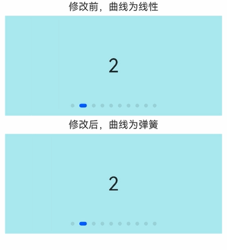

# ArkUI子系统变更说明

## cl.arkui.1  Swiper组件的默认曲线参数变更

**访问级别**

其他

**变更原因**

规格优化。

**变更影响**

当Swiper组件不设置curve参数时，默认曲线从Linear变更为interpolatingSpring(-1,1,328,34)。

**API Level**

8

**变更发生版本**

从OpenHarmony SDK 5.0.0.16 开始。

**变更的接口/组件**

受影响的组件：Swiper
变更前：Swiper默认曲线为Linear
变更后：Swiper默认曲线为interpolatingSpring(-1,1,328,34)。

**适配指导**

默认行为变更，无需适配，但应注意变更后的默认效果是否符合开发者预期， 如不符合则应自定义修改效果控制变量以达到预期

## cl.arkui.2  组件大小不设置且margin超过组件大小时的属性变更

**访问级别**

公开接口

**变更原因**

组件宽高不设置且margin超过组件大小时，会将组件大小压缩成0。

**变更影响**

该变更为非兼容性变更。

API12变更前，组件宽高不设置，设置margin超过组件大小时，压缩不生效，组件保持原先大小。

API12变更后，组件宽高不设置，设置margin超过组件大小时，压缩生效，组件宽高压缩为0。

**起始 API Level**

9

**变更发生版本**

从OpenHarmony SDK 5.0.0.16 开始。

**变更的接口/组件**

受影响的组件和接口：设置过大margin属性的组件。

**适配指导**

适当减小margin使组件能显示，或给组件设置宽高使组件大小不受margin影响。