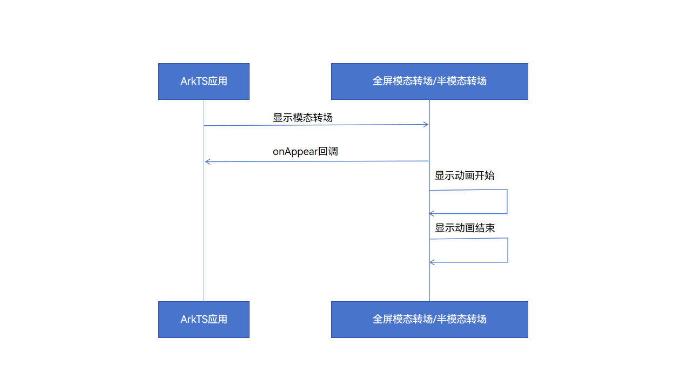
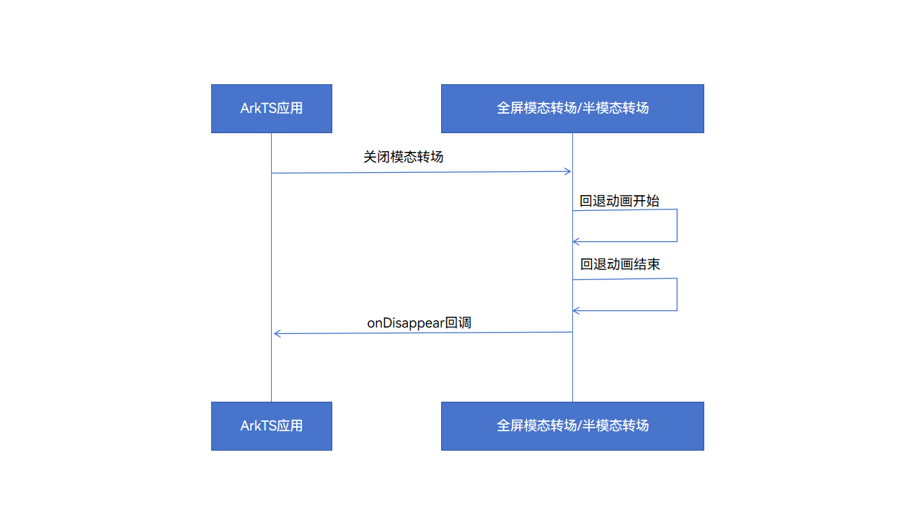
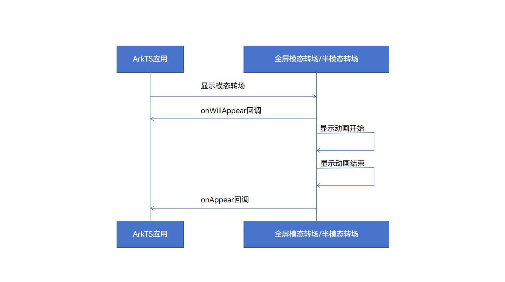

# ArkUI子系统Changelog

## cl.arkui.1 全屏模态转场/半模态转场onAppear回调触发时序修正

**访问级别**

公开接口

**变更原因**

为保持onAppear回调与onDisappear回调命名和行为一致，将onAppear回调触发时序由模态页面显示动画开始前修正为模态页面显示动画结束后

**变更影响**

该变更为非兼容性变更。

全屏模态转场/半模态转场的onAppear回调，由模态页面显示动画开始前触发，改为模态页面显示动画结束后触发。

**API Level**

10

**变更发生版本**

从OpenHarmony SDK 5.0.0.17 版本开始。

**变更的接口/组件**

受影响的组件：全屏模态转场、半模态转场

API 12之前，全屏模态转场/半模态转场的onAppear回调会在模态页面显示动画开始前触发

API 12及之后，全屏模态转场/半模态转场的onAppear回调会在模态页面显示动画结束后触发

**适配指导**

如有需要在模态页面显示动画开始前执行的逻辑，可以使用API 12新增的onWillAppear回调替代onAppear回调，请查阅[半模态转场](../../../application-dev/reference/apis-arkui/arkui-ts/ts-universal-attributes-sheet-transition.md)文档进行适配。
