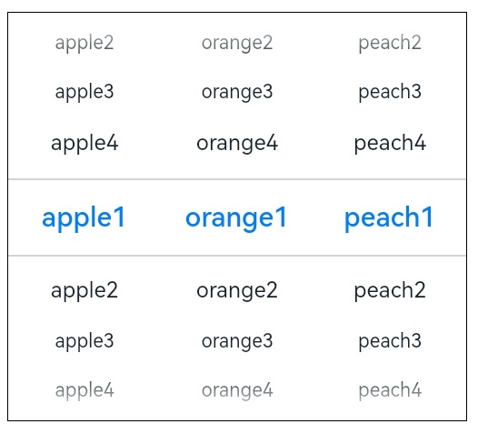
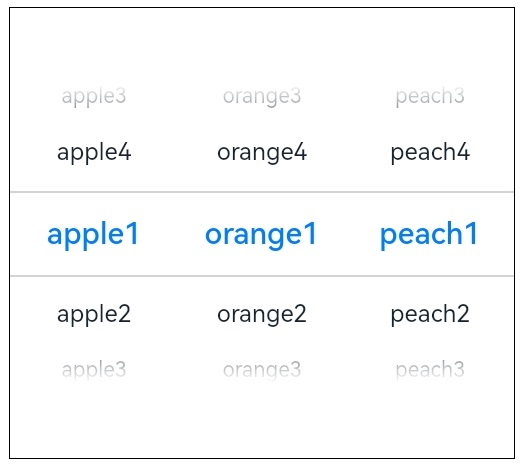

# ArkUI子系统Changelog

## cl.arkui.1  TextPicker内容默认布局行为变更

**访问级别**

公开接口

**变更原因**

TextPicker布局绘制逻辑与DatePicker、TimePicker不一致, 当组件高度设置过大时，滑动选项显示数量会超过5个，导致上下边缘渐隐效果异常。

**变更影响**

该变更为兼容性变更。

变更前，TextPicker的滑动选项总高度与组件高度相同，且滑动事件在整个组件内相应。



变更后，TextPicker组件高度过大时(大于5个滑动选项所需高度)，组件的整体高度不发生改变，但滑动选项最多只会显示5个，在组件内上下居中显示，剩余区域将填充空白，且手势事件将只在滑动选项区域响应。



**API Level**

8

**变更发生版本**

从OpenHarmony SDK 5.0.0.17 开始。

**变更的接口/组件**

受影响的组件：TextPicker。

**适配指导**

默认行为变更，无需适配，但应注意变更后的行为是否对整体应用逻辑产生问题。

## cl.arkui.2  Dialog在页面路由跳转时关闭行为变更

**访问级别**

公开接口

**变更原因**

在层级结构上，页面和弹窗是同级的，它们相互独立，页面路由跳转时不应自动关闭弹窗，弹窗的关闭行为应由开发者根据需要自行控制。

**变更影响**

该变更为非兼容性变更。

变更前，若页面存在弹窗时进行路由跳转，页面内容会切换，同时也会自动关闭最后一个弹窗。

变更后，若页面存在弹窗时进行路由跳转，只会进行页面内容切换，不再自动关闭弹窗，即弹窗始终处于页面之上不会消失。

**API Level**

9

**变更发生版本**

从OpenHarmony SDK 5.0.0.17 开始, API 12及后续版本生效。

**变更的接口/组件**

受影响的组件：Router、 Dialog。

**适配指导**

若开发者在页面路由跳转时要关闭当前页面所有弹窗，可在路由跳转前调用弹窗的close方法进行手动关闭。

示例代码如下:
```ts
import router from '@ohos.router';
// 记录当前页面所有弹窗
const dialogs: Map<string, CustomDialogController> = new Map();

@CustomDialog
struct CustomDialogExample {
  controllerTwo?: CustomDialogController
  build() {
    Column() {
      Button('点击进行路由跳转')
        .onClick(() => {
          // 关闭当前页面所有弹窗
          dialogs.forEach((controller, name) => {
            controller.close();
          })
          // 路由跳转
          router.pushUrl({url: 'pages/Index'})
        })
    }
  }
}

@Entry
@Component
struct CustomDialogUser {
  dialogController: CustomDialogController | null = new CustomDialogController({
    builder: CustomDialogExample(),
  })
  build() {
    Column() {
      Button('点击打开弹窗')
        .onClick(() => {
          if (this.dialogController != null) {
            // 打开弹窗
            this.dialogController.open()
            // 记录当前弹窗
            dialogs.set('first', this.dialogController)
          }
        })
    }
  }
}
```

## cl.arkui.3  Image组件按照syncLoad来同步/异步加载PixelMap格式图片

**访问级别**

公开接口

**变更原因**

应用侧的某些实现场景需要Image组件支持异步加载pixelMap。

**变更影响**

该变更为非兼容性变更。

syncLoad为Image组件的属性，用于设置是否同步加载图片。

API version 12之前，无论开发者设置syncLoad为false或者true。Image组件加载PixelMap始终为同步加载，在主线程加载。

API version 12之后，Image组件按照syncLoad来同步/异步加载PixelMap格式图片，若没有设置则按照syncLoad属性的默认值false进行异步加载。其中异步加载将在 **异步线程** 加载PixelMap格式图片，加载时会有“一闪”的现象。

**API Level**

12

**变更发生版本**

从OpenHarmony SDK 5.0.0.17 版本开始。

**示例：**

无

**变更的接口/组件**

Image组件

**适配指导**

若应用侧需要Image组件同步加载pixelmap，则需要设置syncLoad为true。
