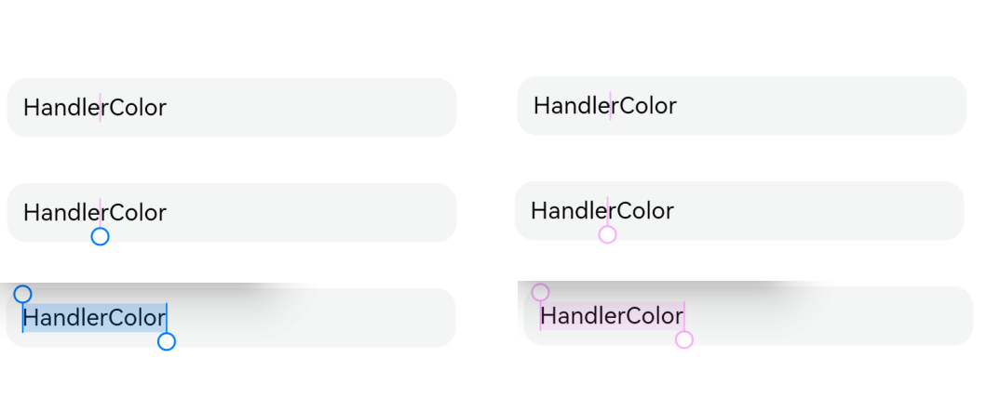
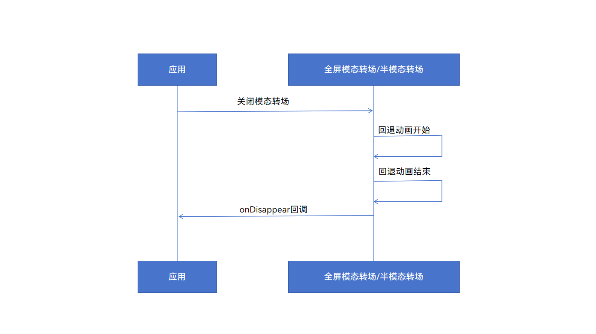
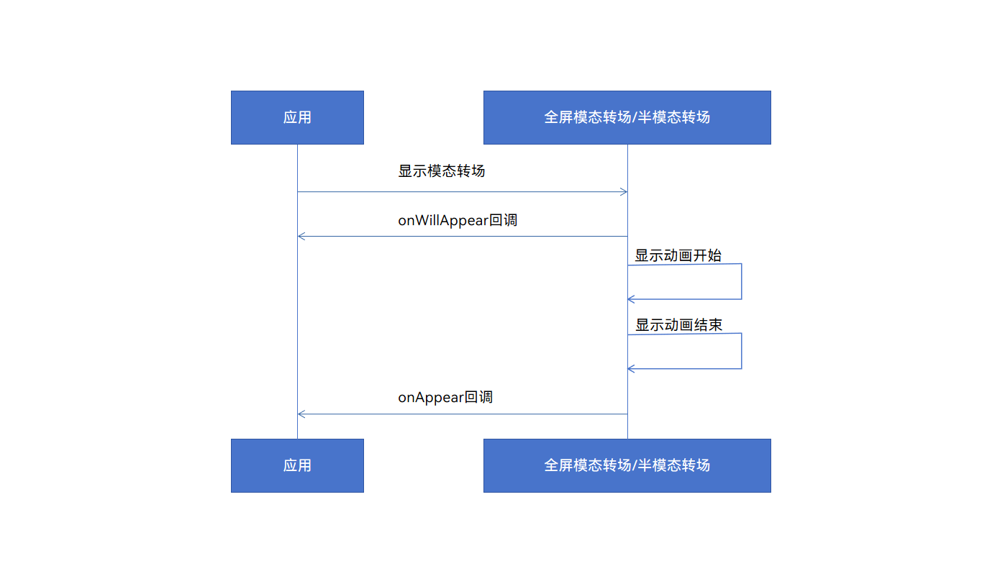

# ArkUI子系统变更说明

## cl.arkui.1 弹窗避让安全区域行为变更

**访问级别**

公开接口

**变更原因**

蒙层区域无法覆盖底部导航栏，沉浸式模式下内容无法避让导航栏与状态栏。

**变更影响**

该变更为非兼容性变更。

变更前：1.弹窗蒙层显示区域未延伸至底部导航条；2.在showInSubwindow为true或应用配置为沉浸式时，内容未避让顶部状态栏与底部导航条。

变更后：1.弹窗蒙层显示区域默认延伸至底部导航条；2.在showInSubwindow为true或应用配置为沉浸式时，内容会避让顶部状态栏与底部导航条。

如下图所示为设置Alignment为Bottom时变更前后效果对比：


**API Level**

AlertDialog、CustomDialog 起始支持版本为 API 7，ActionSheet、DatePickerDialog、TimePickerDialog、TextPickerDialog 起始支持版本为 API 8，promptAction.showDialog 起始支持版本为 API 9，promptAction.openCustomDialog 起始支持版本为 API 11。

**变更发生版本**

从OpenHarmony SDK 5.0.0.19开始。

**变更的接口/组件**

受影响的组件：promptAction.showDialog、promptAction.openCustomDialog、AlertDialog、ActionSheet、DatePickerDialog、TimePickerDialog、TextPickerDialog、CustomDialog。

**适配指导**

若开发者需要弹窗内容不避让导航条，可设置aligment为DialogAligment.Bottom、offset.dy为导航栏高度, 具体示例代码如下：
1.EntryAbility页面设置窗口全屏，获取顶部状态栏与底部导航栏高度
```ts
// src/main/ets/entryability/EntryAbility.ets
import { AbilityConstant, UIAbility, Want } from '@kit.AbilityKit';
import { window } from '@kit.ArkUI';

export default class EntryAbility extends UIAbility {
  onWindowStageCreate(windowStage: window.WindowStage): void {
    windowStage.loadContent('pages/Index', (err, data) => {
      if (err.code) {
        return;
      }
      // 获取应用主窗口
      let windowClass: window.Window = windowStage.getMainWindowSync();
      // 设置窗口全屏
      windowClass.setWindowLayoutFullScreen(true)
      // 获取状态栏高度
      let statusArea = windowClass.getWindowAvoidArea(window.AvoidAreaType.TYPE_SYSTEM);
      AppStorage.setOrCreate('SafeAreaTopHeight', statusArea.topRect.height);
      // 获取导航栏高度
      let navigationArea = windowClass.getWindowAvoidArea(window.AvoidAreaType.TYPE_NAVIGATION_INDICATOR);
      AppStorage.setOrCreate('SafeAreaBottomHeight', navigationArea.bottomRect.height);
    });
  }
}
```

2.调用弹窗页面设置alignment与offset
```ts
// src/main/ets/pages/Index.ets
let storage = LocalStorage.getShared();

@CustomDialog
struct CustomDialogExample {
  controller?: CustomDialogController

  build() {
    Column() {
      Text('这是一个弹窗')
        .fontSize(30)
        .height(100)
      Button('点我关闭弹窗')
        .onClick(() => {
          if (this.controller != undefined) {
            this.controller.close()
          }
        })
        .margin(20)
    }
  }
}

@Entry(storage)
@Component
struct CustomDialogUser {
  safeAreaTopHeight: string = AppStorage.get<number>('SafeAreaTopHeight') + 'px';
  safeAreaBottomHeight: string = AppStorage.get<number>('SafeAreaBottomHeight') + 'px';
  dialogController: CustomDialogController | null = new CustomDialogController({
    builder: CustomDialogExample(),
    alignment: DialogAlignment.Bottom,
    offset: { dx: 0, dy: this.safeAreaBottomHeight }
  })

  build() {
    Column() {
      Button('点击打开弹窗')
        .onClick(() => {
          if (this.dialogController != null) {
            this.dialogController.open()
          }
        })
    }
    .width('100%')
    .height('100%')
    .justifyContent(FlexAlign.Center)
  }
}
```

## cl.arkui.2 linearGradient、sweepGradient、radialGradient通用属性及LinearGradient interface中的colors参数类型从Array&lt;any&gt;变更为Array&lt;[ResourceColor, number]&gt;

**访问级别**

公开接口

**变更原因**

any类型过于宽泛，从api上没有引导开发者使用正确的参数类型。

**变更影响**

该变更为非兼容性变更。

变更前：允许将linearGradient、sweepGradient、radialGradient通用属性及LinearGradient interface中的colors参数定义为Array&lt;any&gt;类型。

变更后：如果使用了与Array&lt;[ResourceColor, number]&gt;不兼容的colors参数类型，如Array&lt;any&gt;，编译报错。

**API Level**

linearGradient、sweepGradient、radialGradient通用属性的起始支持版本为API 7，LinearGradient interface中的起始支持版本为API 9。

**变更发生版本**

从OpenHarmony SDK 5.0.0.19开始。

**适配指导**

如果需要定义linearGradient、sweepGradient、radialGradient接口中使用的变量，colors参数的类型应准确定义为与Array&lt;[ResourceColor, number]&gt;兼容的类型。

例如：
```ts
@Entry
@Component
struct Test {
  colors: Array<any> = [[0xff0000, 0.0], [0x0000ff, 0.3], [0xffff00, 1.0]];
  build() {
    Row()
      .width('90%')
      .height(50)
      .linearGradient({
        angle: 90,
        // colors定义为了Array<any>类型，与需要的类型Array<[ResourceColor, number]>不兼容，将产生编译报错
        colors: this.colors
      })
  }
}
```
应将定义colors改为与api定义兼容的类型，如colors: Array&lt;[ResourceColor, number]&gt; = [[0xff0000, 0.0], [0x0000ff, 0.3], [0xffff00, 1.0]].

## cl.arkui.3 sweepGradient、radialGradient通用属性的center参数类型从Array&lt;any&gt;变更为[Length, Length]

**访问级别**

公开接口

**变更原因**

any类型过于宽泛，从api上没有引导开发者使用正确的参数类型，也没有从api上约束center的长度为2。

**变更影响**

该变更为非兼容性变更。

变更前：允许将sweepGradient、radialGradient通用属性的center参数类型定义为Array&lt;any&gt;类型。

变更后：如果使用了与[Length, Length]不兼容的center参数类型，编译报错。

**API Level**

7

**变更发生版本**

从OpenHarmony SDK 5.0.0.19开始。

**适配指导**

如果需要定义sweepGradient、radialGradient接口中使用的变量，center参数的类型应准确定义为与[Length, Length]兼容的类型。

例如：
```ts
@Entry
@Component
struct Test {
  myCenter: Array<number> = [50, 50];
  build() {
    Row()
      .width(100)
      .height(100)
      .sweepGradient({
        // Array<number>与需要的类型[Length, Length]不兼容，将产生编译报错
        center: this.myCenter,
        start: 0,
        end: 359,
        colors: [[0xff0000, 0.0], [0x0000ff, 0.3], [0xffff00, 1.0]]
      })
  }
}
```
应将myCenter定义为与api定义兼容的类型，可改为myCenter: [number, number] = [50, 50].

## cl.arkui.4 快捷键接口keyboardShortcut匹配规则变更为严格匹配，匹配成功后拦截后续按键事件处理

**访问级别**

公开接口

**变更原因**

快捷键匹配原则过于宽松，例如绑定了CTRL+A的快捷键事件，实际使用CTRL+SHIFT+A依然能成功触发该事件。
快捷键事件被匹配并消费后依然会继续下发，并可能触发后续按键事件，例如被输入法响应。

**变更影响**

该变更为非兼容性变更。

变更前：绑定的快捷键是当前已触发按键的子集，即可触发快捷键。触发快捷键后，按键事件会继续触发`onKeyEvent`事件等其他按键事件。

变更后：绑定的快捷键必须与当前触发的按键完全一致，方能触发快捷键。触发快捷键即视为按键已消费，不再触发其他按键事件。

**API Level**

10

**变更发生版本**

从OpenHarmony SDK 5.0.0.19开始。

**适配指导**

快捷键的按键集合严格对应所需要的按键。

## cl.arkui.5 TextInput、TextArea、Search文本手柄颜色和文本选中底板颜色显示样式变更

**访问级别**

公开接口

**变更原因**

该变更为非兼容性变更。

**变更影响**

a) TextInput、TextArea、Search文本手柄颜色，显示样式变更

变更前：TextInput、TextArea、Search文本手柄颜色，显示为默认颜色。

变更后：TextInput、TextArea、Search文本手柄颜色，显示为光标颜色。

b) TextInput、TextArea、Search文本选中底板颜色显示样式变更

变更前：TextInput、TextArea、Search文本选中底板颜色，未设置颜色，显示为默认颜色，默认透明度20%。

变更后：TextInput、TextArea、Search文本选中底板颜色，未设置颜色，显示为光标颜色，透明度在光标颜色透明度的基础上叠加20%。

如下图所示为变更前后效果对比：



**API Level**

TextInput起始支持版本为 API 7，TextArea、Search起始支持版本为 API 8

**变更发生版本**

从OpenHarmony SDK 5.0.0.19开始。

**适配指导**

默认样式变更调整，无需适配。


## cl.arkui.6 @observed、@track装饰器命名变更为@ObservedV2、@Trace

**访问级别**

公开接口

**变更原因**

新装饰器@observed、@track与旧装饰器@Observed、@Track十分相似不易区分，且由小写字母开头与其他现有装饰器风格不一致。现将@observed、@track装饰器更名为@ObservedV2、@Trace，以便开发者将新旧装饰器区分开来，同时保持装饰器命名风格的统一。

**变更影响**

该变更为非兼容性变更，影响如下：

原有使用@observed装饰器装饰的类需要更改为使用@ObservedV2装饰。

原有使用@track装饰器装饰的类中成员属性需要更改为使用@Trace装饰。

变更前：

```ts
@observed
class Info {
  @track name: string = "Tom";
  @track age: number = 25;
  id: number = 0;
}
@Entry
@Component
struct Index {
  info: Info = new Info();
  build() {
    Column() {
      Text("Name: " + this.info.name)
      Text("Age: " + this.info.age)
    }
  }
}
```

变更后：

```ts
@ObservedV2
class Info {
  @Trace name: string = "Tom";
  @Trace age: number = 25;
  id: number = 0;
}
@Entry
@Component
struct Index {
  info: Info = new Info();
  build() {
    Column() {
      Text("Name: " + this.info.name)
      Text("Age: " + this.info.age)
    }
  }
}
```

**影响范围**

@observed装饰器、@track装饰器

**起始API Level**

@observed：API12

@track：API12

**变更发生版本**

从OpenHarmony SDK 5.0.0.19开始。

**适配指导**

使用@ObservedV2装饰类，@Trace装饰类中成员属性。

```ts
@ObservedV2
class Person {
  id: number = 0;
  @Trace age: number = 8;
}
@Entry
@Component
struct Index {
  person: Person = new Person();

  build() {
    Column() {
      Text(`${this.person.age}`)
    }
  }
}
```

## cl.arkui.7 LocalStorage实例对象作为参数传入@Entry装饰器的LocalStorage对象返回值变更

**访问级别**

公开接口

**变更原因**

LocalStorage实例对象属性通过@Entry传入时，值不生效。

**变更影响**

通过对象属性传入的LocalStorage实例对象值，对页面UI的变化从不生效到变成生效。

变更前：this.parentLinkNumber的返回值为1。

变更后：this.parentLinkNumber的返回值为47。

示例1：

```ts
let param_47: Record<string, number> = { 'PropA': 47 };
let customStorage: LocalStorage = new LocalStorage(param_47);
const objEntryOp: EntryOptions = {
  storage: customStorage
}
interface InterfaceObj {
  EntOpt: EntryOptions
}
const obj: InterfaceObj = {
  EntOpt: objEntryOp
}
@Entry(obj.EntOpt)
@Component
struct ChainCallStorage {
  @LocalStorageLink('PropA') parentLinkNumber: number = 1;

  build() {
    Column({ space: 15 }) {
      Button(`点击=== ${this.parentLinkNumber}`)
        .onClick(() => {
          this.parentLinkNumber += 1;
        })
    }
  }
}
```

示例2：

```ts
let param_47: Record<string, number> = { 'PropA': 47 };
let customStorage8: LocalStorage = new LocalStorage(param_47);

interface InterfaceObj {
  storage: LocalStorage
}
const obj: InterfaceObj = {
  storage: customStorage8
}

@Entry(obj.storage)
@Component
struct ChainCallStorage1 {
  @LocalStorageLink('PropA') parentLinkNumber: number = 1;

  build() {
    Column({ space: 15 }) {
      Button(`点击=== ${this.parentLinkNumber}`)
        .onClick(() => {
          this.parentLinkNumber += 1;
        })
    }
  }
}
```

**API Level**

起始支持版本为 API 12。

**变更发生版本**

从OpenHarmony SDK 5.0.0.18开始。

**适配指导**

请参考相关文档规范，做相应适配整改，LocalStorage实例对象的赋值优先级高于本地默认值。

[@LocalStorageProp初始化规则](https://gitee.com/openharmony/docs/blob/master/zh-cn/application-dev/quick-start/arkts-localstorage.md)

## cl.arkui.8 RichEditor处于获焦时调用addTextSpan，addImageSpan，addBuilderSpan，addSymbolSpan，光标位置变更

**访问级别**

公开接口

**变更原因**

RichEditor处于获焦时调用addTextSpan，addImageSpan，addBuilderSpan，addSymbolSpan，光标位置显示异常

**变更影响**

当RichEditor处于获焦时调用addTextSpan，addImageSpan，addBuilderSpan，addSymbolSpan光标位置逻辑统一

变更前：RichEditor处于获焦时，调用addTextSpan，addImageSpan，addBuilderSpan，addSymbolSpan时，生效后光标位置会根据offset信息与插入前光标位置信息进行确定光标不会动或进行移动

变更后：RichEditor处于获焦时，调用addTextSpan，addImageSpan，addBuilderSpan，addSymbolSpan后，光标位置信息一律在所插内容之后显示

**起始API Level**

addTextSpan，addImageSpan 起始支持版本为10，addBuilderSpan，addSymbolSpan 起始支持版本为11

**变更发生版本**

从OpenHarmony SDK 5.0.0.19开始。

**适配指导**

在获焦时RichEditor调用addTextSpan，addImageSpan，addBuilderSpan，addSymbolSpan后，光标位置调整，开发者无需后续对光标位置信息做适配。

## cl.arkui.9 全屏模态转场/半模态转场onAppear回调触发时序修正

**访问级别**

公开接口

**变更原因**

为保持onAppear回调与onDisappear回调命名和行为一致，将onAppear回调触发时序由模态页面显示动画开始前修正为模态页面显示动画结束后

**变更影响**

该变更为非兼容性变更。

全屏模态转场/半模态转场的onAppear回调，由模态页面显示动画开始前触发，改为模态页面显示动画结束后触发。

**API Level**

10

**变更发生版本**

从OpenHarmony SDK 5.0.0.19 版本开始。

**变更的接口/组件**

受影响的组件：全屏模态转场、半模态转场

API 12之前，全屏模态转场/半模态转场的onAppear回调会在模态页面显示动画开始前触发




API 12及之后，全屏模态转场/半模态转场的onAppear回调会在模态页面显示动画结束后触发




**适配指导**

如有需要在模态页面显示动画开始前执行的逻辑，可以使用API 12新增的onWillAppear回调替代onAppear回调，请查阅[半模态转场](../../../application-dev/reference/apis-arkui/arkui-ts/ts-universal-attributes-sheet-transition.md)文档进行适配。