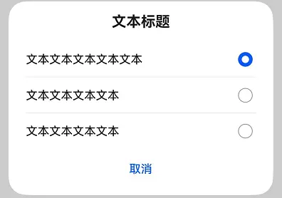

# ArkUI子系统变更说明

## cl.arkui.1 promptAction.showDialog、promptAction.openCustomDialog、AlertDialog、ActionSheet、DatePickerDialog、TimePickerDialog、TextPickerDialog、CustomDialog 显示样式变更

**访问级别**

公开接口

**变更原因**

该变更为兼容性变更。

**变更影响**

promptAction.showDialog、promptAction.openCustomDialog、AlertDialog、ActionSheet、DatePickerDialog、TimePickerDialog、TextPickerDialog、CustomDialog 显示样式变更。

变更前：弹窗蒙层显示区域未延伸至底部导航条；在showInSubwindow为true或应用配置为沉浸式时，未避让顶部状态栏与底部导航条。

变更后：弹窗蒙层显示区域默认延伸至底部导航条；在showInSubwindow为true或应用配置为沉浸式时，默认避让顶部状态栏与底部导航条。

如下图所示为设置Alignment为Bottom时变更前后效果对比：

**API Level**

AlertDialog、CustomDialog 起始支持版本为 API 7，ActionSheet、DatePickerDialog、TimePickerDialog、TextPickerDialog 起始支持版本为 API 8，promptAction.showDialog 起始支持版本为 API 9，promptAction.openCustomDialog 起始支持版本为 API 11。

**变更发生版本**

从OpenHarmony SDK 5.0.0.19开始。

**适配指导**

默认样式变更调整，无需适配。

## cl.arkui.2 SubHeader组件边距、超长显示规则等默认样式变更。

**访问级别**

公开接口

**变更原因**

UX样式变更

**变更影响**

该变更为非兼容性变更，只影响SubHeader组件的默认样式。

- 变更前
  1. SubHeader组件左右边距24vp。
  2. SubHeader组件一级标题字重Medium,二级标题超长缩小字号，最小14号。
  3. SubHeader组件显示规则：组件优先展示左侧内容信息。
   
  
- 变更后
  1. SubHeader组件左右边距16vp。
  2. SubHeader组件一级标题字重Bold,二级标题超长不缩小字号。
  3. SubHeader组件显示规则：组件右侧默认占据整体组件宽度的1/3，左侧默认占据整体组件宽度的2/3。

  如下图所示为变更前后效果对比：

 | 变更前 | 变更后 |
|---------|---------|
|  |   |

**API Level**

API 12

**变更发生版本**

从OpenHarmony SDK 5.0.0.19 版本开始。

**变更的接口/组件**

SubHeader组件。

**适配指导**

UX默认行为变更，无需适配，但应注意变更后的默认效果是否符合开发者预期，如不符合则应自定义修改效果控制变量以达到预期。

## cl.arkui.10 advanced.Dialog组件弹窗内边距、标题字重、对齐方式等默认样式变更

**访问级别**

公开接口

**变更原因**

UX样式变更

**变更影响**

该变更为非兼容性变更，只影响弹窗的默认样式，默认样式随系统风格变更。

- 变更前
  1. 弹窗内上边距为24vp，主标题字重为FontWeight.Medium。
  2. 弹窗标题对齐方式为左对齐。
  3. TipsDialog图片默认展示为充满边界。

   
- 变更后
  1. 弹窗内上边距为8vp，主标题字重为FontWeight.Bold。
  2. 弹窗标题对齐方式为居中对齐。
  3. 优化图片显示规则，优先保证显示比例。

  如下图所示为变更前后效果对比：

 | 变更前 | 变更后 |
|---------|---------|
|   |    |

**API Level**

10

**变更发生版本**

从OpenHarmony SDK 5.0.0.19 版本开始。

**变更的接口/组件**

advanced.Dialog.TipsDialog,advanced.Dialog.SelectDialog,advanced.Dialog.AlertDialog,advanced.Dialog.LoadingDialog

**适配指导**

UX默认行为变更，无需适配，但应注意变更后的默认效果是否符合开发者预期，如不符合则应自定义修改效果控制变量以达到预期。