# ArkUI子系统Changelog

## cl.arkui.1 Toggle组件Switch样式移除宽高比1.8倍限制

**访问级别**

公开接口

**变更原因**

a)Toggle组件Switch样式原宽高比固定为1.8倍，导致开发者无法不受限制自定义宽高。现移除1.8倍限制，增强开发者自定义能力。

**变更影响**

该变更为非兼容性变更。

API version 11及以前，Toggle组件Switch样式宽高比固定为1.8倍，开发者设置宽高比大于1.8倍时以高度为基准，小于1.8倍时以宽度为基准。

例：宽度设置为200vp，高度设置为100vp，则宽度会被重置为180vp，高度保持100vp；宽度设置为180vp，高度设置为150vp，则高度会被重置为100vp，宽度保持180vp；

API version 12及以后，Toggle组件Switch样式宽高比没有限制。

**起始API Level**

width，height通用属性的起始支持版本为API 7

**变更发生版本**

从OpenHarmony SDK 5.0.0.21 版本开始。

**变更的接口/组件**

Toggle组件

**适配指导**

取消组件宽高比例限制， 如果此前设置组件宽高比例大于1.8倍时需要以高度为基准修改业务代码，小于1.8倍时需要以宽度为基准修改业务代码，才能保持原有组件样式。

其他适配请查阅[Toggle组件](../../../application-dev/reference/apis-arkui/arkui-ts/ts-basic-components-toggle.md)文档进行适配。

## cl.arkui.2  Radio组件单选项样式风格增强、支持显示自定义图标 

**访问级别**

公开接口

**变更原因**

允许用户自定义单选项的选中状态：

1.可以选择不同的样式，如圆饼样式，对勾样式，自定义图标样式。

2.用户自定义图标时，设置选中状态时图标显示，非选中状态时图标不显示。

**变更影响**

该变更为非兼容性变更。

- 变更前：默认选中状态DOT（圆圈样式）。
- 变更后：默认选中状态TICK（对勾样式）。

| DOT | TICK |
|---------|---------|
|  |  |

**API Level**

12

**变更发生版本**

从OpenHarmony SDK 5.0.0.21版本开始。

**示例：**
该示例实现了自定义选中状态
```
@Entry
@Component
struct RadioExample {
  @Builder 
  indicatorBuilder() {
    Image($r("app.media.star"))
  }
  build() {
    Flex({ direction: FlexDirection.Row, justifyContent: FlexAlign.Center, alignItems: ItemAlign.Center }) {
      Column() {
        Text('Radio1')
        Radio({ value: 'Radio1', group: 'radioGroup',
          indicatorType:RadioIndicatorType.TICK
        }).checked(true)
          .height(50)
          .width(80)
          .onChange((isChecked: boolean) => {
            console.log('Radio1 status is ' + isChecked)
          })
      }
      Column() {
        Text('Radio2')
        Radio({ value: 'Radio2', group: 'radioGroup',
          indicatorType:RadioIndicatorType.DOT
        }).checked(false)
          .height(50)
          .width(80)
          .onChange((isChecked: boolean) => {
            console.log('Radio2 status is ' + isChecked)
          })
      }
      Column() {
        Text('Radio3')
        Radio({ value: 'Radio3', group: 'radioGroup',
          indicatorType:RadioIndicatorType.CUSTOM,
          indicatorBuilder:()=>{this.indicatorBuilder()}
        }).checked(false)
          .height(50)
          .width(80)
          .onChange((isChecked: boolean) => {
            console.log('Radio3 status is ' + isChecked)
          })
      }
    }.padding({ top: 30 })
  }
}
```

**变更的接口/组件**

Radio组件

**适配指导**

请查阅[Radio组件](../../../application-dev/reference/apis-arkui/arkui-ts/ts-basic-components-radio.md)文档进行适配。

## cl.arkui.3 文本组件的文本选择行为变更

**访问级别**

公开接口

**变更原因**

依照UX规范

**变更影响**

该变更为非兼容性变更。API version 11及以前：

a)当前Text组件长按出现菜单时，旋转屏幕，此时依旧出现菜单。

b)当前Text/TextInput/TextArea/Search/RichEditor组件长按出现菜单，进行复制行为，文本退出选中态。

c)当前TextInput/TextArea/Search/RichEditor组件在手机和平板设备上通过代码选区，只出现选中态，无手柄。

API version 12及以后：

a)当前Text组件长按出现菜单时，旋转屏幕，隐藏菜单，保持选中态。

b)当前TextInput/TextArea/Search/RichEditor组件长按出现菜单时，进行复制行为，隐藏菜单，保持选中态。

c)当前TextInput/TextArea/Search/RichEditor组件在手机和平板设备上通过代码选区，出现选中态和手柄，用户可自定义出现菜单。

| 变更前 | 变更后 |
|---------|---------|
| 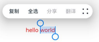 | 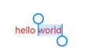 |
|  | 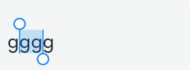 |
| 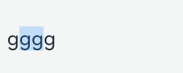 |  |

**API Level**

12 

**变更发生版本**

从OpenHarmony SDK 5.0.0.21 版本开始。

**变更的接口/组件**

Text/TextInput/TextArea/Search/RichEditor组件。

**适配指导**

默认行为变更，无需适配，但应注意变更后的行为是否对整体应用逻辑产生影响

## c1.arkui.4 TextInput组件underline默认样式变更

**访问级别**

公开接口

**变更原因**

依照UX规范

**变更影响**

该变更为非兼容性变更。API version 11及以前，TextInput组件设置underline时，组件出现的时候无圆角，组件获焦失焦后有圆角，且圆角值不同。API version 12及以后，依照UX规范统一默认都设置无圆角。

| 变更前 | 变更后 |
|---------|---------|
|  |  |
|  |  |
|  |  |

**API Level**

12 

**变更发生版本**

从OpenHarmony SDK 5.0.0.21 版本开始。

**变更的接口/组件**

TextInput组件。

**适配指导**

默认效果变更，无需适配，但应注意变更后的默认效果是否符合开发者预期，如不符合则应自定义修改效果控制变量以达到预期

## cl.arkui.5 AlphabetIndexer组件的默认样式变更

**访问级别**

公开接口

**变更原因**

a)当前AlphabetIndexer组件的字母索引条默认字体大小为12vp，依照UX规范修改字母索引条默认字体大小到10vp。

b)当前AlphabetIndexer组件的字母索引条默认字重为Normal，依照UX规范修改字母索引条默认字重到Medium。

c)当前AlphabetIndexer组件的字母索引条选中项文字默认字体大小为12vp，依照UX规范修改字母索引条选中项文字默认字体大小到10vp。

d)当前AlphabetIndexer组件的字母索引条选中项文字默认字重为Normal，依照UX规范修改字母索引条选中项文字默认字重到Medium。

e)当前AlphabetIndexer组件的字母索引条索引项背板圆角默认为4vp，依照UX规范修改字母索引条索引项背板圆角默认为8vp。

f)当前AlphabetIndexer组件的字母索引条背板圆角默认为0vp，依照UX规范修改字母索引条索引项背板圆角默认为12vp。

g)当前AlphabetIndexer组件的字母索引条背板上下padding默认为2vp，依照UX规范修改字母索引条索引项背板上下padding默认为4vp。

h)当前AlphabetIndexer组件的字母索引条pressed状态文字背板颜色默认为'#0c182431'，依照UX规范修改字母索引条pressed状态文字背板颜色默认为'#19182431'。

i)当前AlphabetIndexer组件的弹出窗口默认背板阴影尺寸为DefaultShadowM、依照UX规范变更默认背板阴影尺寸为DefaultShadowL。

j)当前AlphabetIndexer组件的弹出窗口默认背板最大高度为336vp、依照UX规范变更弹出窗口默认背板最大高度为342vp。

k)当前AlphabetIndexer组件的弹出窗口自适应折叠模式默认背板最大高度为224vp、依照UX规范变更弹出窗口自适应折叠模式默认背板最大高度为186vp。

l)当前AlphabetIndexer组件的弹出窗口上下padding默认为0vp、依照UX规范变更弹出窗口上下padding默认为4vp。

m)当前AlphabetIndexer组件的弹出窗口背板圆角默认为16vp，依照UX规范修改弹出窗口背板圆角默认为28vp。

n)当前AlphabetIndexer组件的弹出窗口索引项默认尺寸为56vp、依照UX规范变更弹出窗口索引项默认尺寸为48vp。

o)当前AlphabetIndexer组件的弹出窗口索引项间隔为0vp、依照UX规范变更弹出窗口索引项间隔为4vp。

p)当前AlphabetIndexer组件的弹出窗口索引项背板圆角默认为0vp，依照UX规范修改弹出窗口索引项背板圆角默认为24vp。

q)当前AlphabetIndexer组件的弹出窗口背板颜色默认为'#FFFFFFFF'，依照UX规范修改弹出窗口背板颜色默认为'#66808080'。

r)当前AlphabetIndexer组件的弹出窗口字母部分背板颜色默认为'#FFFFFFFF'，依照UX规范修改弹出窗口字母部分背板颜色默认为'#0c182431'。

s)当前AlphabetIndexer组件的弹出窗口非字母部分背板颜色默认为'#FFFFFFFF'，依照UX规范修改弹出窗口非字母部分背板颜色默认为'#00000000'。

t)当前AlphabetIndexer组件的弹出窗口非字母部分点击时背板颜色默认为0x1A000000，依照UX规范修改弹出窗口非字母部分背板颜色默认为'#0c182431'。

u)当前AlphabetIndexer组件的弹出窗口背板模糊材质默认为NONE，依照UX规范修改弹出窗口背板模糊材质默认为COMPONENT_REGULAR。

**变更影响**

该变更为非兼容性变更。API version 11及以前，采用当前默认值。API version 12及以后，采用修改后默认值。

**API Level**

12 

**变更发生版本**

从OpenHarmony SDK 5.0.0.21 版本开始。

**变更的接口/组件**

AlphabetIndexer组件

**适配指导**

请查阅[AlphabetIndexer组件](../../../application-dev/reference/apis-arkui/arkui-ts/ts-container-alphabet-indexer.md)文档进行适配。

## cl.arkui.6  AlphabetIndexer组件允许用户自定义AlphabetIndexer的样式风格 

**访问级别**

公开接口

**变更原因**

允许用户自定义AlphabetIndexer的样式风格：

1、设置AlphabetIndexer索引项背板圆角、AlphabetIndexer背板圆角自适应变化

2、设置AlphabetIndexer提示弹窗索引项背板圆角、AlphabetIndexer提示弹窗背板圆角自适应变化

3、设置AlphabetIndexer提示弹窗首个索引项背板颜色

4、设置AlphabetIndexer提示弹窗背板模糊风格

**变更影响**

该变更为非兼容性变更。

API version 11及以前，不允许用户自定义AlphabetIndexer索引项背板圆角、提示弹窗索引项背板圆角、提示弹窗首个索引项背板颜色、提示弹窗背板模糊风格。


API version 12及以后，允许用户自定义AlphabetIndexer索引项背板圆角、提示弹窗索引项背板圆角、提示弹窗首个索引项背板颜色、提示弹窗背板模糊风格。


**API Level**

12

**变更发生版本**

从OpenHarmony SDK 5.0.0.21 版本开始。

**示例：**

```
@Entry
@Component
struct AlphabetIndexerSample {
  private arrayA: string[] = ['安']
  private arrayB: string[] = ['卜', '白', '包', '毕', '丙']
  private arrayC: string[] = ['曹', '成', '陈', '催']
  private arrayL: string[] = ['刘', '李', '楼', '梁', '雷', '吕', '柳', '卢']
  private value: string[] = ['#', 'A', 'B', 'C', 'D', 'E', 'F', 'G',
    'H', 'I', 'J', 'K', 'L', 'M', 'N',
    'O', 'P', 'Q', 'R', 'S', 'T', 'U',
    'V', 'W', 'X', 'Y', 'Z']

  build() {
    Stack({ alignContent: Alignment.Start }) {
      Row() {
        List({ space: 20, initialIndex: 0 }){}
        .width('50%')
        .height('100%')

        AlphabetIndexer({ arrayValue: this.value, selected: 0 })
          .popupBackground(0xD2B48C) // 弹出框背景颜色
          .popupBackgroundBlurStyle(BlurStyle.COMPONENT_ULTRA_THICK) // 设置AlphabetIndexer提示弹窗背板模糊风格
          .popupTitleBackground(0x00FF00) // 设置AlphabetIndexer提示弹窗首个索引项背板颜色
          .popupItemBorderRadius(20) // 设置AlphabetIndexer提示弹窗索引项背板圆角
          .itemBorderRadius(5) // 设置AlphabetIndexer索引项背板圆角
          .onSelect((index: number) => {
            console.info(this.value[index] + ' Selected!')
          })
          .onRequestPopupData((index: number) => {
            if (this.value[index] == 'A') {
              return this.arrayA // 当选中A时，弹出框里面的提示文本列表显示A对应的列表arrayA，选中B、C、L时也同样
            } else if (this.value[index] == 'B') {
              return this.arrayB
            } else if (this.value[index] == 'C') {
              return this.arrayC
            } else if (this.value[index] == 'L') {
              return this.arrayL
            } else {
              return [] // 选中其余子母项时，提示文本列表为空
            }
          })
          .onPopupSelect((index: number) => {
            console.info('onPopupSelected:' + index)
          })
      }
      .width('100%')
      .height('100%')
    }
  }
}
```

**变更的接口/组件**

AlphabetIndexer组件

**适配指导**

请查阅[AlphabetIndexer组件](../../../application-dev/reference/apis-arkui/arkui-ts/ts-container-alphabet-indexer.md)文档进行适配。

## cl.arkui.7 MenuItemGroup组件header、footer对齐方式变更

**访问级别**

公开接口

**变更原因**

优化MenuItemGroup组件header、footer的对齐方式，以提供更好的视觉效果。

**变更影响**

API12变更之前：header、footer与菜单文本左对齐。

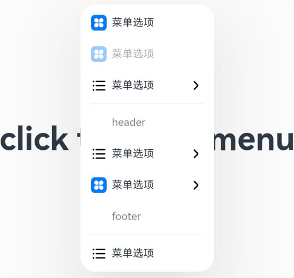

API12变更之后：header、footer与左侧图标左对齐。当header、footer较长时，变更后，菜单宽度可能自适应变窄。


**起始API Level**

9

**变更发生版本**

从OpenHarmony SDK 5.0.0.21 版本开始。

**变更的接口/组件**

MenuItemGroup组件。

**适配指导**

UX默认行为变更，无需适配。

## cl.arkui.8 DatePickerDialog列宽比例、picker上下间距、内容与弹窗边距样式变更

**访问级别**

公开接口

**变更原因**

修正视觉效果以获得更好的用户体验。

**变更影响**

该变更为非兼容性变更。

a) DatePickerDialog列宽比例变更

变更前：年/月/日选择器列宽比例为1：1：1；展示时间时，日月/上下午/时/分 选择器列宽比例为12：7：7：7。

变更后：年/月/日选择器列宽比例为3：2：2；展示时间时，日月/上下午/时/分 选择器列宽比例为4：3：2：2。

b) DatePickerDialog内容与弹窗左右边界间距变更

变更前：内容与弹窗左右边界无间距。

变更后：内容与弹窗左右边界有24vp间距。

c) DatePickerDialog中picker上下间距变更

变更前：dialog中datePicker无上下间距。

变更后：dialog中datePicker上下间距为8vp。

如下图所示为变更前后效果对比：

| 变更前 | 变更后 |
|---------|---------|
|  |  |
|  |  |

**API Level**

API Level 8，在API 12进行版本隔离

**变更发生版本**

从OpenHarmony SDK 5.0.0.21开始。

**适配指导**

默认行为变更，无需适配，但应注意变更后的行为是否对整体应用逻辑产生影响。

## cl.arkui.9 快捷键接口keyboardShortcut匹配规则变更为严格匹配，匹配成功后拦截后续按键事件处理

**访问级别**

公开接口

**变更原因**

快捷键匹配原则过于宽松，例如绑定了CTRL+A的快捷键事件，实际使用CTRL+SHIFT+A依然能成功触发该事件。
快捷键事件被匹配并消费后依然会继续下发，并可能触发后续按键事件，例如被输入法响应。

**变更影响**

该变更为非兼容性变更。

变更前：绑定的快捷键是当前已触发按键的子集，即可触发快捷键。触发快捷键后，按键事件会继续触发`onKeyEvent`事件等其他按键事件。

变更后：绑定的快捷键必须与当前触发的按键完全一致，方能触发快捷键。触发快捷键即视为按键已消费，不再触发其他按键事件。

**API Level**

10

**变更发生版本**

从OpenHarmony SDK 5.0.0.19开始。

**适配指导**

快捷键的按键集合严格对应所需要的按键。

## cl.arkui.10 onPageHide变更

**访问级别**

公开接口

**变更背景**

当前router中会在页面创建之前调用onPageHide生命周期，但是对应页面实际上并没有隐藏。

**变更影响**

该行为变更为非兼容性变更。

**API Level**

API Level 7，在API Version 12生效。

**变更发生版本**

从OpenHarmony SDK 5.0.0.21开始。

**变更的接口/组件**

涉及接口 [onPageHide](../../../application-dev/reference/apis-arkui/arkui-ts/ts-custom-component-lifecycle.md#onpagehide)。

API Version 12前：页面生命周期先触发退出页面隐藏onPageHide,再触发进场页面的aboutToAppear

API Version 12后：页面跳转时，先触发进来页面的创建生命周期aboutToAppear,再触发退出页面的onPageHide生命周期。

**适配指导**

依赖退出页面的onPageHide与进场页面的aboutToAppear生命周期执行的场景可以在aboutToAppear中通过事件通知机制，将触发退出页面的onPageHide中的实现逻辑。

## cl.arkui.11 NavDestination生命周期变更

**访问级别**

公开接口

**变更原因**

1. NavDestination组件有转场动画场景和无转场动画场景生命周期不一致。

2. NavDestination所在自定义组件销毁生命周期早于Destination的销毁生命周期。

**变更影响**

该变更为非兼容性变更。如果开发者依赖Destination所在外层自定义组件onAboutToDisAppear以及Destination的onDisAppear生命周期执行顺序可能会受到影响。

**起始API Level**

API Level 10

**变更发生版本**

从OpenHarmony SDK 5.0.0.21开始。

**变更的接口/组件**

[NavDestination](../../../application-dev/reference/apis-arkui/arkui-ts/ts-basic-components-navdestination.md)生命周期

变更前:

| 变更前有动画 | 变更前无动画 |
|---|---|
|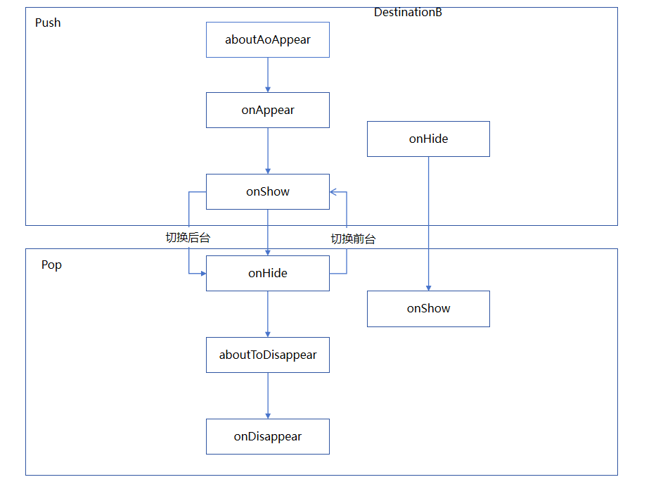 | 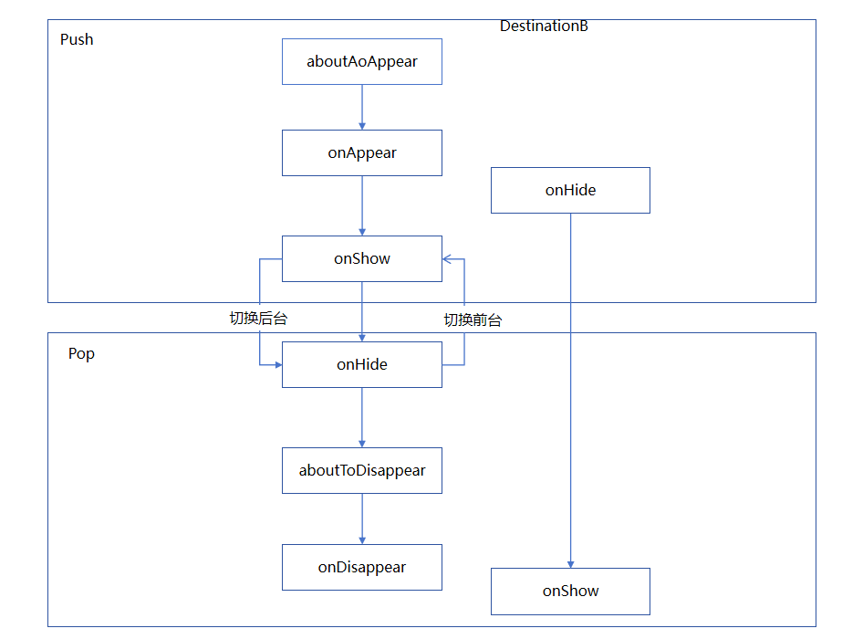 |

1. 有动画场景：onAboutToAppear(进场NavDestination页面) -> onAppear(进场NavDestination页面) -> onHidden(退出NavDestination页面) -> onShown(进场NavDestination页面) -> onAboutToDisAppear(退场NavDestination页面) -> onDisAppear(退场NavDestination页面)。

2. 无动画场景：
onAboutToAppear(进场NavDestination页面) -> onAppear(进场NavDestination页面) -> onHidden(退出NavDestination页面) -> onAboutToDisAppear(退场NavDestination页面) -> onDisAppear(退场NavDestination页面)-> onShown(进场NavDestination页面)。

变更后：
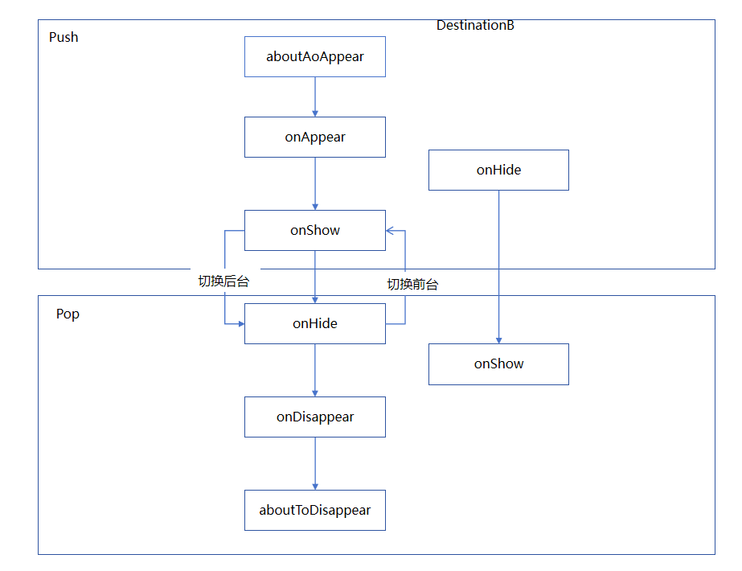
onAboutToAppear(进场NavDestination页面)->onAppear(进场NavDestination页面) -> onHidden(退出NavDestination页面) -> onShown(进场NavDestination页面) -> onDisAppear(退出NavDestination页面) -> onAboutToDisAppear(退出NavDestination页面)。

**适配指导**

依赖进场页面的aboutToAppear与退场页面aboutToDisAppear执行时间先后顺序的场景，可以将aboutToDisAppear生命周期转到willDisAppear生命周期中或者Navigation路由拦截setInterception的didShow回调中处理。

## cl.arkui.12 select组件样式变更

**访问级别**

公开接口

**变更原因**

提供小型化Select组件下拉按钮，相比于正常尺寸更小，以满足开发者在不同场景下的需求，获得更好的用户体验。

**变更影响**

该变更为非兼容性变更。

1. 新增加controlSize设置select下拉按钮默认尺寸（NORMAL、SMALL）

涉及属性列表：

| 属性         | NORMAL 组件                        | SMALL 组件               |
| ------------ | --------------------------------- | --------------------------------- |
| 背板高度     | 40vp                              | 28vp                              |
| 背板最小宽度 | 68vp                              | 56vp                              |
| 背板圆角     | 20vp                              | 14vp                              |
| 图标高度     | 24vp                              | 20vp                              |
| 图标宽度     | 12vp                              | 10vp                              |
| 图标间距     | 上间距8vp 、右间距16vp、下间距8vp   | 上间距4vp 、右间距12vp、下间距4vp   |
| 文本大小     | 16fp                              | 14fp                              |
| 文本间距     | 上间距8vp 、左间距16vp、下间距8vp   | 上间距4vp 、左间距12vp、下间距4vp   |

变更前，NORMAL的背板最小宽度是66vp；


变更后，NORMAL的背板最小宽度是68vp；


2. 修改select下拉按钮默认颜色，

变更前，默认背景颜色是系统资源中的`ohos_id_color_card_bg`；


变更后，默认背景颜色是系统资源中的`ohos_id_color_button_normal`。


3. controlSize、width、height接口作用优先级：

   1）如果开发者只设置了width和height，当文字大小设置的是比较大的值的时候，文字超出组件大小，且以省略号方式显示；

   2）如果开发者只设置了controlSize，没有设置width和height，组件宽高自适应文字，文字不超出组件，并设置最小宽度minWidth和最小高度minHeight；

   3）如果controlSize、width、height接口都设置了，width和height设置的值生效，但如果width和height设置的值小于controlSize设置的最小宽度minWidth和最小高度minHeight，width和height设置的值不生效，宽高仍保持controlSize设置的最小宽度minWidth和最小高度minHeight。

      宽度和高度随字体大小自适应示意图：

      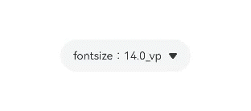

4. disabled状态的select下拉按钮背景色的opacity：

变更前，disabled状态的select下拉按钮背景色不透明。


变更后，disabled状态的select下拉按钮背景色与字体的opacity一致。


**起始 API Level**

12

**变更发生版本**

从OpenHarmony SDK 5.0.0.21 版本开始。

**变更的接口/组件**

Select组件

**适配指导**

请查阅[select组件](../../../application-dev/reference/apis-arkui/arkui-ts/ts-basic-components-select.md)文档进行适配。

## cl.arkui.13 富文本的SetSelection接口，光标行为变更

**访问级别**

公开接口

**变更原因**

依照UX规范

**变更影响**

该变更为非兼容性变更。API version 11及以前：

SetSelection接口start=end!=-1时，将光标移动到start位置。

API version 12及以后：

SetSelection接口start=end!=-1时，视为选中失败，不改变光标位置。

| 变更前 | 变更后 |
|---------|---------|
| 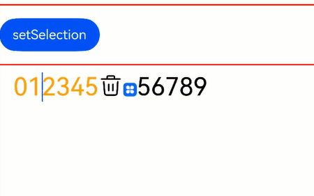 |  |

**起始 API Level**

11

**变更发生版本**

从OpenHarmony SDK 5.0.0.21 版本开始。

**变更的接口/组件**

RichEditor组件。

**适配指导**

默认效果变更，无需适配，但应注意变更后的默认效果是否符合开发者预期，如不符合则应自定义修改效果控制变量以达到预期。

## cl.arkui.14 NavDestination标题栏按钮默认背板、标题字体字号等默认样式变更

**访问级别**

公开接口

**变更原因**

UX样式变更

**变更影响**

该变更为非兼容性变更，只影响NavDestination组件的默认样式。

- 变更前
  1. NavDestination标题栏按钮无背板。
  2. NavDestination标题栏主标题字重为MEDIUM。
  
- 变更后
  1. NavDestination标题栏按钮增加圆形背板。
  2. NavDestination标题栏主标题字重为BOLD。
  3. NavDestination默认返回按钮图标更新。

  如下图所示为变更前后效果对比：

 | 变更前 | 变更后 |
|---------|---------|
|   |    |

**起始 API Level**

API 9

**变更发生版本**

从OpenHarmony SDK 5.0.0.21 版本开始。

**变更的接口/组件**

NavDestination组件。

**适配指导**

默认效果变更，无需适配，但应注意变更后的默认效果是否符合开发者预期，如不符合则应自定义修改效果控制变量以达到预期。

## cl.arkui.15 EditableTitleBar默认样式变化

**访问级别**

公开接口

**变更原因**

UX样式增强

**变更影响**

该变更为非兼容性变更。

变更前：
1. 主标题字重为Regular；
2. 图标大小为24*24；
3. 图标热区大小为48*48，圆角方形；
4. 标题栏高度为56vp；
5. 标题与左侧图标间距12vp。

变更后：
1. 主标题字重为Bold；
2. 图标大小为20*20；
3. 图标增加40*40灰色圆形背板；
4. 标题栏最小高度为56vp，标题上下间距4vp，超过56vp时，高度自适应；
5. 标题与左侧图标间距8vp。

back图标样式变更。

变更前后对比效果，如下图所示：
| 变更前 | 变更后 |
|---------|---------|
|  | 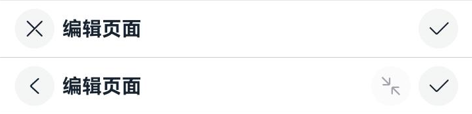 |

**起始API Level**

10

**变更发生版本**

从OpenHarmony SDK 5.0.0.21 版本开始。

**变更的接口/组件**

EditableTitleBar

**适配指导**

默认效果变更，无需适配。但应注意变更后的默认效果是否符合预期。


## cl.arkui.16 Navigation默认样式变化

**访问级别**

公开接口

**变更原因**

UX样式增强

**变更影响**

该变更为非兼容性变更。

变更前：
1. Full、Free模式非自定义主标题字重为Medium；
2. Menu图标大小为24*24；
3. Menu图标热区大小为48*48，圆角方形；
4. 标题栏左、右间距为24vp；
5. Free模式收齐时，非自定义主标题字号为24fp。

变更后：
1. Full、Free模式非自定义主标题字重为Bold；
2. Menu图标大小为20*20；
3. Menu图标增加40*40灰色圆形背板；
4. 标题栏左、右间距为16vp；
5. Free模式收齐时，非自定义主标题字号为26fp。

变更前后对比效果，如下图所示：
| 变更前 | 变更后 |
|---------|---------|
| 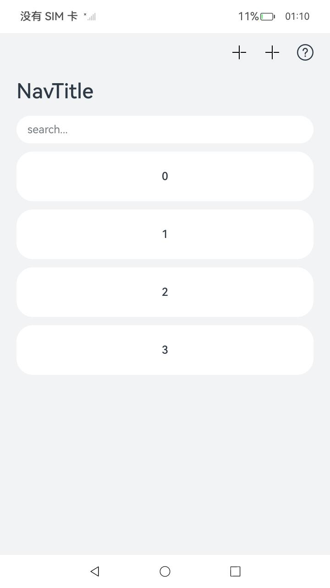 | 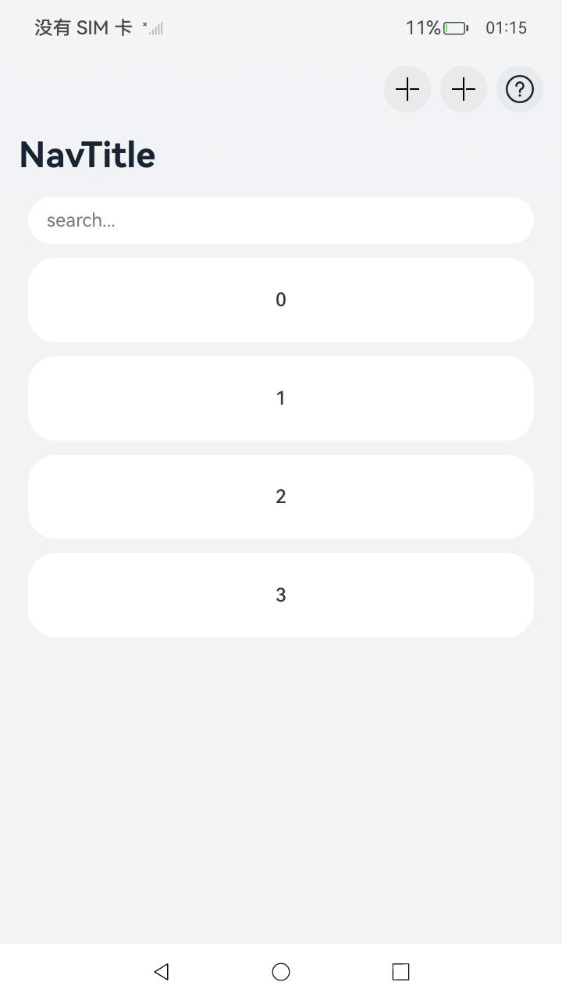 |
| 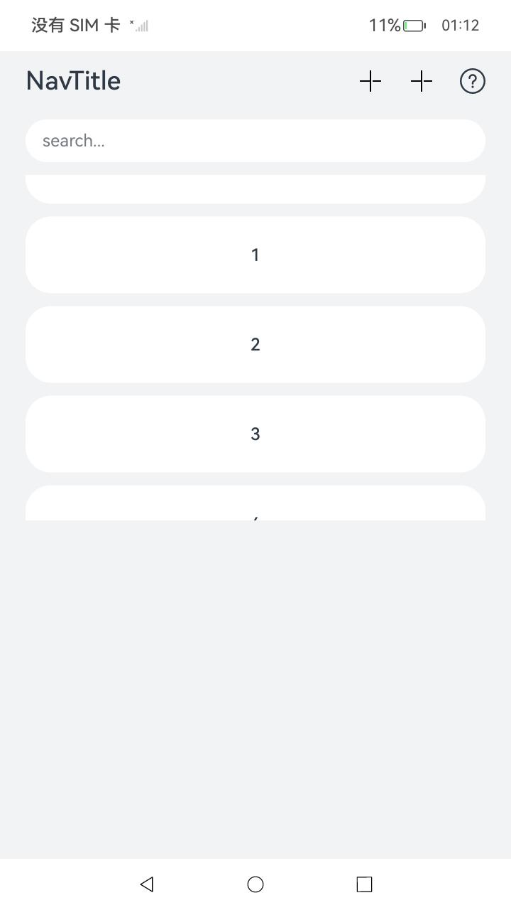 | 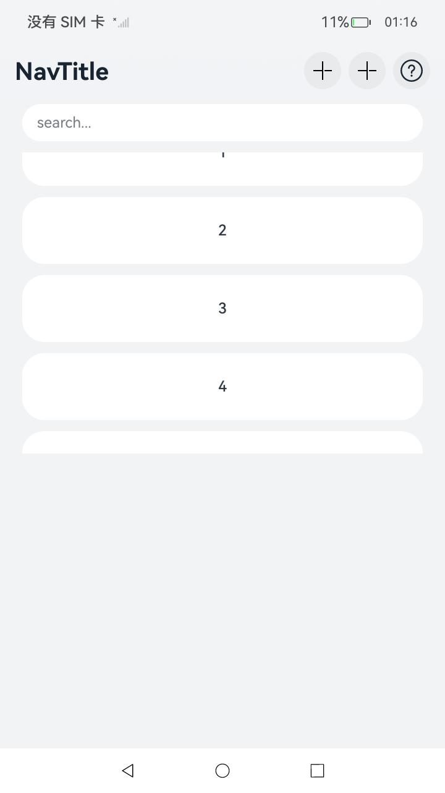 |

**起始API Level**

8

**变更发生版本**

从OpenHarmony SDK 5.0.0.21 版本开始。

**变更的接口/组件**

EditableTitleBar

**适配指导**

默认效果变更，无需适配。但应注意变更后的默认效果是否符合预期。

## cl.arkui.17 TimePicker时分秒前置零默认样式变更

**访问级别**

公开接口

**变更原因**

UX样式变更

**变更影响**

该变更为非兼容性变更，只影响TimePicker组件的默认样式。

- 变更前
  TimePicker组件12小时制小时默认有前置零。
  
- 变更后
  TimePicker组件12小时制小时默认没有前置零。

  如下图所示为变更前后效果对比：

 | 变更前 | 变更后 |
|---------|---------|
| 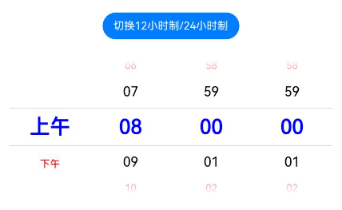  |  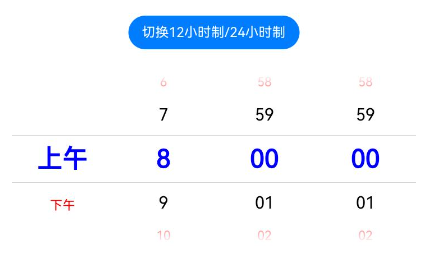  |

**起始 API Level**

API 12

**变更发生版本**

从OpenHarmony SDK 5.0.0.21 版本开始。

**变更的接口/组件**

TimePicker组件。

**适配指导**

默认效果变更，无需适配，但应注意变更后的默认效果是否符合开发者预期，如不符合则应自定义修改效果控制变量以达到预期。

## cl.arkui.18 RichEditor组件symbol动效变更

**访问级别**

公开接口

**变更原因**

依照UX规范

**变更影响**

该变更为非兼容性变更。

变更前：
RichEditor组件在编辑态支持播放symbol动效。

变更后：
RichEditor组件在编辑态不支持播放symbol动效。

**起始API Level**

11

**变更发生版本**

从OpenHarmony SDK 5.0.0.21 版本开始。

**变更的接口/组件**

RichEditor

**适配指导**

默认效果变更，无需适配。

## cl.arkui.19 allowDrop校验变更

**访问级别**

公开接口

**变更原因**

allowDrop用于接受方组件指定自己支持的拖拽数据类型，并将该值应用到拖拽方组件的角标显示上。但没有严格执行不匹配时的禁止落入逻辑，仍然会回调开发者的onDrop并传递数据。

**变更影响**

该变更为不兼容变更。

变更前：
当allowDrop声明的数据类型与拖拽组件的数据类型完全不匹配时，仍然会回调开发者设置的onDrop并传递数据。

变更后：
当allowDrop声明的数据类型与拖拽组件的数据类型完全不匹配时，不会回调开发者设置的onDrop。

**起始API Level**

12

**变更发生版本**

从OpenHarmony SDK 5.0.0.21 版本开始。

**变更的接口/组件**

allowDrop

**适配指导**

1.  以下两种情况无影响，无需适配：

    （1）未配置allowDrop属性，系统默认其可处理所有类型数据。

    （2）配置了数据类型，且onDrop中也可处理配置的数据类型。

2.  以下情况会受到影响，需适配：

    配置了allowDrop属性，并声明了一些数据类型。但是，onDrop会对未声明过的数据类型进行处理，可在allowdrop中增加onDrop需要处理的数据类型声明。

    **示例：**

    ```
    // xxx.ets

    @Entry
    @Component
    struct ImageExample {
      @State uri: string = ""
      @State AblockArr: string[] = []
      @State BblockArr: string[] = []
      @State AVisible: Visibility = Visibility.Visible
      @State dragSuccess :Boolean = false
      @State dragDataTypes: UniformDataType[] | null = [ null ]

      build() {
        Column() {
          Text('Image拖拽')
            .fontSize('30dp')
          Flex({ direction: FlexDirection.Row, alignItems: ItemAlign.Center, justifyContent: FlexAlign.SpaceAround }) {
            Image($r('app.media.icon'))
              .width(100)
              .height(100)
              .border({ width: 1 })
              .visibility(this.AVisible)
              .draggable(true)
              .onDragEnd((event: DragEvent) => {
                let ret = event.getResult();
                if(ret == 0) {
                  console.log("enter ret == 0")
                  this.AVisible = Visibility.Hidden;
                } else {
                  console.log("enter ret != 0")
                  this.AVisible = Visibility.Visible;
                }
              })
          }
          .margin({ bottom: 20 })
          Row() {
            Column(){
              List(){
                ForEach(this.AblockArr, (item:string, index) => {
                  ListItem() {
                    Image(item)
                      .width(100)
                      .height(100)
                      .border({width: 1})
                  }
                  .margin({ left: 30 , top : 30})
                }, (item:string) => item)
              }
              .height('90%')
              .width('100%')
              .allowDrop(this.dragDataTypes)
              .onDrop((event?: DragEvent, extraParams?: string) => {
                this.uri = JSON.parse(extraParams as string).extraInfo;
                this.AblockArr.splice(JSON.parse(extraParams as string).insertIndex, 0, this.uri);
                console.log("ondrop not udmf data");
              })
              .border({width: 1})
            }
            .height("50%")
            .width("45%")     
          }
        }.width('100%')
      }
    }
    ```