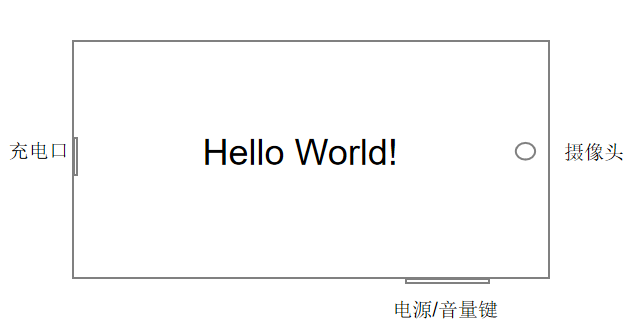
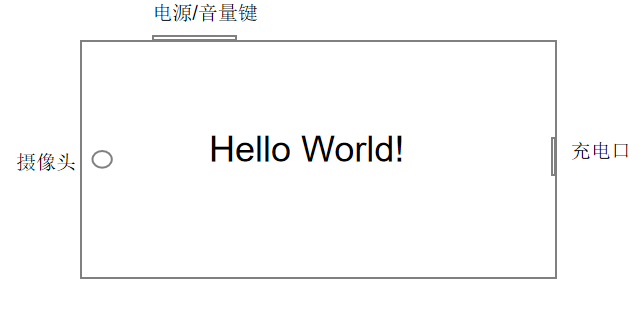

# 窗口子系统变更说明

## cl.window.1 Orientation横屏行为变更

**访问级别**

公开接口

**变更原因**

应用通过配置在module.json中ability标签"orientation"或setPreferredOrientation接口设置横屏时，习惯性使用LANDSCAPE，此时会旋转到电源键在手机下方，与业界通用逻辑相反，不符合用户使用习惯，影响使用手机体验。

**变更影响**

该变更为非兼容性变更。
此变更从OpenHarmony SDK 5.0.0.25，API 12及以后开始生效，API 11及之前保持原状。更改后应用设置LANDSCAPE横屏时，旋转方向会与更改前相反的方向。

变更前后对比效果，如下图所示：
| 变更前 | 变更后 |
|---------|---------|
|  |  |

**起始 API Level**

9

**变更发生版本**

从OpenHarmony SDK 5.0.0.25开始。

**变更的接口/组件**

变更前后，应用设置横屏的效果对照表见如下表格。

横屏效果对照表：
|Orientation值| 变更前          | 变更后   | 
|-------| -------- | --------------- | 
|LANDSCAPE|  电源键向下    |  电源键向上   |
|LANDSCAPE_INVERTED|  电源键向上    |  电源键向下  | 
|AUTO_ROTATION_LANDSCAPE|  电源键向下    |  电源键向上 | 
|AUTO_ROTATION_LANDSCAPE_RESTRICTED|  电源键向下    |  电源键向上   | 
|USER_ROTATION_LANDSCAPE   |  电源键向下   | 电源键向上   | 
|USER_ROTATION_LANDSCAPE_INVERTED|  电源键向上  |  电源键向下   | 

**适配指导**

一、设置的横屏枚举值变更：

(1) 更改前如果传入LANDSCAPE参数，更改后为保持相同的体验效果，需传入LANDSCAPE_INVERTED参数。

(2) 更改前如果传入LANDSCAPE_INVERTED参数，更改后为保持相同的体验效果，需传入LANDSCAPE参数。

(3) 更改前如果传入USER_ROTATION_LANDSCAPE参数，更改后为保持相同的体验效果，需传入USER_ROTATION_LANDSCAPE_INVERTED参数。

(4) 更改前如果传入USER_ROTATION_LANDSCAPE_INVERTED参数，更改后为保持相同的体验效果，需传入USER_ROTATION_LANDSCAPE参数。

二、监听的横屏方向变更：

应用设置横屏后，屏幕发生旋转，旋转后通过监听display.on('change')可以获取display的orientation值，变更后display的orientation值也会跟着发生变化。

(1) 当手机电源键在右侧时，displayOrientation更改前后变化对照表：
|Orientation值| 变更前          | 变更后   | 
|-------| -------- | --------------- | 
|LANDSCAPE|  1    |  3   |
|LANDSCAPE_INVERTED|  3    |  1  | 
|AUTO_ROTATION_LANDSCAPE|  1    |  3 | 
|AUTO_ROTATION_LANDSCAPE_RESTRICTED|  3    |  1   | 
|USER_ROTATION_LANDSCAPE   |  1   | 3   | 
|USER_ROTATION_LANDSCAPE_INVERTED|  3  |  1   |
(2) 当手机电源键在左侧时，displayOrientation值与更改前保持一致。
三、推荐的横屏枚举值：

变更后推荐用户使用LANDSCAPE和USER_ROTATION_LANDSCAPE设置横屏
