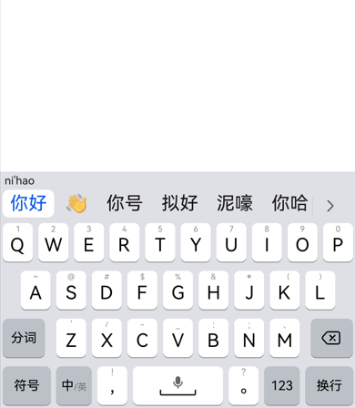
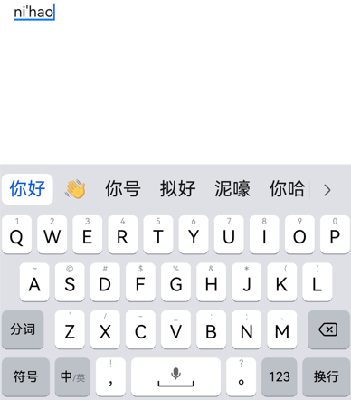

# ArkUI子系统Changelog

## cl.arkui.1 onTextSelectionChange触发回调不需要获焦变更

**访问级别**
 
公开接口

**变更原因**

onTextSelectionChange回调触发与控件获焦解除绑定

**变更影响**

该变更为非兼容性变更。

变更前：控件没有获焦时，不允许触发onTextSelectionChange。

变更后：控件没有获焦时，允许触发onTextSelectionChange。

**起始API Level**

10

**变更发生版本**

从OpenHarmony SDK 5.0.0.27开始。

**变更的接口/组件**

Text、TextInput、TextArea、Search。

**适配指导**

如果onTextSelectionChange绑定了事件，需要适配未获焦时的触发回调的行为。

## cl.arkui.2 富文本增加预上屏功能及开关接口，默认打开，支持关闭。

**访问级别**
 
公开接口

**变更原因**

富文本新增支持输入预上屏功能,默认打开，支持开关关闭。

**变更影响**

该变更为非兼容性变更。

变更前：输入法应用输入时富文本组件无预上屏内容及预上屏下划线样式，在确认候选词后内容插入到组件中。

变更后：输入法应用输入时富文本组件显示预上屏内容及下划线样式，未确认完毕候选词前，预上屏内容已经插入到组件中，在确认完毕候选词后，预上屏内容从组件中移除，再将确认完毕的候选词插入到组件中显示。应用若想保持之前输入时的状态，需要自行设置预上屏开关为false。
输入相关回调返回值中增加预上屏字段:aboutToIMTInput#RichEditorInsertValue.previewText;onIMEInputComplete#RichEditorTextSpanResult.previewText。

| 变更前 | 变更后 |
|---------|---------|
| | |

**起始API Level**

12

**变更发生版本**

从OpenHarmony SDK 5.0.0.27开始。

**变更的接口/组件**

RichEditor

**适配指导**

富文本预上屏功能默认打开，预上屏时会触发相关输入回调。
例：预上屏输入  "n" -> "ni"时，aboutToIMeInput回调 : {RichEditorInsertValue.insertValue = "", RichEditorInsertValue.previewText = "i"}
onIMEInputComplete回调 ：{RichEditorTextSpanResult.value = "", RichEditorTextSpanResult.previewText = "i"}

基于回调的使用方式不同，输入内容的状态可能会出现不符合开发者预期的情况,开发者可以通过设置预上屏开关，将预上屏功能关闭。
RichEditor({ controller: this.controller })
    .enablePreviewText(false)