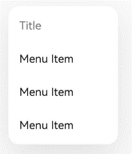
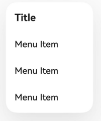

# ArkUI子系统Changelog

## cl.arkui.1 自定义组件struct装饰器校验信息优化

**访问级别**

公开接口

**变更原因**

之前的报错信息存在冗余，不易理解。

**变更影响**

该变更为兼容性变更。

变更前：
输出一个警告(WARN)和一个错误(ERROR)日志信息。
```
WARN: ArkTS:WARN File: xx
A struct should use decorator '@Component' or '@ComponentV2'.
ERROR: ArkTS:ERROR File:xx
'TestComponent()' does not meet UI component syntax.
```

变更后：
如果struct没有被(@Entry/@Preview/@ComponentV2/@Component/@CustomDialog/@Reusable)其中一个装饰器装饰，编译报错，只有一个错误(ERROR)日志信息。
```
ERROR: ArkTS:ERROR File:xx
Decorator '@Component', '@ComponentV2', or '@CustomDialog' is missing for struct 'TestComponent'.
```
错误示例如下：
```ts
struct Child {
  build() {
    Column() {
      Text("hello Child")
    }
  }
}

@Entry
@Component
struct Child {
  build() {
    Column() {
      Child()
    }
  }
}
```

**起始API Level**

不涉及API变更

**变更发生版本**

从OpenHarmony SDK 5.0.0.28开始。

**适配指导**

如果应用代码未发生变化，则不需要适配。
## cl.arkui.2 增加方法装饰器的校验

**访问级别**

公开接口

**变更原因**

当开发者错误的使用多个方法装饰器装饰在同一个方法上时，会导致运行时异常，需要在编译阶段提前拦截。

**变更影响**

该变更为非兼容性变更。

变更前：
当不同的方法装饰器装饰在同一个方法时，编译无日志提示信息。

变更后：
当不同的方法装饰器装饰在同一个方法时，编译输出报错提示信息。
```
ERROR: ArkTS:ERROR File:xx
A function can only be decorated by one of the 'AnimatableExtend, Builder, Extend, Styles and Concurrent'.
ERROR: ArkTS:ERROR File:xx
The member property or method can not be decorated by multiple built-in decorators.
```

错误示例如下：
```ts
@Builder
@Styles
function testFunc() {
  Text("hello testFunc")
}

@Component
struct TestComponent {

  @Builder
  @Styles
  testMethod() {
    Text("hello testMethod")
  }

  build() {
    Column() {
      Text("hello TestComponent")
    }
  }
}
```

变更前：
当相同的内置方法装饰器(@AnimatableExtend/@Builder/@Extend/@Styles/@Concurrent)装饰在同一个方法时，编译无日志提示信息。

变更后：
当相同的内置方法装饰器(@AnimatableExtend/@Builder/@Extend/@Styles/@Concurrent)装饰在同一个方法时，编译输出警告日志提示信息。
```
WARN: ArkTS:WARN File: xx
Duplicate decorators for function are not allowed.
```

错误示例如下：
```ts
@Builder
@Builder
function testFunc() {
  Text("hello testFunc")
}
```

**起始API Level**

不涉及API变更

**变更发生版本**

从OpenHarmony SDK 5.0.0.28开始。

**适配指导**

如果开发者不按规范使用对应范式，则需按日志提示信息进行修改。

## cl.arkui.3 bindPopup在窗口失焦后不消失

**访问级别**

公开接口

**变更原因**

开发者不希望popup所在的窗口失去焦点后，popup会自动消失

**变更影响**

该变更为非兼容性变更。

变更前：
popup所在窗口失焦时，popup会自动消失。

变更后：
popup所在窗口失焦时，popup不会自动消失。


**起始API Level**

不涉及API变更

**变更发生版本**

从OpenHarmony SDK 5.0.0.28开始。

**适配指导**

气泡的关闭需要用户自行决定。如果出现之前版本某一操作后popup消失，现版本不消失的现象时，用户可以检查现象前后窗口焦点是否发生了变化，如果发生变化，现版本需要用户自行将isShow属性设置为false来关闭popup。

## cl.arkui.4 TextInput/TextArea组件设置宽度为auto时，最小值为16vp

**访问级别**

公开接口

**变更原因**

TextInput/TextArea组件设置宽度为auto并且内容为空时，组件消失。

**变更影响**

该变更为兼容性变更。

变更前：
TextInput/TextArea组件设置宽度为auto并且内容为空时，组件消失。

变更后：
TextInput/TextArea组件设置宽度为auto并且内容为空时，组件最小宽度为16vp。

**起始API Level**

不涉及API变更

**变更发生版本**

从OpenHarmony SDK 5.0.0.28开始。

**适配指导**

默认行为变更，无需适配，但应注意变更后的行为是否对整体应用逻辑产生影响。

## cl.arkui.5 TextInput/TextArea组件设置为内联模式时，最小值为16vp

**访问级别**

公开接口

**变更原因**

TextInput/TextArea组件设置为内联模式并且内容为空时，组件消失。

**变更影响**

该变更为兼容性变更。

变更前：
TextInput/TextArea组件设置为内联模式并且内容为空时，组件消失。

变更后：
TextInput/TextArea组件设置为内联模式并且内容为空时，组件最小宽度为16vp。

**起始API Level**

不涉及API变更

**变更发生版本**

从OpenHarmony SDK 5.0.0.28开始。

**适配指导**

默认行为变更，无需适配，但应注意变更后的行为是否对整体应用逻辑产生影响。

## cl.arkui.6 TextInput/TextArea组件在2in1设备上通过双击弹出菜单时，点击全选，菜单消失

**访问级别**

公开接口

**变更原因**

TextInput/TextArea组件在2in1上通过双击弹出菜单时，点击全选，此时无需菜单弹出。

**变更影响**

该变更为兼容性变更。

变更前：
TextInput/TextArea组件在2in1上通过双击弹出菜单时，点击全选，此时菜单弹出。

变更后：
TextInput/TextArea组件在2in1上通过双击弹出菜单时，点击全选，此时菜单消失。

**起始API Level**

不涉及API变更

**变更发生版本**

从OpenHarmony SDK 5.0.0.28开始。

**适配指导**

默认行为变更，无需适配，但应注意变更后的行为是否对整体应用逻辑产生影响。

## cl.arkui.7 Menu组件默认样式变更

**访问级别**

公开接口

**变更原因**

优化menu组件的视觉体验。

**变更影响**

该变更为非兼容性变更。

**变更前：**



菜单列表的左右padding默认为0

菜单项文本字重默认为regular

菜单组件圆角大小默认为16vp

对于带标题的菜单列表，标题文本大小默认为16fp

对于带标题的菜单列表，标题文本颜色默认为#89000000

对于带标题的菜单列表，标题文本字重默认为normal

**变更后：**



菜单列表的左右padding默认为16vp

菜单项文本字重默认为medium

菜单组件圆角大小默认为20vp

对于带标题的菜单列表，标题文本大小默认为18fp

对于带标题的菜单列表，标题文本颜色默认为#FF000000

对于带标题的菜单列表，标题文本字重默认为bold


**起始API Level**

9

**变更发生版本**

从OpenHarmony SDK 5.0.0.28开始。

**适配指导**

默认效果变更，无需适配，但应注意变更后的默认效果是否符合开发者预期，如不符合则应自定义修改效果控制变量以达到预期。

## cl.arkui.8 chipGroup不设置items属性的异常处理

**访问级别**

公开接口

**变更原因**

chipGroup组件在使用过程中，对于必填属性items，不设置时DevEco Studio是否抛出异常。

**变更影响**

该变更为非兼容性变更。

变更前：必填属性items，不设置时DevEco Studio不报错。

变更后：必填属性items，不设置时DevEco Studio抛出异常告警。

**起始API Level**

12

**变更发生版本**

从OpenHarmony SDK 5.0.0.28开始。

**适配指导**

使用chipGroup组件时，如果不设置必填属性items，则需按日志提示信息进行修改。

## cl.arkui.9 ListItem横滑跟手比变更

**访问级别**

公开接口

**变更原因**

ListItem横滑动态跟手比计算公式，需要与其他场景（例如：List拖动过界）的公式一致。

**变更影响**

该变更为不兼容变更。

ListItem横滑动态跟手比按新实现后，手指滑动相同距离，组件滑动距离会变大。

**起始API Level**

9

**变更发生版本**

从OpenHarmony SDK 5.0.0.28开始。

**适配指导**

默认效果变更，无需适配。

## cl.arkui.10 DrawableDescriptor显示效果

**访问级别**

公开接口

**变更原因**

对原来非标准288x288图标的裁切行为做统一变更，提高用户体验。

**变更影响**

该变更为不兼容性变更。

对于非288x288尺寸前景图片，当前生成的分层图标按照缩放后裁剪显示，288x288尺寸前景图片保持原规格。

**起始API Level**

10

**变更发生版本**

从OpenHarmony SDK 5.0.0.28开始。

**适配指导**

默认效果变更：默认效果变更，无需适配，但应注意变更后的默认效果是否符合开发者预期，如不符合则应自定义修改效果控制变量以达到预期。

## cl.arkui.11 TipsDialog的imageRes/imageSize/title变更

**访问级别**

公开接口

**变更原因**

TipsDialog 原来只支持 resource 类型的图片，现扩展 TipsDialog 支持 pixelMap 和 string 类型的图片，方便用户根据使用场景选用图片类型，提升用户使用体验。同时变更 TipsDialog 图片大小和中间标题由必填改为非必填，方便用户根据使用场景决定是否选用默认样式。

**变更影响**

该变更为不兼容变更。

变更前：
1. TipsDialog不支持pixelMap和string类型的图片
2. TipsDialog的图片大小为必填
3. TipsDialog必须有中间标题

变更后：
1. TipsDialog支持pixelMap和string类型的图片
2. TipsDialog图片大小非必填，默认大小64vp*64vp
3. TipsDialog中间标题可为非必填，未填不展示标题

**起始API Level**

API 12

**变更发生版本**

从OpenHarmony SDK 5.0.0.28开始。

**适配指导**

TipsDialg组件创建函数变更：无需适配，但应注意变更后的属性范围扩展是否符合开发者预期，如不符合可具体参考：
```ts
import { TipsDialog } from '@kit.ArkUI';

@Entry
@Component
struct Index {
  isChecked = false;
  dialogControllerImage: CustomDialogController = new CustomDialogController({
    builder: TipsDialog({
      imageRes: $r('sys.media.ohos_ic_public_voice'),
      content: '想要卸载这个APP嘛?',
      primaryButton: {
        value: '取消',
        action: () => {
          console.info('Callback when the first button is clicked')
        },
      },
      secondaryButton: {
        value: '删除',
        role: ButtonRole.ERROR,
        action: () => {
          console.info('Callback when the second button is clicked')
        }
      },
      onCheckedChange: () => {
        console.info('Callback when the checkbox is clicked')
      }
    }),
  })

  build() {
    Row() {
      Stack() {
        Column(){
          Button("上图下文弹出框")
            .width(96)
            .height(40)
            .onClick(() => {
              this.dialogControllerImage.open()
            })
        }.margin({bottom: 300})
      }.align(Alignment.Bottom)
      .width('100%').height('100%')
    }
    .backgroundImageSize({ width: '100%', height: '100%' })
    .height('100%')
  }
}
```

## cl.arkui.12 ChipGroup组件items拓展参数类型支持SymbolGlyphModifier

**访问级别**

公开接口

**变更原因**

ChipGroup组件设置IconGroupSuffix的items参数原来只支持image类型的图片，现扩展支持HM Symbol资源设置，方便用户使用资源更加丰富的Symbol库，提升用户使用体验。

**变更影响**

该变更为不兼容变更。

变更前：
IconGroupSuffix的参数items类型是Array\<IconItemOptions>，支持用户传参image类型的图标。

变更后：
IconGroupSuffix的参数items类型是Array\<IconItemOptions | SymbolGlyphModifier>，支持用户传参image类型或者symbol类型的图标。

**起始API Level**

API 12

**变更发生版本**

从OpenHarmony SDK 5.0.0.28开始。

**变更的接口/组件**

[@ohos.arkui.advanced.ChipGroup.d.ets](https://gitee.com/openharmony/interface_sdk-js/blob/master/api/@ohos.arkui.advanced.ChipGroup.d.ets)中如下接口：

items: Array<IconItemOptions | SymbolGlyphModifier>;

**适配指导**

ChipGroup创建IconGroupSuffx变更：无需适配，开发者可以根据需要设置image或者symbol图标，如要使用symbol图标，可以参考以下示例：
```ts
import { ChipSize, ChipGroup, IconGroupSuffix, SymbolGlyphModifier } from '@kit.ArkUI'

@Entry
@Preview
@Component
struct Index {
  @State selected_index: Array<number> = [0, 1, 2, 3, 4, 5, 6];
  @State selected_state: boolean = true;
  @State prefixModifierNormal: SymbolGlyphModifier = new SymbolGlyphModifier($r('sys.symbol.ohos_star'));
  @State prefixModifierActivated: SymbolGlyphModifier = new SymbolGlyphModifier($r('sys.symbol.ohos_star')).fontColor([Color.Red]);
  @State suffixModifierNormal: SymbolGlyphModifier = new SymbolGlyphModifier($r('sys.symbol.ohos_wifi'));
  @State suffixModifierActivated: SymbolGlyphModifier = new SymbolGlyphModifier($r('sys.symbol.ohos_wifi')).fontColor([Color.Red]);

  @LocalBuilder
  ChipGroupSuffix(): void {
    IconGroupSuffix({
      items: [
        new SymbolGlyphModifier($r('sys.symbol.magnifyingglass'))
          .onClick(() => {
            if (this.selected_state == false) {
              this.selected_index = [0, 1, 2, 3, 4, 5, 6];
              this.selected_state = true;
            } else {
              this.selected_index = [];
              this.selected_state = false;
            }
          })
      ]
    })
  }

  build() {
    Column() {
      ChipGroup({
        items: [
          {
            prefixSymbol: { normal: this.prefixModifierNormal, activated: this.prefixModifierActivated },
            label: { text: "操作块1" },
            suffixSymbol: { normal: this.suffixModifierNormal, activated: this.suffixModifierActivated },
            allowClose: false,
          },
          {
            prefixSymbol: { normal: this.prefixModifierNormal, activated: this.prefixModifierActivated },
            label: { text: "操作块2" },
            allowClose: true,
          },
          {
            prefixIcon: { src: $r('sys.media.ohos_ic_public_clock') },
            label: { text: "操作块3" },
            allowClose: true,
          },
          {
            prefixIcon: { src: $r('sys.media.ohos_ic_public_cast_stream') },
            label: { text: "操作块4" },
            allowClose: true,
          },
          {
            prefixIcon: { src: $r('sys.media.ohos_ic_public_cast_mirror') },
            label: { text: "操作块5" },
            allowClose: true,
          },
          {
            prefixIcon: { src: $r('sys.media.ohos_ic_public_cast_stream') },
            label: { text: "操作块6" },
            allowClose: true,
          },
        ],
        itemStyle: {
          size: ChipSize.NORMAL,
          backgroundColor: $r('sys.color.ohos_id_color_button_normal'),
          fontColor: $r('sys.color.ohos_id_color_text_primary'),
          selectedBackgroundColor: $r('sys.color.ohos_id_color_emphasize'),
          selectedFontColor: $r('sys.color.ohos_id_color_text_primary_contrary'),
        },
        selectedIndexes: this.selected_index,
        multiple: true,
        chipGroupSpace: { itemSpace: 8, endSpace: 0 },
        chipGroupPadding: { top: 10, bottom: 10 },
        onChange: (activatedChipsIndex: Array<number>) => {
          console.log('chips on clicked, activated index ' + activatedChipsIndex)
        },
        suffix: this.ChipGroupSuffix
      })
    }
  }
}
```