# ArkUI子系统Changelog

## cl.arkui.1 自定义弹窗避让软键盘行为优化

**访问级别**

公开接口

**变更原因**

从API version 12开始，将自定义弹窗避让软键盘行为优化为弹窗到达极限位置之后进行高度压缩。

**变更影响**

该变更为非兼容性变更。

API version 11及以前，自定义弹窗避让软键盘时仅抬起软键盘对应高度，横屏等高度不足场景或自定义弹窗高度较大场景下，会出现弹窗超出屏幕显示的情况。

API version 12及以后，将自定义弹窗避让软键盘行为优化为弹窗到达极限位置之后进行高度压缩，而不会使弹窗超出极限位置显示。

**起始API Level**

CustomDialogController: API7
openCustomDialog(options: CustomDialogOptions): API11
openCustomDialog<T extends Object>(dialogContent: ComponentContent<T>, options?: promptAction.BaseDialogOptions): API12

**变更发生版本**

从OpenHarmony SDK 5.0.0.29 版本开始。

**变更的接口/组件**

自定义弹窗

**适配指导**

默认行为变更，无需适配，但应注意变更后的行为是否对整体应用逻辑产生影响。

## cl.arkui.2 Badge组件显隐时增加缩放动效

**访问级别**

公开接口

**变更原因**

给Badge组件显隐时增加缩放动画，代替简单的出现与消失

**变更影响**

该变更为非兼容性变更。

API version 11及以前：Badge组件显隐时没有缩放动效。

API version 12及以后：Badge组件前后状态相同时不缩放，显隐时增加缩放动效。

**起始 API Level**

7

**变更发生版本**

从OpenHarmony SDK 5.0.0.29开始。

**适配指导**

默认样式变更调整，无需适配。

## cl.arkui.3 TimePickerDialog、DatePickerDialog支持设置前导零

**访问级别**

公开接口

**变更原因**

开发者给TimePickerDialog、DatePickerDialog设置是否需要前导零。

**变更影响**

该变更为不兼容变更，只影响TimePickerDialog、DatePickerDialog组件的默认样式。

- 变更前： TimePickerDialog、DatePickerDialog组件12小时制小时默认有前置零。
  
- 变更后： TimePickerDialog、DatePickerDialog组件12小时制小时默认没有前置零。

  如下图所示为变更前后效果对比：

 | 变更前 | 变更后 |
|---------|---------|
| 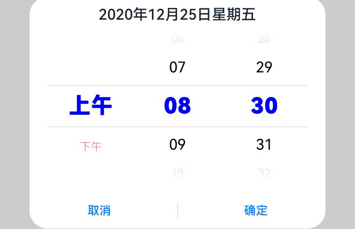  |  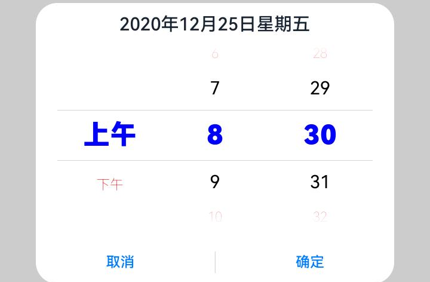  |

 | 变更前 | 变更后 |
|---------|---------|
|   |    |

**起始API Level**

12

**变更发生版本**

从OpenHarmony SDK 5.0.0.29开始。

**适配指导**

默认行为变更，无需适配，但应注意时间窗口是否按照设置显示前导零。

## cl.arkui.4 构造@ComponentV2修饰的自定义组件时，增加对常规变量的构造赋值校验

**访问级别**

公开接口

**变更原因**

该变更为不兼容变更。

在@ComponentV2修饰的自定义组件中使用@Local、@Provider()、@Consumer()、常规变量(没有任何装饰器修饰的，不涉及更新的普通变量)，在构造的时候传参赋值，进行校验并输出错误信息。

**变更影响**

执行下列用例：

```ts
@Entry
@ComponentV2
struct v2DecoratorInitFromParent {
  build() {
    Column() {
      testChild({
        regular_value: "hello",
        local_value: "hello",
        provider_value: "hello",
        consumer_value: "hello"
      })
    }
  }
}

@ComponentV2
struct testChild {
  regular_value: string = "hello";
  @Local local_value: string = "hello";
  @Provider() provider_value: string = "hello";
  @Consumer() consumer_value: string = "hello";
  build() {}
}
```

变更前无报错

变更后报错信息为：

Property 'regular_value' in the custom component 'testChild' cannot initialize here (forbidden to specify).
Property 'local_value' in the custom component 'testChild' cannot initialize here (forbidden to specify).
Property 'provider_value' in the custom component 'testChild' cannot initialize here (forbidden to specify).
Property 'consumer_value' in the custom component 'testChild' cannot initialize here (forbidden to specify).

**起始API Level**

不涉及API变更

**变更发生版本**

从OpenHarmony SDK 5.0.0.29开始。

**适配指导**

如果开发者不按规范使用对应范式，则需按日志提示信息进行修改。

## cl.arkui.5 Video切换视频源时显示预览图

**访问级别**

公开接口

**变更原因**

视频源切换时预览图规格表现不一致。

**变更影响**

该变更为非兼容性变更。

变更前：视频播放后执行视频源切换时不显示预览图，再次执行视频源切换时显示预览图。

变更后：每次执行视频源切换都会显示预览图。

**起始API Level**

7

**变更发生版本**

从OpenHarmony SDK 5.0.0.29开始。

**适配指导**

如果应用中使用了Video组件中的previewUri属性，且存在视频源切换行为，开发者需按照预览图是否展示的最新逻辑进行适配。

## cl.arkui.6 BindSheet半模态组件横屏支持设置档位与高度

**访问级别**

公开接口

**变更原因**

手机横屏时，BindSheet支持开发者设置挡位和高度

**变更影响**

该变更为不兼容性变更。

API version 11及以前：bindSheet在手机横屏时不支持设置挡位和高度，默认高度距离横屏窗口顶部8vp。

API version 12及以后：bindSheet在手机横屏时支持开发者设置挡位和高度，最大高度距离横屏窗口顶部8vp。

**起始API Level**

10

**变更发生版本**

从OpenHarmony SDK 5.0.0.29开始。

**适配指导**

默认行为变更，需应用适配。横竖屏设置挡位规则保持一致，参考detents属性的设置请查阅[半模态组件](../../../application-dev/reference/apis-arkui/arkui-ts/ts-universal-attributes-sheet-transition.md)文档进行适配。

## cl.arkui.7 RichEditor/TextInput/TextArea/Search组件编辑态长按时显示单光标

**访问级别**

公开接口

**变更原因**

RichEditor/TextInput/TextArea/Search组件在编辑态下，若检测到手指长按后进行move操作，则在当前手指触摸位置显示光标。

**变更影响**

该变更为不兼容变更，只影响RichEditor/TextInput/TextArea/Search组件编辑态长按逻辑。

- 变更前： RichEditor/TextInput/TextArea/Search组件编辑态长按时选中触摸内容，并出现双手柄。

- 变更后： RichEditor/TextInput/TextArea/Search组件编辑态长按时显示单光标（涉及光标动效），而不会选中触摸内容。

  如下图所示为变更前后效果对比：

 | 变更前 | 变更后 |
|---------|---------|
| 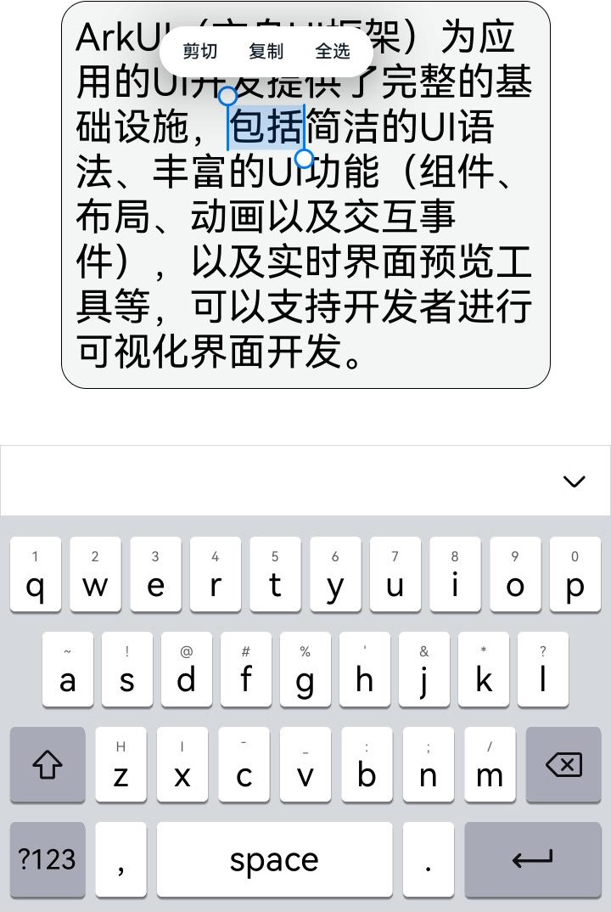  |  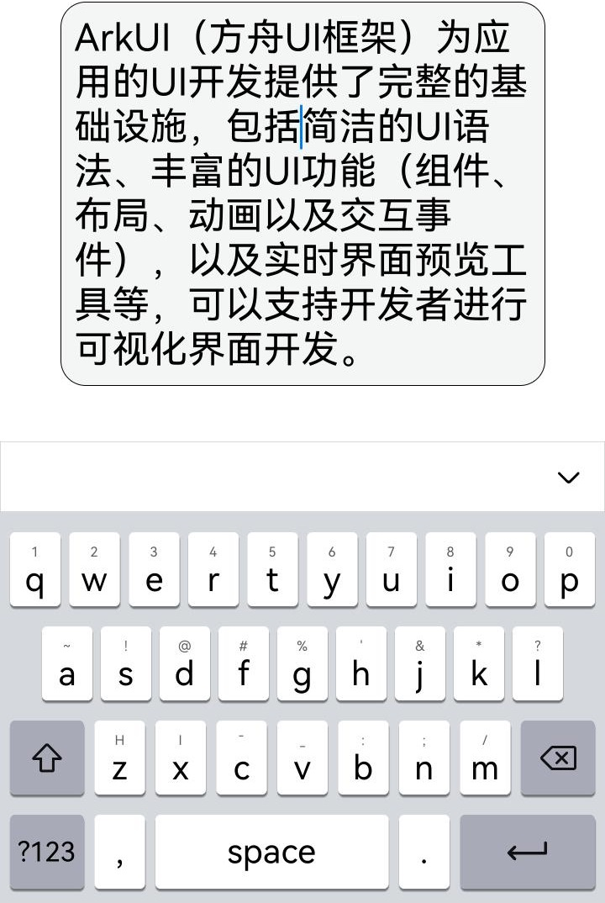  |

**起始API Level**

11

**变更发生版本**

从OpenHarmony SDK 5.0.0.29开始。

**适配指导**

UX统一文本编辑交互规范，开发者无需适配。

## cl.arkui.8 Dialog组件内AlertDialogParam弹窗类型和ActionSheetOptions弹窗类型支持镜像能力

**访问级别**

公开接口

**变更原因**

Dialog组件内AlertDialogParam弹窗类型和ActionSheetOptions弹窗类型支持镜像能力。

**变更影响**

该变更为不兼容变更。

- 变更前：

  Dialog组件内AlertDialogParam弹窗类型的cornerRadius接口不支持LocalizedBorderRadiuses类型设置圆角。

  Dialog组件内AlertDialogParam弹窗类型的borderColor接口不支持LocalizedEdgeColors类型设置颜色。

  Dialog组件内AlertDialogParam弹窗类型的borderWidth接口不支持LocalizedEdgeWidths类型设置宽度。

  Dialog组件内ActionSheetOptions弹窗类型的cornerRadius接口不支持LocalizedBorderRadiuses类型设置圆角。

  Dialog组件内ActionSheetOptions弹窗类型的borderColor接口不支持LocalizedEdgeColors类型设置颜色。

  Dialog组件内ActionSheetOptions弹窗类型的borderWidth接口不支持LocalizedEdgeWidths类型设置宽度。

- 变更后：

  Dialog组件内AlertDialogParam弹窗类型的cornerRadius接口支持LocalizedBorderRadiuses类型设置圆角。

  Dialog组件内AlertDialogParam弹窗类型的borderColor接口支持LocalizedEdgeColors类型设置颜色。

  Dialog组件内AlertDialogParam弹窗类型的borderWidth接口支持LocalizedEdgeWidths类型设置宽度。

  Dialog组件内ActionSheetOptions弹窗类型的cornerRadius接口支持LocalizedBorderRadiuses类型设置圆角。

  Dialog组件内ActionSheetOptions弹窗类型的borderColor接口支持LocalizedEdgeColors类型设置颜色。

  Dialog组件内ActionSheetOptions弹窗类型的borderWidth接口支持LocalizedEdgeWidths类型设置宽度。

AlertDialogParam弹窗类型的cornerRadius：
 | 变更前 | 变更后 |
|---------|---------|
|   |  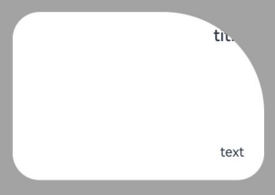  |

AlertDialogParam弹窗类型的borderColor：
 | 变更前 | 变更后 |
|---------|---------|
| 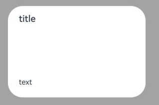  |    |

AlertDialogParam弹窗类型的borderWidth：
 | 变更前 | 变更后 |
|---------|---------|
| 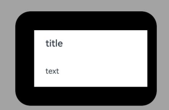  |  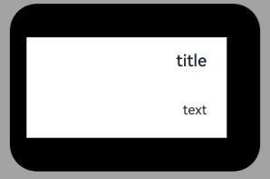  |

ActionSheetOptions弹窗类型的cornerRadius：
 | 变更前 | 变更后 |
|---------|---------|
| 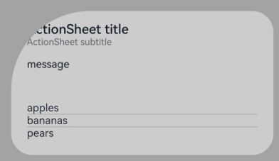  |  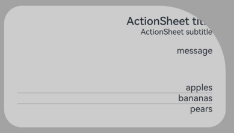  |

ActionSheetOptions弹窗类型的borderColor：
 | 变更前 | 变更后 |
|---------|---------|
| 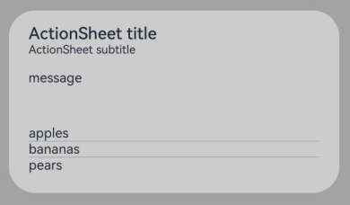  |  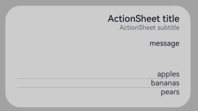  |

ActionSheetOptions弹窗类型的borderWidth：
 | 变更前 | 变更后 |
|---------|---------|
| 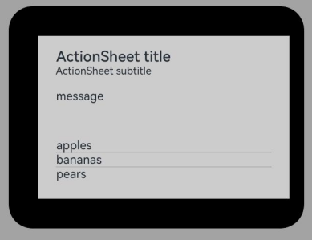  |  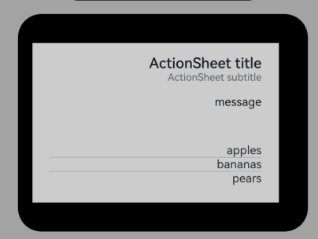  |

**起始API Level**

API 12

**变更发生版本**

从OpenHarmony SDK 5.0.0.29开始。

**变更的接口/组件**

Dialog组件内AlertDialogParam弹窗类型的cornerRadius、borderColor、borderWidth接口；
Dialog组件内ActionSheetOptions弹窗类型的cornerRadius、borderColor、borderWidth接口。

**适配指导**

开发者可以在Dialog内通过AlertDialogParam弹窗类型的cornerRadius接口弹窗设置圆角，且当参数类型为LocalizedBorderRadiuses类型时，支持随语言习惯改变布局顺序。

开发者可以在Dialog内通过AlertDialogParam弹窗类型的borderColor接口设置边框颜色，且当参数类型为LocalizedEdgeColors类型时，支持随语言习惯改变布局顺序。

开发者可以在Dialog内通过AlertDialogParam弹窗类型的borderWidth接口设置边框宽度，且当参数类型为LocalizedEdgeWidths类型时，支持随语言习惯改变布局顺序。

开发者可以在Dialog内通过ActionSheetOptions弹窗类型的cornerRadius接口弹窗设置圆角，且当参数类型为LocalizedBorderRadiuses类型时，支持随语言习惯改变布局顺序。

开发者可以在Dialog内通过ActionSheetOptions弹窗类型的borderColor接口设置边框颜色，且当参数类型为LocalizedEdgeColors类型时，支持随语言习惯改变布局顺序。

开发者可以在Dialog内通过ActionSheetOptions弹窗类型的borderWidth接口设置边框宽度，且当参数类型为LocalizedEdgeWidths类型时，支持随语言习惯改变布局顺序。


```ts
import { LengthMetrics } from '@kit.ArkUI';

@Entry
@Component
struct Example {
  build() {
    Flex({ direction: FlexDirection.Column, alignItems: ItemAlign.Center, justifyContent: FlexAlign.Center }) {
      Button('Click to Show')
        .onClick(() => {
          AlertDialog.show(
            {
              title: 'title',
              message: 'text',
              autoCancel: true,
              alignment: DialogAlignment.Center,
              offset: { dx: 0, dy: -50 },
              gridCount: 3,
              width: 300,
              height: 200,
              borderWidth:      // 新增API示例
              {
                top: LengthMetrics.px(60),
                end: LengthMetrics.px(30),
                bottom: LengthMetrics.px(60),
                start: LengthMetrics.px(60)
              },
              cornerRadius:      // 新增API示例
              {
                topStart: LengthMetrics.vp(120),
                topEnd: LengthMetrics.vp(32),
                bottomStart: LengthMetrics.vp(32),
                bottomEnd: LengthMetrics.vp(32)
              },
              borderColor:     // 新增API示例
              {
                top: Color.Black,
                end: Color.Red,
                bottom: Color.Black,
                start: Color.Black
              },
              backgroundColor: Color.White,
            }
          )
          ActionSheet.show({
            title: 'ActionSheet title',
            subtitle: 'ActionSheet subtitle',
            message: 'message',
            autoCancel: true,

            alignment: DialogAlignment.Bottom,
            offset: { dx: 0, dy: -10 },
            borderWidth:      // 新增API示例
            {
              top: LengthMetrics.px(60),
              end: LengthMetrics.px(30),
              bottom: LengthMetrics.px(60),
              start: LengthMetrics.px(60)
            },
            cornerRadius:      // 新增API示例
            {
              topStart: LengthMetrics.vp(120),
              topEnd: LengthMetrics.vp(32),
              bottomStart: LengthMetrics.vp(32),
              bottomEnd: LengthMetrics.vp(32)
            },
            borderColor:     // 新增API示例
            {
              top: Color.Black,
              end: Color.Red,
              bottom: Color.Black,
              start: Color.Black
            },
            sheets: [
              {
                title: 'apples',
                action: () => {
                  console.log('apples')
                }
              },
              {
                title: 'bananas',
                action: () => {
                  console.log('bananas')
                }
              },
              {
                title: 'pears',
                action: () => {
                  console.log('pears')
                }
              }
            ]
          })
        })
    }.width('100%')
    .height('100%')
  }
}
```