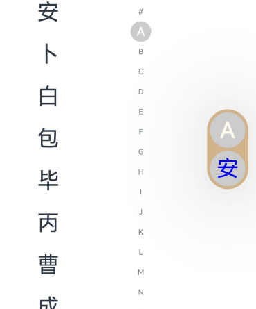
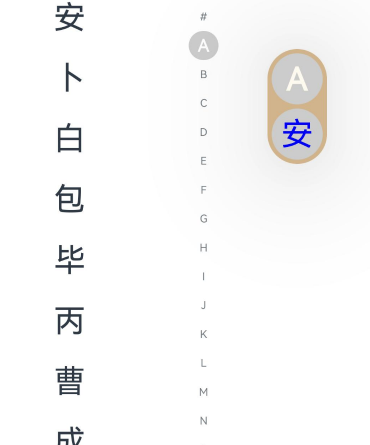
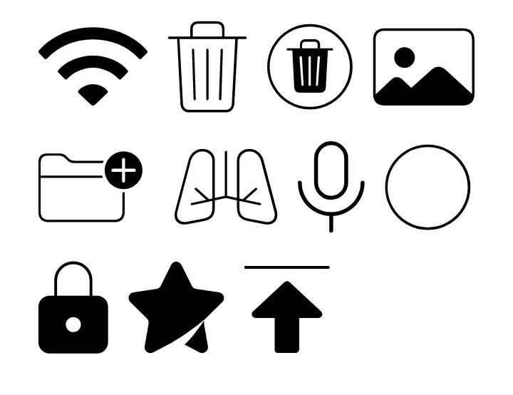
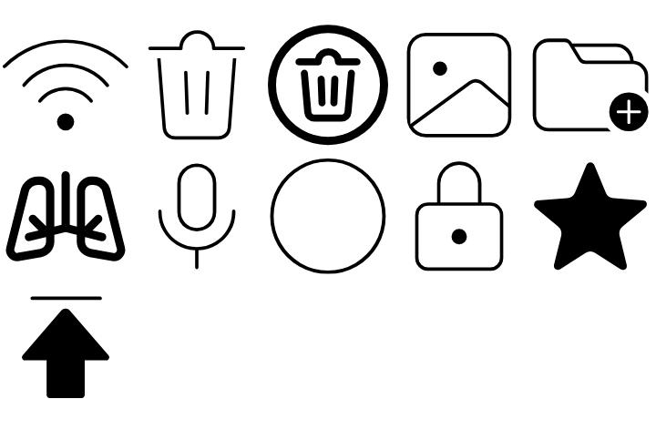

# ArkUI子系统Changelog

## cl.arkui.1 AlphabetIndexer组件popupPosition属性设置为undefined时重置为默认值

**访问级别**

公开接口

**变更原因**

popupPosition属性设置为undefined时应该重置为默认值，但当前实际上会保持现有状态不发生变化，导致开发者不能重置该属性，变更后开发者可通过对该属性设置undefined重置该属性。

**变更影响**

该变更为不兼容变更。

API version 12之前，popupPosition属性设置为undefined时会保持现有状态，提示弹窗位置不发生变化。



API version 12及以后，popupPosition属性设置为undefined时会重置为默认值，提示弹窗位置会发生变化。



**起始API Level**

8

**变更发生版本**

从OpenHarmony SDK 5.0.0.30开始。

**变更的接口/组件**

AlphabetIndexer组件

**适配指导**

开发者需要判断变更后popupPosition属性设置undefined时重置为默认值的效果是否符合预期，如不符合可通过改变[AlphabetIndexer组件](../../../application-dev/reference/apis-arkui/arkui-ts/ts-container-alphabet-indexer.md)popupPosition属性传入参数以达到预期。

## cl.arkui.2 Symbol系统资源变更

**访问级别**

系统接口

**变更原因**

默认样式变更。

**变更影响**

该变更为不兼容变更。

```
@Extend(SymbolSpan) function style() {
  .fontWeight(FontWeight.Lighter)
  .fontSize(96)
}
@Entry
@Component
struct Index {
  build() {
    Column() {
      Text() {
        SymbolSpan($r('sys.symbol.ohos_wifi')).style()
        SymbolSpan($r('sys.symbol.ohos_trash')).style()
        SymbolSpan($r('sys.symbol.ohos_trash_circle')).style()
        SymbolSpan($r('sys.symbol.ohos_photo')).style()
        SymbolSpan($r('sys.symbol.ohos_folder_badge_plus')).style()
        SymbolSpan($r('sys.symbol.ohos_lungs')).style()
        SymbolSpan($r('sys.symbol.ohos_mic')).style()
        SymbolSpan($r('sys.symbol.ohos_circle')).style()

        SymbolSpan($r('sys.symbol.ohos_lock')).style()
        SymbolSpan($r('sys.symbol.ohos_star')).style()
        SymbolSpan($r('sys.symbol.ohos_arrow_up')).style()
      }
    }.width('100%')
  }
}
```
下表例举资源变更前后对比效果：

| 变更前 | 变更后 |
| --- | --- |
| |  |

**起始API Level**

不涉及公开接口。

**变更发生版本**

从OpenHarmony SDK 5.0.0.30开始。

**变更的接口/组件**

涉及Symbol资源的组件：SymbolSpan、SymbolGlyph。

**适配指导**

默认效果变更，无需适配。