# ArkUI子系统Changelog

## cl.arkui.1 UIExtensionComponent增加使用约束

**访问级别**

系统接口

**变更原因**

变更前文档中UIExtensionComponent为系统接口，但在实现中并未做系统应用访问校验。

**变更影响**

该变更为不兼容变更。

UIExtensionComponent增加系统应用访问校验。

**起始API Level**

10

**变更发生版本**

从OpenHarmony SDK 5.0.0.32开始。

**变更的接口/组件**

UIExtensionComponent组件。

**适配指导**

使用UIExtensionComponent的必须为系统应用。

## cl.arkui.2 DatePickerDialog显示时间时分割线延长

**访问级别**

公开接口

**变更原因**

修正视觉效果以获得更好的用户体验。

**变更影响**

该变更为不兼容变更。

| 变更前 | 变更后 |
|---------|---------|
| 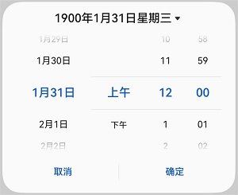 |  |

**起始API Level**

12

**变更发生版本**

从OpenHarmony SDK 5.0.0.32 版本开始。

**变更的接口/组件**

涉及的组件：DatePickerDialog。

**适配指导**

默认行为变更，无需适配。

## cl.arkui.4 List的constraintSize设置生效

**访问级别**

公开接口

**变更原因**

List的布局行为和当前通用的布局约束优先的规格不一致。

**变更影响**

该变更为不兼容变更。

变更前，List不设置Height时，constraintSize的minHeight设置不生效。

变更后，List不设置Height时，constraintSize的minHeight设置会生效。

```ts
@Entry
@Component
struct ListExample {
  build() {
    List({ space: 5 }) {
      ForEach([1, 2, 3, 4, 5], (item: number) => {
        ListItem() {
          Text('' + item)
            .width('100%').height(50)
            .textAlign(TextAlign.Center).backgroundColor(0xFFFFFF)
        }
      }, (item: string) => item)
    }
    .padding(5)
    .constraintSize({ minHeight: 500 })
    .backgroundColor(0xDCDCDC)
  }
}
```

如下是以上示例代码变更前后效果对比：

 | 变更前 | 变更后 |
|---------|---------|
| 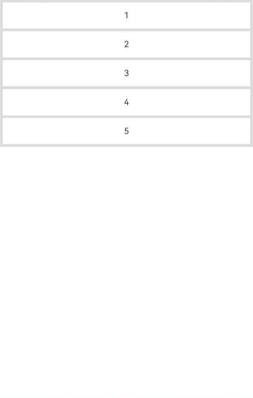  |  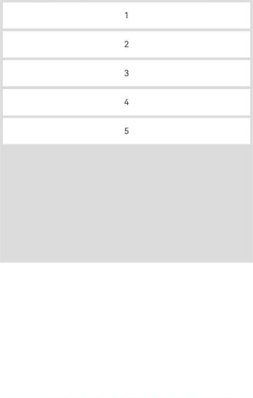  |

**起始API Level**

7

**变更发生版本**

从OpenHarmony SDK 5.0.0.32开始。

**变更的接口/组件**

List组件的constraintSize接口。

**适配指导**

如果List没有设置height属性，且设置了constraintSize的minHeight属性。变更后minHeight属性生效，导致布局界面变化，如果需要保持之前的布局界面，可以删除constraintSize的minHeight属性。

如下代码，变更前constraintSize的minHeight属性不生效，变更后constraintSize的minHeight属性生效导致显示界面变化。
```ts
@Entry
@Component
struct ListExample {
  build() {
    List({ space: 5 }) {
      ForEach([1, 2, 3, 4, 5], (item: number) => {
        ListItem() {
          Text('' + item)
            .width('100%').height(50)
            .textAlign(TextAlign.Center).backgroundColor(0xFFFFFF)
        }
      }, (item: string) => item)
    }
    .padding(5)
    .constraintSize({ minHeight: 500, maxHeight: 1000 })
    .backgroundColor(0xDCDCDC)
  }
}
```
删除constraintSize接口minHeight设置可以恢复之前的效果。
```ts
@Entry
@Component
struct ListExample {
  build() {
    List({ space: 5 }) {
      ForEach([1, 2, 3, 4, 5], (item: number) => {
        ListItem() {
          Text('' + item)
            .width('100%').height(50)
            .textAlign(TextAlign.Center).backgroundColor(0xFFFFFF)
        }
      }, (item: string) => item)
    }
    .padding(5)
    .constraintSize({ maxHeight: 1000 })
    .backgroundColor(0xDCDCDC)
  }
}
```

## cl.arkui.5 模态UIExtension创建默认行为变更

**访问级别**

公开接口

**变更原因**

通过各个应用或者kit提供的开放能力创建出来的模态`UIExtension`，可能被三方应用组件或窗口遮挡，造成安全风险。
> 各个应用或者kit是通过`CreateModalUIExtension`这个系统接口来创建模态`UIExtension`，
> 本质上是这个接口的默认行为发生了变化

**变更影响**

该变更为不兼容变更。

模态`UIExtension`不允许被不安全窗口遮挡，拉起模态`UIExtension`时，会隐藏三方应用已创建的不安全窗口和组件，并阻止三方应用创建新的不安全窗口

变更前后行为如下表所示：

| 变更前                                   | 变更后                                       |
| ---------------------------------------- | -------------------------------------------- |
| 允许不安全窗口遮挡，允许三方应用组件遮挡 | 不允许不安全窗口遮挡，不允许三方应用组件遮挡 |

不安全窗口的定义新增宿主创建的Dialog窗口，变更前后不安全窗口包含的窗口类型如下表所示。

| 变更前                                   | 变更后                                                       |
| ---------------------------------------- | ------------------------------------------------------------ |
| 非系统全局悬浮窗<br>宿主创建的非系统子窗 | 非系统全局悬浮窗<br>宿主创建的非系统子窗<br>宿主创建的非系统Dialog窗口 |

**变更前**：

图中的权限弹窗就是一个模态UIExtension，该窗口弹出后，通话子窗口不会被隐藏
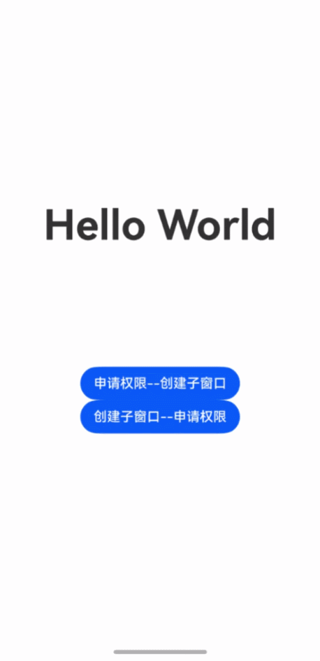


**变更后**：

图中的权限弹窗就是一个模态UIExtension，该窗口弹出后，通话子窗口被隐藏，退出后通话子窗口重新展示


**起始API Level**

11

**变更发生版本**

从OpenHarmony SDK 5.0.0.32开始。

**变更的接口/组件**

| kit名称           | 接口名/组件名                                                |
| ----------------- | ------------------------------------------------------------ |
| Core File Kit     | DocumentViewPicker组件                                       |
| Store Kit         | productViewManager.loadService<br>productViewManager.loadProduct |
| Media Library Kit | PhotoAccessHelper.createDeleteRequest<br>PhotoAccessHelper. removeAssets<br>PhotoAccessHelper.showAssetsCreationDialog<br>PhotoAccessHelper.createAssetWithShortTermPermission<br>PhotoAccessHelper.select |
| Scan Kit          | scanBarcode.startScanForResult                               |
| Ads Kit           | advertising.showAd                                           |
| AbilityKit        | AtManager.requestPermissionsFromUser                         |
| ShareKit          | SystemShare.show                                             |
| Game Service Kit  | gamePlayer.init<br/>gamePlayer.unionLogin<br/>gamePlayer.getLocalPlayer<br/>gamePlayer.verifyLocalPlayer |
| Map Kit           | sceneMap.chooseLocation<br/>sceneMap.queryLocation<br/>sceneMap.selectDistrict |
| Account Kit       | authentication.executeRequest.LoginWithHuaweiID<br/>authentication.executeRequest.AuthorizationWithHuaweiID<br/>extendService.verifyAccount<br/>extendService.startAccountCenter<br/>loginComponent.LoginWithHuaweiIDButton<br/>loginComponent.LoginPanel<br/>loginComponent.startFacialRecognitionVerification<br/>realName.startFacialRecognitionVerification<br/>shippingAddress.chooseAddress<br/>minorsProtection.verifyMinorsProtectionCredential<br/>minorsProtection.leadToTurnOnMinorsMode<br/>minorsProtection.leadToTurnOffMinorsMode |
| ArkUI             | TextInput输入框组件(仅系统密码自动填充服务场景涉及, <br>InputType设置为USER_NAME/Password/NEW_PASSWORD类型) |

**适配指导**

默认行为变更，无需适配，但应注意变更后的行为是否对整体应用逻辑产生影响。

## cl.arkui.6 AlphabetIndexer组件autoCollapse属性默认值由false改为true

**访问级别**

公开接口

**变更原因**

自适应折叠模式使用场景更广，显示效果更加灵活，默认开启自适应折叠模式更符合开发者期望。

**变更影响**

该变更为不兼容变更。

API version 12之前：autoCollapse属性默认值为false，当AlphabetIndexer组件高度不足时，不会折叠显示。

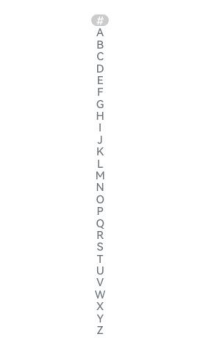

API version 12及之后：autoCollapse属性默认值为true，当AlphabetIndexer组件高度不足时，会折叠显示。

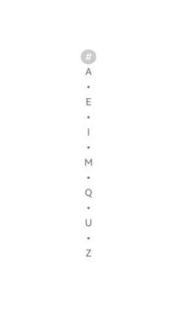

**起始API Level**

11

**变更发生版本**

从OpenHarmony SDK 5.0.0.32开始。

**变更的接口/组件**

AlphabetIndexer组件

**适配指导**

默认行为变更，默认开启自适应折叠模式，若要关闭自适应折叠模式，可通过设置[autoCollapse](../../../application-dev/reference/apis-arkui/arkui-ts/ts-container-alphabet-indexer.md#autocollapse11)属性进行适配。

## cl.arkui.7 元服务AppBar调整Z序到弹框之上
**访问级别**

公开接口

**变更原因**

元服务AppBar按钮在有弹框的情况下，只需点击一次即可拉起服务面板，使用户能够更方便的使用元服务。

**变更影响**

该变更为不兼容性变更，仅涉及UI显示效果，UI显示效果仅在元服务生效。

API version 11及以前：bindMenu，AlertDialog，CustomDialog，bindPopup，bindSheet，bindContentCover等弹框层级都在AppBar之上。蒙层会覆盖AppBar。

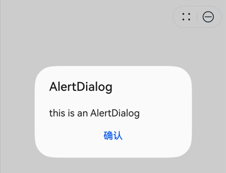

API version 12及以后：针对元服务，大部分弹框层级都在AppBar之下。AppBar按钮悬浮在蒙层之上，只点击一次即可拉起服务面板。

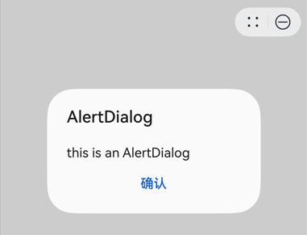

涉及的弹框范围：bindMenu，AlertDialog，CustomDialog，bindPopup，bindSheet，bindContentCover等非子窗模式弹框。

**起始API Level**
9

**变更发生版本**

从OpenHarmony SDK 5.0.0.32开始。


**适配指导**

接口行为变更，无需适配.

## cl.arkui.8 RichEditor组件builderSpan支持绑定自定义菜单

**访问级别**

公开接口

**变更原因**

富文本支持builderSpan绑定自定义菜单。

**变更影响**

该变更为不兼容变更。

变更前：右击或长按builderSpan会弹出对RichEditorSpanType.IMAGE类型绑定的自定义菜单。

变更后：新增自定义菜单绑定类型RichEditorSpanType.BUILDER，builderSpan和imageSpan分开绑定和弹出自定义菜单。右击或长按builderSpan不再弹出对RichEditorSpanType.IMAGE类型绑定的自定义菜单，而是弹出对RichEditorSpanType.BUILDER类型绑定的自定义菜单。

**起始API Level**

10


**变更发生版本**

从OpenHarmony SDK 5.0.0.32开始。

**变更的接口/组件**

RichEditor组件的RichEditorSpanType接口。

**适配指导**

若开发者需要右击或长按builderSpan时弹出RichEditorSpanType.IMAGE类型的自定义菜单，需要对该自定义菜单绑定RichEditorSpanType.BUILDER类型。
```ts
@Entry
@Component
struct Example {
    @Builder
    menu() {
        Column() {
            Text("自定义菜单");
        }
    }
    build() {
        Column() {
            RichEditor({controller: new RichEditorController()})
                // 变更前
                .bindSelectionMenu(RichEditorSpanType.IMAGE, this.menu(), ResponseType.LongPress)

                // 变更后
                .bindSelectionMenu(RichEditorSpanType.IMAGE, this.menu(), ResponseType.LongPress)
                // 绑定RichEditorSpanType.BUILDER类型
                .bindSelectionMenu(RichEditorSpanType.BUILDER, this.menu(), ResponseType.LongPress)
        }
    }
}
```

## cl.arkui.9 文本计算接口fontSize参数默认单位实现修正

**访问级别**

公开接口

**变更原因**

fontSize参数在文档描述中number类型默认单位是fp，实际实现是vp。

**变更影响**

系统设置显示和亮度下字体大小使用标准字体，该变更为兼容变更，变更前后文本计算接口返回结果相同。

系统设置显示和亮度下字体大小使用特大字体，该变更为不兼容变更。

变更前：measureText接口的fontSize参数传入number类型数值，获取到的文本计算宽度小于实际文本显示所需宽度。

变更后：measureText接口的fontSize参数传入number类型数值，获取到的文本计算宽度等于实际文本显示所需宽度。

**起始API Level**

measureText:9，measureTextSize:10

**变更发生版本**

从OpenHarmony SDK 5.0.0.32开始。

**变更的接口/组件**

measureText和measureTextSize接口。

**适配指导**

若在Text组件上，fontSize设置的是vp类型字号，则在measureText测算接口将fontSize的number类型参数改为string类型，传入vp类型字号参数。
```
import { MeasureText } from '@kit.ArkUI'

@Entry
@Component
struct Index {
  @State text: string = "Hello world"
  //变更前
  @State textWidth: number = MeasureText.measureText({
    textContent: this.text,
    fontSize: 24
  })
  //变更后
  @State textWidth2: number = MeasureText.measureText({
    textContent: this.text,
    fontSize: '24vp'
  })

  build() {
    Row() {
      Column() {
        //被计算文本
        Text(this.text).fontSize('24vp')
        Text(`The width of '24vp Hello World': ${this.textWidth}`)
        Text(`The another width of '24vp Hello World': ${this.textWidth2}`)
      }
      .width('100%')
    }
    .height('100%')
  }
}
```

若在Text组件上，fontSize设置的是fp类型字号则无需适配，测算接口fontSize参数传入number类型数值和Text组件上使用的字号单位是一致的。

## cl.arkui.10 光标默认样式变更

**访问级别**

系统接口

**变更原因**

默认样式变更。

**变更影响**

该变更为不兼容变更。

变更前：光标小圆圈默认直径为20vp。

变更后：光标小圆圈默认直径为16vp。

变更前后对比效果，如下表所示
| 变更前 | 变更后 |
| --- | --- |
|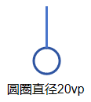 |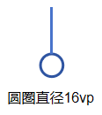  |

**起始API Level**

不涉及公开接口。

**变更发生版本**

从OpenHarmony SDK 5.0.0.32开始。

**变更的接口/组件**

涉及光标的组件：TextInput、TextArea、Search、RichEditor。

**适配指导**

默认效果变更，无需适配。

## cl.arkui.11 高级组件SelectionMenu默认样式变更

**访问级别**

系统接口

**变更原因**

默认样式变更。

**变更影响**

该变更为不兼容变更。

变更前：自定义文本选择菜单点击“更多”后展开菜单会显示内置的置灰项分享翻译搜索。

变更后：自定义文本选择菜单点击“更多”后展开菜单去除内置的置灰项分享翻译搜索。

变更前后对比效果，如下表所示：

| 变更前 | 变更后 |
| --- | --- |
|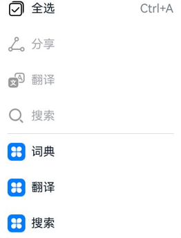 |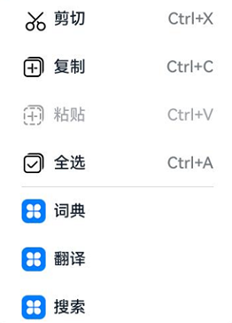  |

**起始API Level**

不涉及公开接口。

**变更发生版本**

从OpenHarmony SDK 5.0.0.32开始。

**变更的接口/组件**

高级组件SelectionMenu。

**适配指导**

默认效果变更，无需适配。

## cl.arkui.12 Svg根节点视窗外图片内容裁剪

**访问级别**

公开接口

**变更原因**

修正视觉效果以符合Svg标准。

**变更影响**

该变更为不兼容变更。

```
<svg width="100" height="100" viewBox="0 0 300 300" version="1.1">
    <defs>
        <circle id = "circleId" cx="100" cy="50" r="40"  fill="red"/>
    </defs>
    <polygon points="220,100 300,210 170,250 123,234" style="fill:#cccccc;stroke:#000000;stroke-width:1"/>
    <use href="#circleId" x = "300" y= "150" width="50" height="50"/>
</svg>
```
| 变更前 | 变更后 |
|---------|---------|
| 绘制内容超出根节点视窗区域会显示 | 绘制内容超出根节点视窗区域不显示 |
| 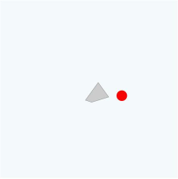 |  |

**起始API Level**

12

**变更发生版本**

从OpenHarmony SDK 5.0.0.32 版本开始。

**变更的接口/组件**

涉及的组件：Image、ImageSpan、Canvas。

**适配指导**

默认行为变更，无需适配，但应注意变更后的行为是否对整体应用显示效果产生影响。

## cl.arkui.13 子窗显示的toast不响应返回事件
**访问级别**

公开接口

**变更原因**

业界惯例toast不会响应返回手势事件，当前子窗下的toast会响应返回事件，不符合规范。

**变更影响**

该变更为不兼容变更。

变更前：toast会响应返回手势，toast消失。

变更后：toast不会响应返回手势，toast不消失，返回手势事件传递到页面其他组件。

**起始API Level**

9

**变更发生版本**

从OpenHarmony SDK 5.0.0.32开始。

**变更的接口/组件**

promptAction.showToast

**适配指导**

默认行为变更，无需适配，但应注意后续不支持通过返回手势退出toast。

## cl.arkui.14 带按钮的气泡样式变更
**访问级别**

公开接口

**变更原因**

popup的按钮文本过长时，布局显示异常。

**变更影响**

该变更为不兼容变更。


| 变更前 | 变更后 |
|---------|---------|
| 按钮文本的最大行数没有限制，按钮内容会相互交叉 | 最多可显示两行文本，文本逐渐缩小到9vp，仍然超长"..."省略 |
| 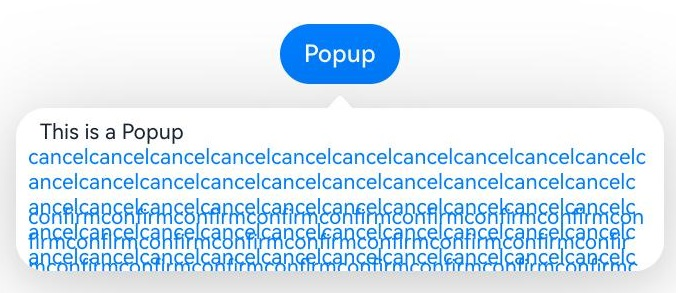 | 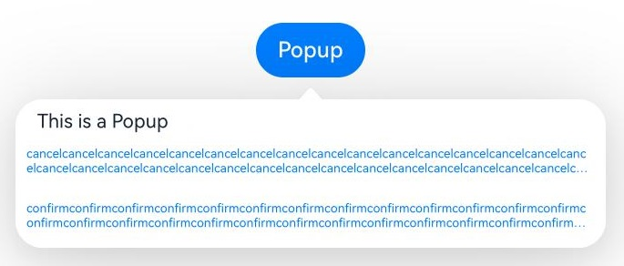 |


**起始API Level**

7

**变更发生版本**

从OpenHarmony SDK 5.0.0.32开始。

**变更的接口/组件**

bindPopup

**适配指导**

默认效果变更，无需适配。

## cl.arkui.15 toast样式变更
**访问级别**

公开接口

**变更原因**

toast文本有两行时，有概率出现文本居中显示，不符合规范，规范为toast多行显示时，需左对齐显示。

**变更影响**

该变更为不兼容变更。

| 变更前 | 变更后 |
|---------|---------|
| 文本居中显示 | 文本左对齐显示 |
| 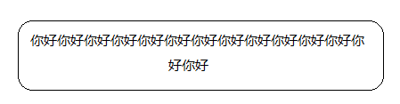 | 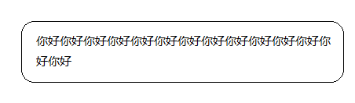 |

**起始API Level**

9

**变更发生版本**

从OpenHarmony SDK 5.0.0.32开始。

**变更的接口/组件**

promptAction.showToast

**适配指导**

默认效果变更，无需适配。

## cl.arkui.16 高级组件ComposeListItem右边按钮OperateItem类型为arrow或者arrow+text时，在没有配置action的时候，不需要单独响应点击效果，应显示全局的按压效果

**访问级别**

公开接口

**变更原因**

高级组件ComposeListItem整个组件分为左右两部分，左边是内容区，右边是按钮操作区。现在问题是右边操作区按钮的OperateItem类型为arrow或者arrow+text时，在没有提供action的时候，会单独响应点击效果，预期不应该显示的；需要修改为在没有提供action的时候，右侧操作区不应该响应单独点击效果，而是整个组件响应按压效果。

**变更影响**

该变更为不兼容变更。

| 变更前 | 变更后 |
|---------|---------|
| 右侧操作区OperateItem类型为arrow或者arrow+text时，没有提供action，右侧操作区单独响应了阴影效果。 | 右侧操作区OperateItem类型为arrow或者arrow+text时，没有提供action，整个组件响应了阴影效果。 |
|  |  |

**起始API Level**

11

**变更发生版本**

从OpenHarmony SDK 5.0.0.32开始。

**变更的接口/组件**

 高级组件ComposeListItem组件

**适配指导**

默认行为变更，无需适配。